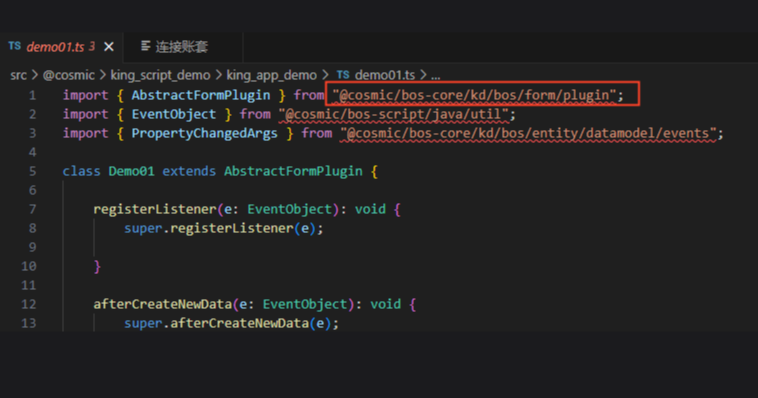
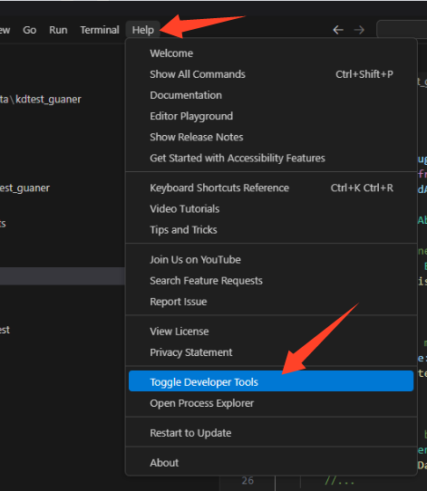
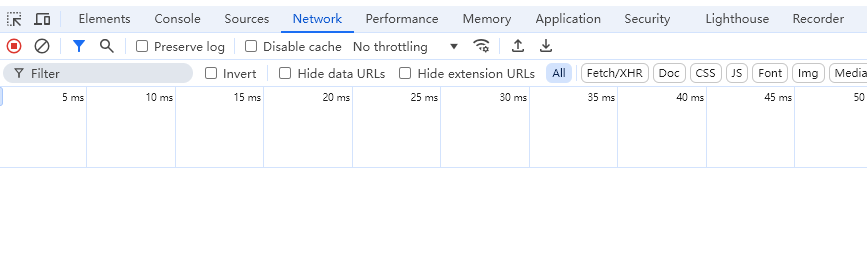

### 问题描述
在VSCode中开发 `KingScript` 插件时，无法引入包，如图：

### 问题分析
`KingScript` 与 `TypeScript` 开发环境相似，依赖 `node_modules` 中安装的模块，如果 `node_modules` 没有对应模块则无法正常引入。

### 解决办法
#### 1. 检查苍穹版本，7.0+才支持 `KingScript`。
#### 2. 检查 `import` 包拼写是否正确。
#### 3. 检查 `node_modules` 是否有对应包文件夹。
- 如果 `node_modules` 文件夹内容为空，可以尝试新建一个本地项目，重新连接账套下载一次，当前下载失败原因可能是因为之前服务器 `KingScript` 脚本运行环境未准备好，无法拉取到 `node_modules` 。
- 如果新建项目仍然无法拉取到 `node_modules` 可能是因为本地网络限制，排查方法：

打开VSCode调试工具

检查Network网络请求，看是否有被拦截

