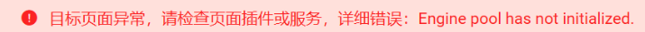

### 问题描述
在执行脚本时报引擎未初始化异常，如图：

### 问题分析
`KingScript` 引擎执行时，需要初始化 `lib` 模块，如 `java` 内置的 `Long`、`BigDecimal`、`集合类型` 以及平台或标品开放的 `Sdk` 方法，当初始化未完成时执行 `KingScript` 代码就会报脚本引擎池未初始化完成异常。

### 解决办法
1. 服务未初始化完成，请等待片刻再尝试。
2. 检查 `monitor` 日志，搜索 `KingScript` 关键字，看是否有 `lib` 包缺失等异常，如果有 `lib` 包缺失提示，通常是系统中对应的jar包不完整，可以更新最新补丁包或尝试重启服务。