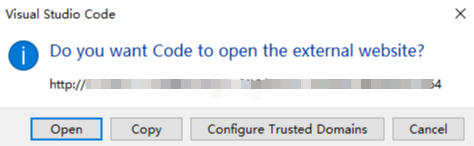
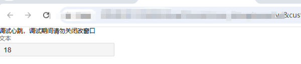
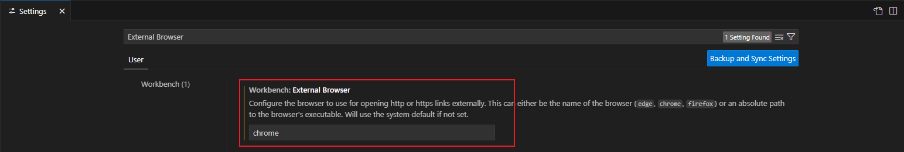

### 问题描述
苍穹VSCode插件调试KingScript插件代码时，提示调试启动失败

### 问题分析
KingScript调试依赖当前用户单据操作会话，为了保证调试器能与页面单据通信，需要用户提前登录苍穹系统，并打开对应单据。

通常有以下几点：
1. 调试打开浏览器心跳页弹窗未授信；
2. 打开心跳页之前用户未登录苍穹环境；
3. 心跳页与用户登录环境域名不一致；
4. 心跳页与用户登陆环境所使用浏览器不一致；

VSCode启动调试时会打开一个浏览器心跳页面，目的是保持与当前用户单据操作的会话环境保持一致，如下图：

用户需要手动确认并点击Open，此时打开的心跳页如下图：

当心跳页计数正常时，表示调试功能正常，此时可以进行单据调试。

### 解决办法
按照问题分析，请确保：
1. 调试前已经登录苍穹环境；
2. VSCode授信能正常打开调试心跳页；
3. 确保心跳页与用户登录的苍穹环境域名一致（心跳页域名与登录账套环境一致）；
4. 确保心跳页与用户登录的苍穹环境所使用浏览器一致（建议下载1.95.3或以上版本的VSCode编辑器，并设置打开外部链接的浏览器，使其与苍穹环境所使用浏览器一致）；
