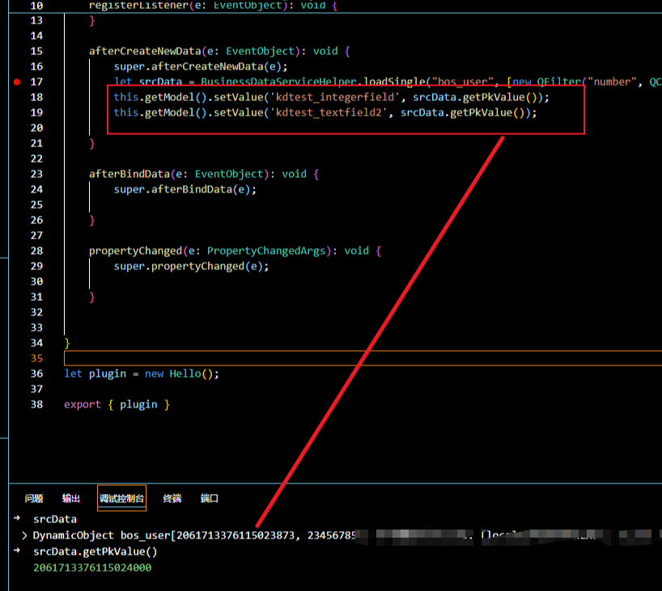

### 问题描述
在使用 `KingScript` 处理 `bigint` 主键时，出现精度丢失，如图：


### 问题分析
`KingScript` 执行引擎是基于 `JavaScript` ， `JavaScript` `Number` 精度为 (**2^53-1**)，如图：


### 解决办法
使用 `BigInt` 类型处理，`BigInt` 是 ECMAScript 2020（ES 11）引入的，用于表示任意精度的整数，`BigInt` 解决了允许 `JavaScript` 开发者处理超出 `Number` 类型安全整数范围 (**2^53-1**) 的数值问题。
- 类型示例
```KingScript
//定义BigInt类型
let id1 = 1637034321724565504n;
let id2 = BigInt(1637034321724565505);
let id3 = BigInt('1637034321724565506');
console.log(id1);// 输出:1637034321724565504
console.log(id2);// 输出:1637034321724565505
console.log(id3);// 输出:1637034321724565506
//运算（BigInt数字需要同类型进行数学运算）
let v1 = id1 + id2 + id3;
let v2 = id1 * 2n;
let v3 = id3 / 3n;
console.log(v1);// 输出:4911102965173696514
console.log(v2);// 输出:3274068643449131008
console.log(v3);// 输出:545678107241521835
```
- 插件示例
```kingscript
import { AbstractBillPlugIn } from "@cosmic/bos-core/kd/bos/bill";
import { EventObject } from "@cosmic/bos-script/java/util";
import { PropertyChangedArgs } from "@cosmic/bos-core/kd/bos/entity/datamodel/events";
import { BusinessDataServiceHelper } from '@cosmic/bos-core/kd/bos/servicehelper'
import { QFilter } from "@cosmic/bos-core/kd/bos/orm/query"

class MyPlugin extends AbstractBillPlugIn {
    propertyChanged(e: PropertyChangedArgs): void {
        super.propertyChanged(e);
        let id = 1637034321724565504n;
        let id2 = BigInt(1637034321724565504);
        let id3 = BigInt("1637034321724565504");
        let data1 = BusinessDataServiceHelper.loadSingle("bos_user","id",[new QFilter("id","=",id)]);
        let data2 = BusinessDataServiceHelper.loadSingle("bos_user","id",[new QFilter("id","=",id2)]);
        let data3 = BusinessDataServiceHelper.loadSingle("bos_user","id",[new QFilter("id","=",id3)]);
        let pk1 = BigInt(data1.getPkValue());
        let pk2 = BigInt(data2.getPkValue());
        let pk3 = BigInt(data3.getPkValue());
        this.getView().showMessage("pk1:"+pk1+",pk12:"+pk2+",pk3:"+pk3+",sum:"+(pk1+pk2+pk3));
    }
}
let plugin = new MyPlugin();
export { plugin };
```


> ### 特别说明
> 如果当前 VSCode `金蝶云苍穹插件`不支持 BigInt 类型，请修改根目录下 tsconfig.json 文件
> ```kingscript
> 将 "target": "ES2017" 修改为 "target": "ES2020"
> ``` 