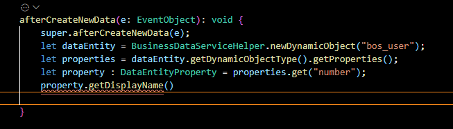
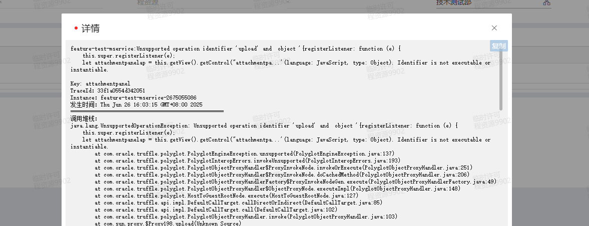

### 问题描述
`KingScript` 在使用Java接口的default方法时，提示方法未定义错误，导致无法保存脚本，运行时提示方法未定义


### 问题分析
`Java`中的接口的default方法在生成ts申明部分时会将方法变成可选方法,typescript不能直接使用可变方法
```java
public interface B {
    default String getName() {
        return "";
    }
}
```
```kingscript
interface B {
    getName?():string;
}
```
### 解决办法
在ts中调用方法前先判断对象是否存在方法，如果要用到接口某个方法时，需要在ts实现类中实现
```kingscript
class DefaultClass implements B {
    String getName() {
        return "";
    }
}
let b : B = new DefaultClass();
if(b.getName){
    b.getMame();
}
```