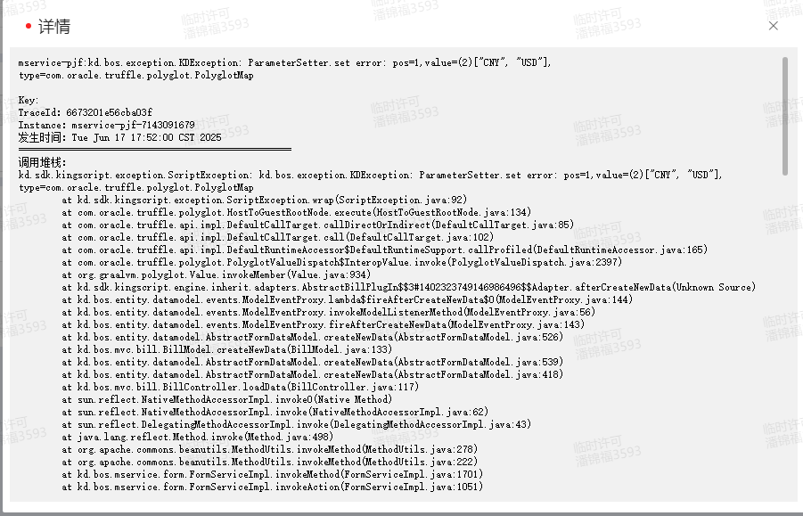
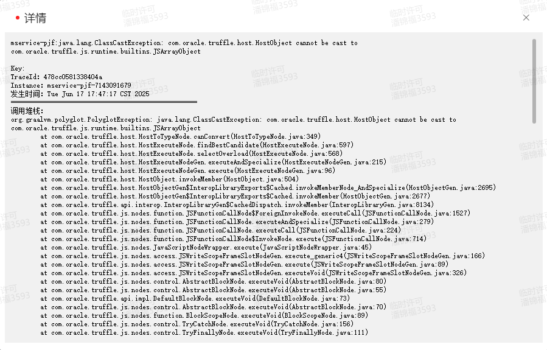

### 问题描述
`KingScript` 在使用BusinessDataServiceHelper.load传递过滤条件时，提示类型转换异常



### 问题分析
对于单个QFilter内部的条件，参数类型需要用Java中的类型，比如in对应的类型应该是ArrayList，多个QFilter之间需要用typescript中的类型，比如数组。
```kingscript
    let filters = [];
    let list = new ArrayList();
    list.add("CNY");
    list.add("USD");
    filters.push(new QFilter("number", QCP.in, list));
    let datas = BusinessDataServiceHelper.load("bd_currency", "name", filters);
    let nameList = "";
    for (let i = 0; i < datas.length; i++) {
        if (i > 0) nameList += ", ";
        nameList += datas[i].get("name");
    }
    this.getModel().setValue("textfield", nameList);
```