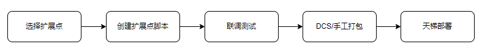
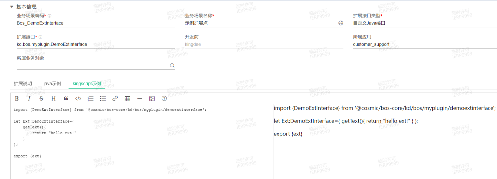
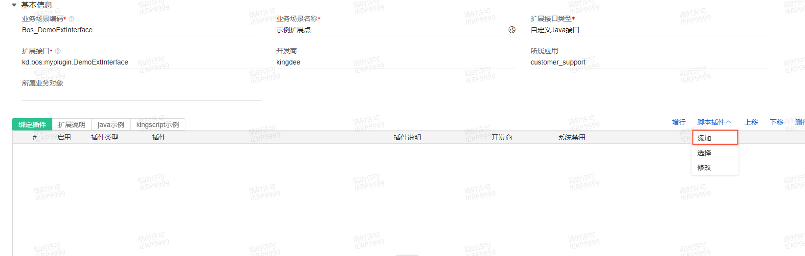
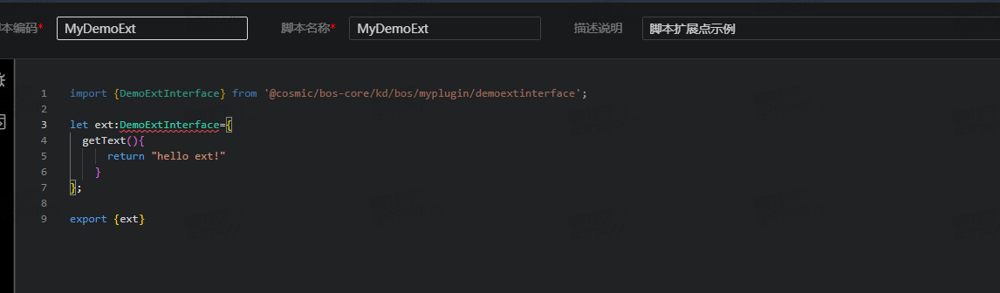
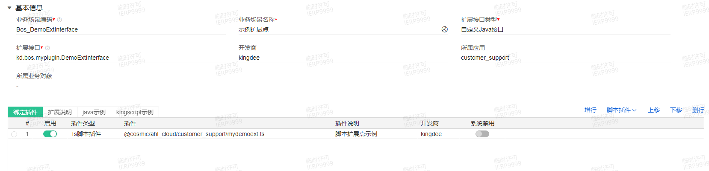
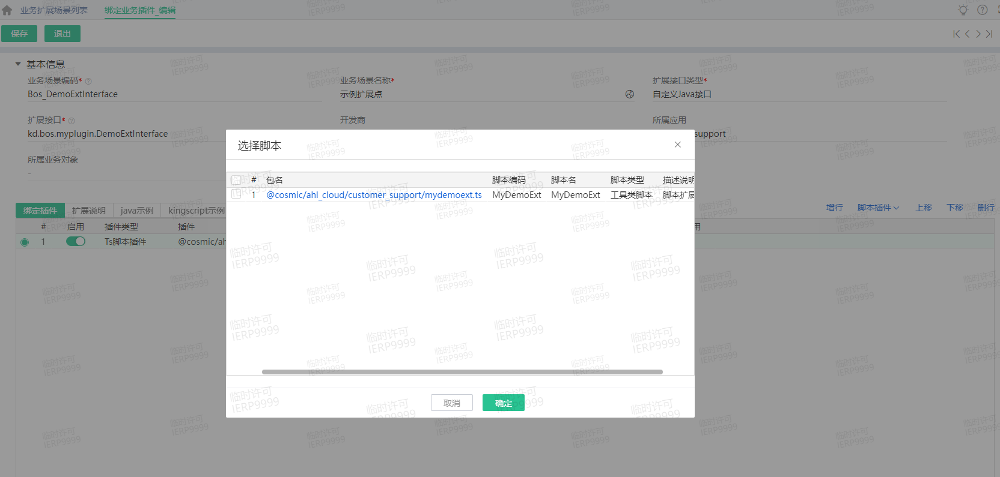
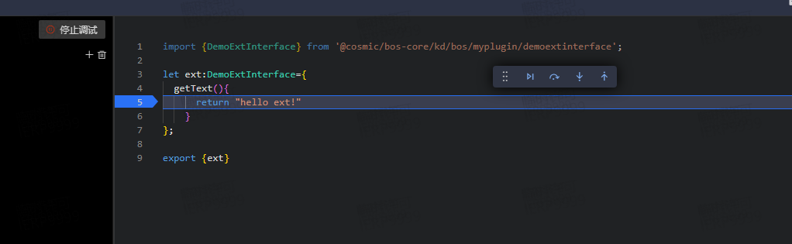
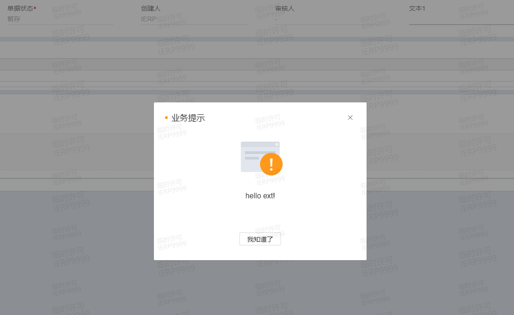

## 脚本扩展点定制开发指南
### 1、脚本定制开发流程

### 2、扩展点脚本开发
1. 选择扩展点
开发服务云——》扩展平台应用——》业务扩展场景列表

2. 创建脚本
用户可以根据扩展点在线创建脚本，一个扩展点可以绑定多个脚本。

3. 选择脚本
用户也可以使用VSCode，根据扩展点模板创建扩展点脚本，上传后可以在扩展点进行选择绑定，可以选择多个脚本。

4. 调试脚本
在对应单据功能进行操作，触发扩展点逻辑

### 3、打包部署
[参考轻脚本部署文档](https://vip.kingdee.com/knowledge/720675834658336512?specialId=218022218066869248&productLineId=29&isKnowledge=2&lang=zh-CN)