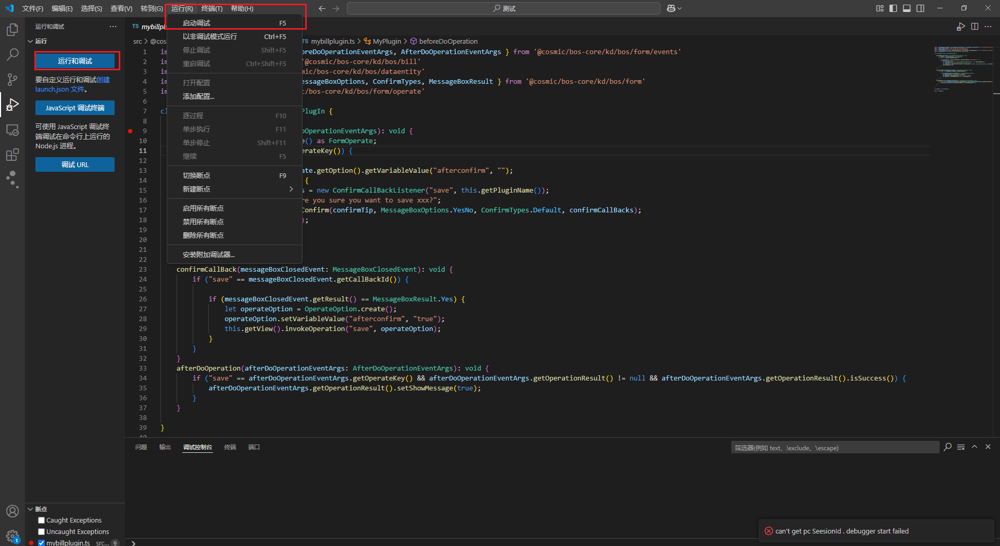
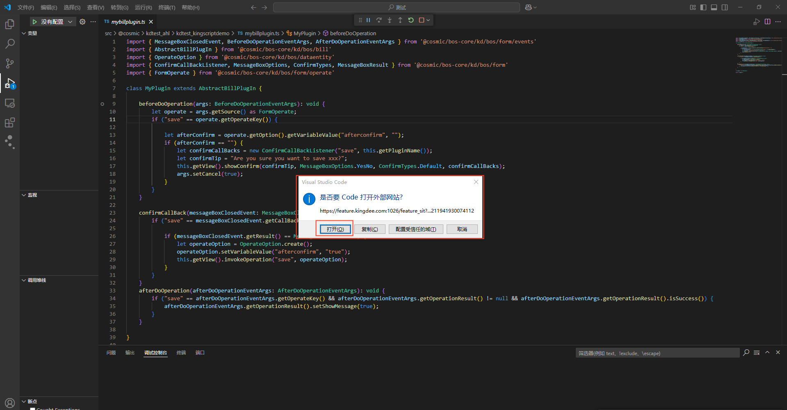
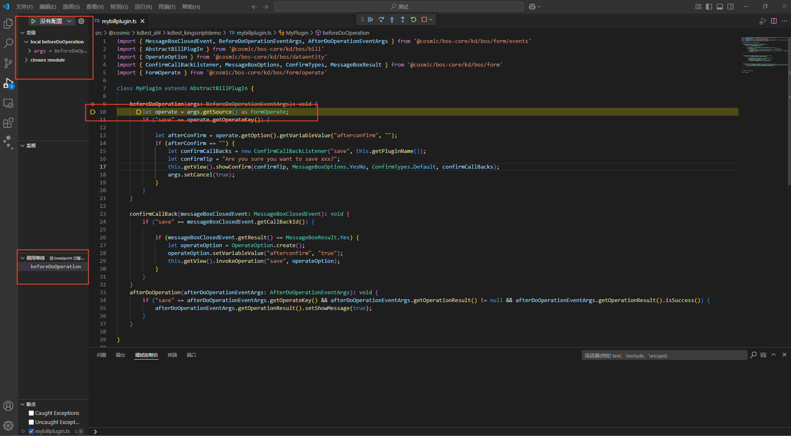
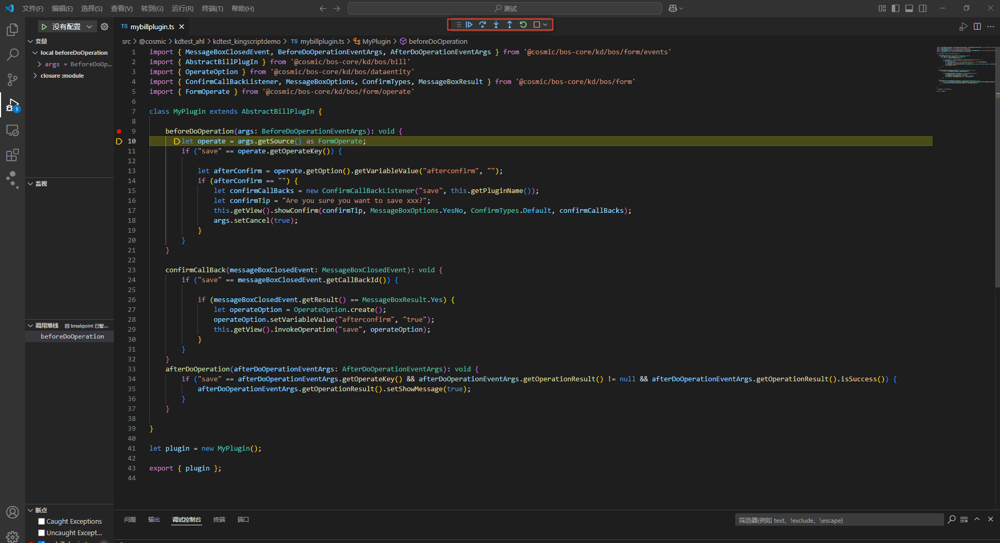
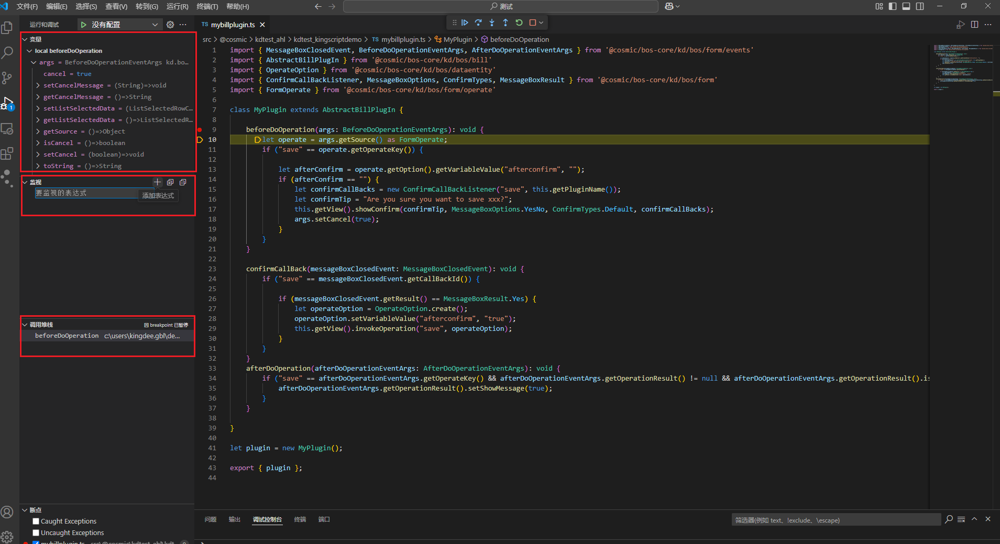
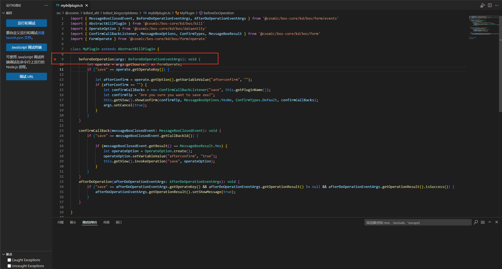

# 调试KingScript

KingScript支持在线编辑器调试以及VSCode插件调试，此处介绍VSCode插件的调试流程，在线编辑器的调试步骤可参考KingScript快速入门以及在线编辑器中的调试部分

## 环境准备

使用VSCode插件进行调试需要现在VSCode中安装对应插件，具体步骤请参考[KingScript VScode新手引导](https://vip.kingdee.com/knowledge/618760652429193984?channel_level=%E9%87%91%E8%9D%B6%E4%BA%91%E7%A4%BE%E5%8C%BA%7C%E6%90%9C%E7%B4%A2%7C%E5%AE%98%E6%96%B9%E7%9F%A5%E8%AF%86&productLineId=29&isKnowledge=2&lang=zh-CN)

## 进入调试

先在对应行处添加断点，随后可以点击”运行和调试“按钮进入调试

**启动调试时请保证处于登录状态，否则会导致调试启动失败**

进入调试的时候会提示打开网页，点击”打开“，随后会跳转到心跳页面，调试过程中请保持打开心跳页面

随后回到对应的界面中进行预览，触发对应事件后即可进入断点中进行调试

调试操作与VSCode基本一致，支持单步调试、单步跳出等操作

支持查看对应的变量、添加表达式以及展示调用堆栈等

> 注意: 目前不支持同时调试多个脚本文件，需先关闭当前调试后，切换到其他代码后，再重新调试。

## 特别说明
轻脚本目前仅支持同步调试，报表、调度、流程、OpenApi等异步请求场景不支持调试。