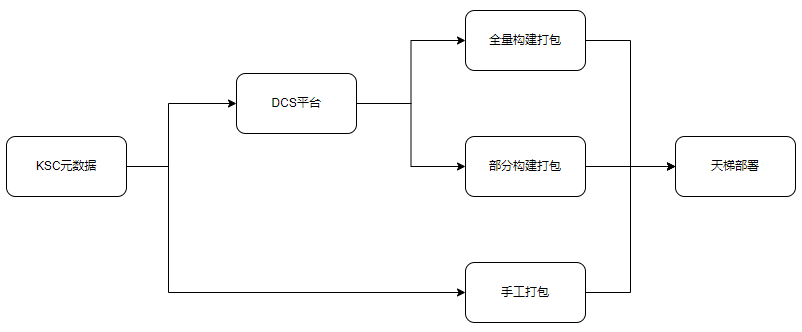
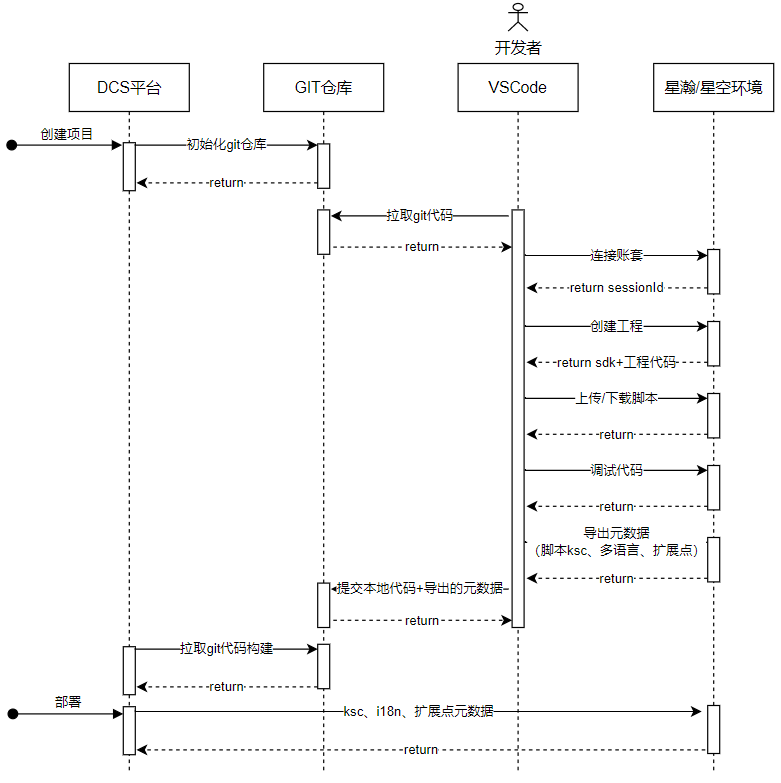
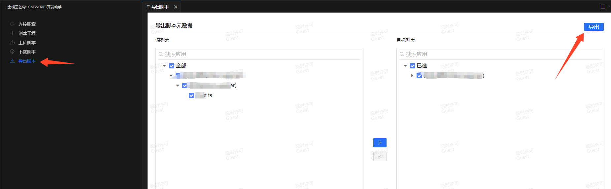
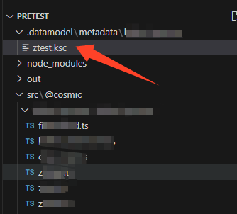
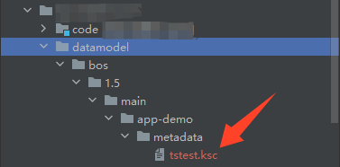

# KingScript 部署指南
本文档旨在介绍 `KingScript` 的几种主要部署方式，帮助开发者快速上手并根据自身需求选择合适的部署方案。
`KingScript` 支持通过DCS（协同开发平台）、手工打包天梯部署多种部署方案。

# 目录
1. [整体流程](#部署流程)
2. [DCS部署](#DCS打包)
3. [手工部署](#手工打包)
---

## 部署流程
`KingScript` 可以通过KSC文件进行部署（`KingScript` 导出的元数据），可以使用DCS（协同开发平台）打包通过天梯部署也可以手工打包元数据进行天梯部署，具体流程如下：

## DCS打包

DCS打包是利用DCS（协同开发平台）提供的打包工具，将 `KingScript` 的脚本文件以元数据资源形式嵌入到应用部署包中，DCS支持全量构建打包与部分构建打包。

DCS开发打包流程如下：

### 部分构建打包

[参考文档](https://vip.kingdee.com/knowledge/specialDetail/512315349249697024?category=631775107693724160&id=710780002375153408&type=Knowledge&productLineId=1&lang=zh-CN)

### 全量构建部署

[参考文档](https://vip.kingdee.com/knowledge/specialDetail/512315349249697024?category=576340724459631104&id=593385866358040832&type=Knowledge&productLineId=1&lang=zh-CN)

## 手工打包

手工部署是指将 `KingScript` 的脚本文件以元数据资源形式嵌入到应用包中。

步骤
1. 准备KSC元数据文件
首先，确保你已经编写并测试好了 `KingScript` 脚本。通过VSCode编辑器导出功能，将脚本文件导出：

导出脚本以ksc后缀结尾：

2. 嵌入ksc到元数据包

将`1`中导出的ksc文件嵌入到你的应用程序元数据资源目录中，在部署时会通过苍穹部署工具自动上传到目标服务器。

## 天梯部署

天梯部署是将导出的 `KingScript` 元数据部通过天梯系统署到公有云环境，具体步骤可以参考：
[天梯帮助文档](https://ops.kdcloud.com/service?id=a3a316d00d1911ebb76363a219375514)