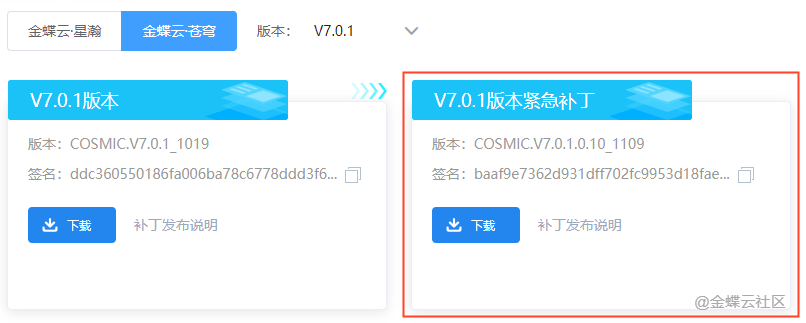
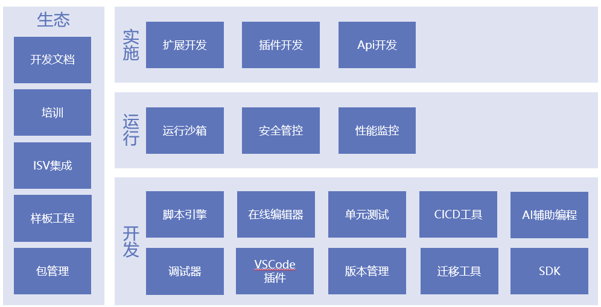
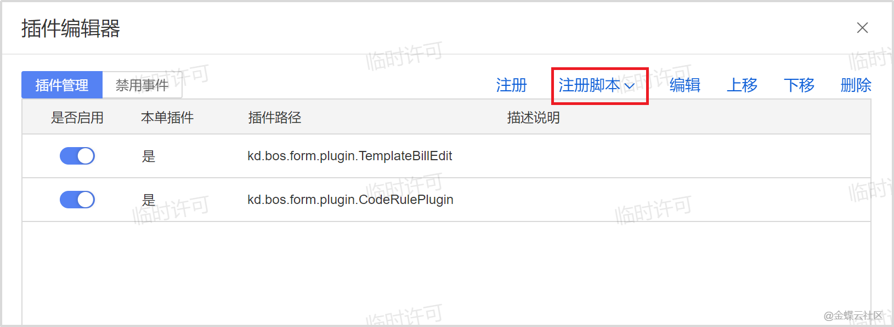
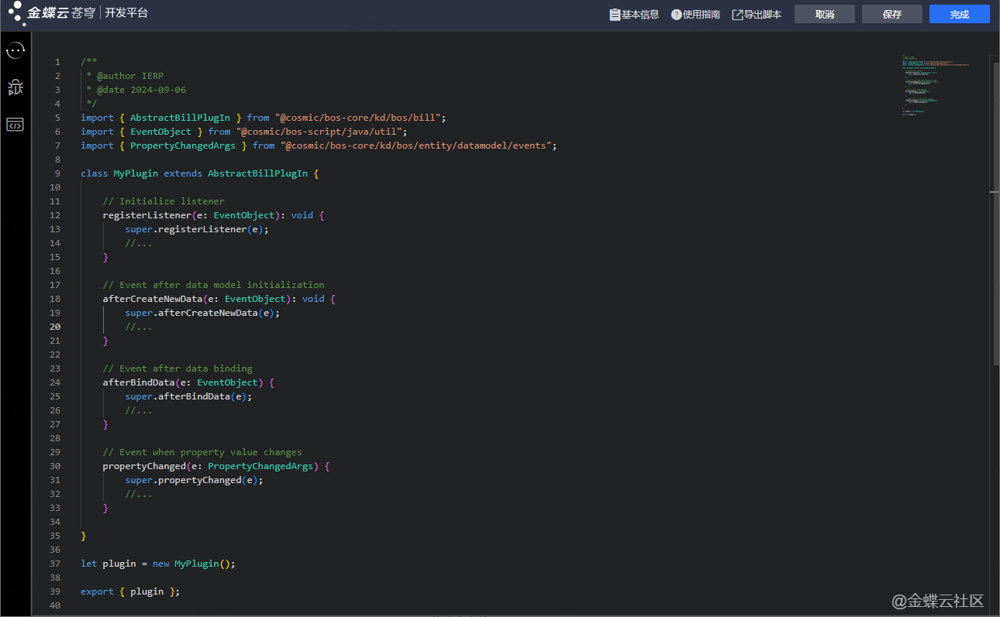

# KingScript介绍

## **KingScript**

## 金蝶云苍穹·脚本开发平台（新版）

| **产品版本**   | **更新内容**        | **更新日期**    |
|------------|-----------------|-------------|
| BOS_V7.0.1 | 7.0支持KingScript | 2024年10月26日 |
| BOS_V7.0.2 | 修复部分问题          | 2024年12月21日 |
| BOS_V7.0.3 | 修复部分问题          | 2024年12月25日 |
| BOS_V7.0.4 | 修复部分问题          | 2025年1月8日   |
| BOS_V7.0.5 | 修复部分问题          | 2025年2月12日  |
| BOS_V7.0.6 | 修复部分问题          | 2025年2月25日  |
| BOS_V7.0.11 | 脚本支持所有原先插件支持场景  | 2025年5月15日  |

**重要说明：**
**建议安装最新补丁**

## 1、产品概述

### 1.1产品介绍

金蝶云苍穹·脚本开发平台（新版）包含三部分内容：KingScript脚本语言、新脚本插件框架、新脚本编辑器。

**KingScript脚本语言**是苍穹平台的服务端脚本语言，运行在JVM中，基本与TypeScript语言相同。

**新脚本插件框架**是苍穹平台对外提供二次开发的插件框架，它提供了平台的模块包和插件基类，基于此框架可简单快速实现业务功能。

**新脚本编辑器**为KingScript脚本语言的在线编辑器，具有语法高亮、API提示、自动导包、代码片段等特性。

当前脚本在线编辑器已完全替换为新版，旧版脚本的编辑器已不再使用和维护，旧版脚本仍可继续使用和运行，但无法新增旧版脚本

### 1.2产品蓝图

## 2、开始使用
### **2.1打开脚本编辑器**
操作路径：设计器 ->插件编辑器
弹出界面如下，点击注册脚本，进入脚本编辑器：

## 2.6开发流程

## 3、新旧脚本差异

|  | 旧版                                                                                                                                                                            | 新版 |
| --- |-------------------------------------------------------------------------------------------------------------------------------------------------------------------------------| --- |
| 开发语言 | Java或KScript（es5）                                                                                                                                                             | KingScript（ts） |
| 编辑器 | KDE/IDEA/Eclipse                                                                                                                                                              | KingScript在线编辑器/Vscode插件 |
| 开发框架 | Java插件框架                                                                                                                                                                      | @cosmic/bos-framework |
| 特点 | 功能完善                                                                                                                                                                          | 支持在线调试以及独立调试、支持即时生效、环境更加轻量化、提供AI能力以及代码片段辅助编程 |
| 文档 | [参考链接](https://developer.kingdee.com/knowledge/specialDetail/218022218066869248?category=218036339197757184&id=239045906702872064&type=Knowledge&productLineId=29&lang=zh-CN) | 见本文档 |

## 4、特性亮点

- 支持在线调试
- 脚本修改后可即时生效 
- 无需配置复杂的本地环境，可以直接在在线编辑器或使用VSCode插件搭建轻量的开发环境
- AI赋能脚本开发 
- 提供代码片段以及代码模板 
- 支持业务场景扩展点开发
