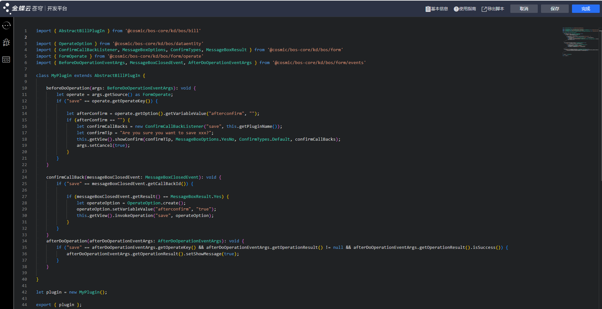
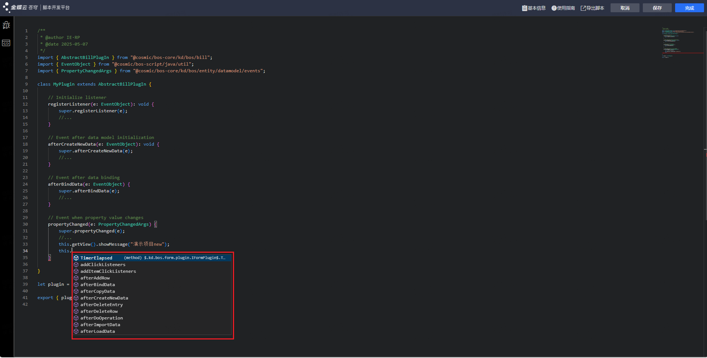
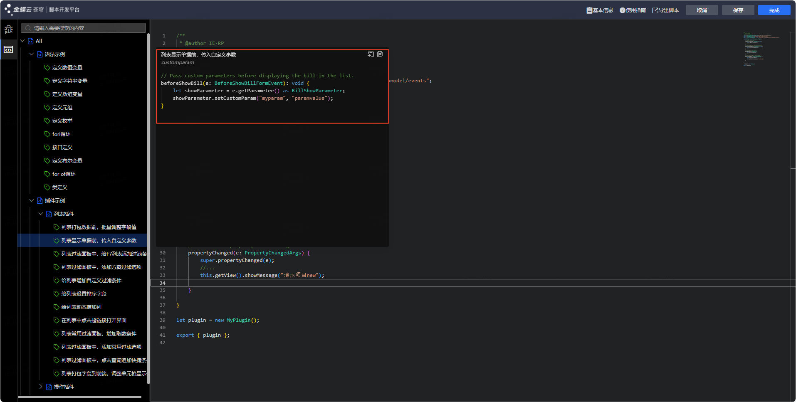
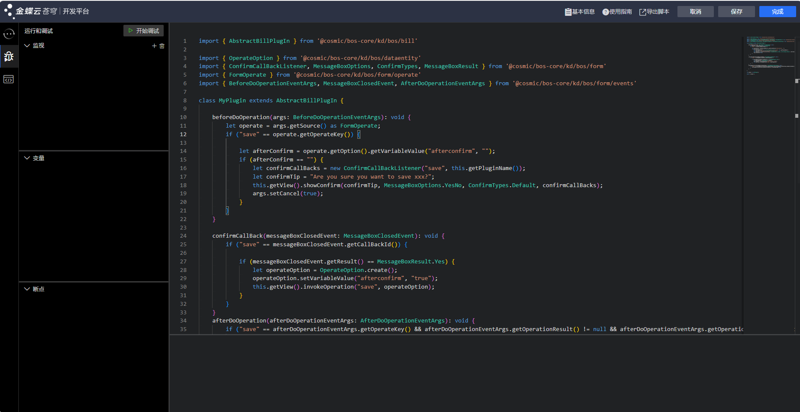
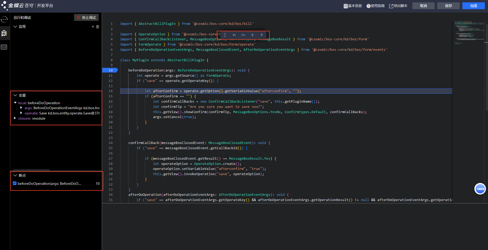
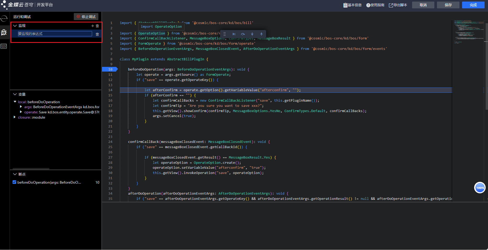

# KingScript快速入门

## 1、环境准备

当前KingScript支持在线编辑器以及VSCode插件两种开发方式，VSCode插件的环境准备 [详见文档](https://vip.kingdee.com/knowledge/618760652429193984?channel_level=%E9%87%91%E8%9D%B6%E4%BA%91%E7%A4%BE%E5%8C%BA%7C%E6%90%9C%E7%B4%A2%7C%E5%AE%98%E6%96%B9%E7%9F%A5%E8%AF%86&productLineId=29&isKnowledge=2&lang=zh-CN)
这里主要介绍使用在线编辑器使用KingScript的步骤

使用在线编辑器无需额外进行环境的准备，7.0以后的版本已支持使用在线编辑器进行KingScript的脚本开发

## 2、进入脚本编辑器

不同模块的入口有所区别，详见KingScript介绍中关于插件注册入口的介绍，此处不做详细介绍，以最常见的单据类型为例，单据类型的插件注册入口在单据-根节点【插件】属性

进入插件编辑器界面后点击“注册脚本”

输入对应的脚本编码以及脚本名称后点击“确认”即可自动跳转到在线编辑器界面

## 2、脚本编写

在线编辑器中会预置不同模块的模板，同时提供了不同功能的代码样例可以直接添加

[//]: # ()
[//]: # (![image_43.png]&#40;images/image_43.png&#41;)

[//]: # (在线编辑器中内置了苍穹的AI开发助手，可以提供AI辅助编程的能力，包括生成代码、生成注释、代码优化、代码解释以及知识问答的功能)

在线编辑器中支持代码补全功能

在线编辑器中内置了代码片段辅助开发

## 3、脚本调试

在线编辑器中支持在线调试功能，点击侧边栏中的调试按钮即可进入调试模式

调试模式下支持对代码进行断点调试，点击对应的行即可添加断点

设置好断点后点击开始调试按钮，回到单据界面中进入预览即可进入断点进行调试

调试模式下支持配置对应的监视表达式

## 4、脚本运行

由于KingScript支持热部署，脚本保存后即时就会生效，不需要额外进行其他操作即可生效
