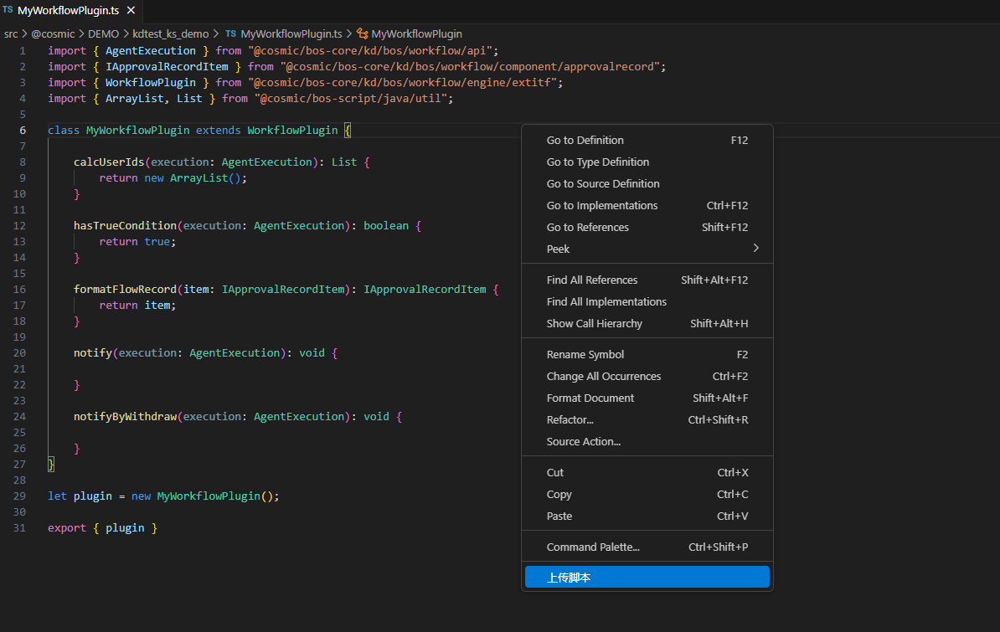
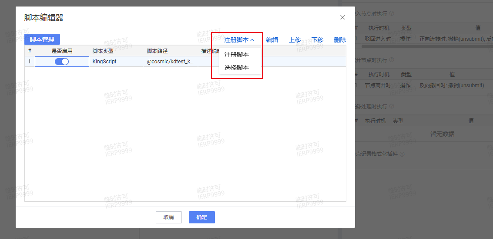

# 工作流插件 KingScript 开发指南

## 目录
1. [概述](#概述)
2. [快速入门](#快速入门)
3. [核心事件详解](#核心事件详解)

---

## 概述
在流程设计时，如果标准的设置不满足需求，可以给工作流增加扩展插件来实现更加复杂的业务逻辑，工作流的插件场景主要集中在参与人、条件规则、流程控制、节点控制、自动节点。

---

## 快速入门
本指南主要演示通过vscode编写脚本插件，并完成插件注册过程。
### 1. 新建ts文件，继承`WorkflowPlugin`插件
```kingscript
import { AgentExecution } from "@cosmic/bos-core/kd/bos/workflow/api";
import { IApprovalRecordItem } from "@cosmic/bos-core/kd/bos/workflow/component/approvalrecord";
import { WorkflowPlugin } from "@cosmic/bos-core/kd/bos/workflow/engine/extitf";
import { ArrayList, List } from "@cosmic/bos-script/java/util";

class MyWorkflowPlugin extends WorkflowPlugin {
    //事件根据自己的业务需要去重写，此处仅是演示，相关事件介绍参考核心事件详解章节
    calcUserIds(execution: AgentExecution): List {
        return new ArrayList();
    }

    hasTrueCondition(execution: AgentExecution): boolean {
        return true;
    }

    formatFlowRecord(item: IApprovalRecordItem): IApprovalRecordItem {
        return item;
    }

    notify(execution: AgentExecution): void {

    }

    notifyByWithdraw(execution: AgentExecution): void {
        
    }
}

let plugin = new MyWorkflowPlugin();

export { plugin }
```

### 2. 右键上传ts文件到环境中


### 3. 注册脚本插件，选择新建的脚本文件
可在参与人、条件规则、流程控制、节点控制、自动节点等位置注册脚本插件


---

## 核心事件详解
| 事件 | 说明 |
| ---- | ---- |
| calcUserIds | 当用户创建好流程后，针对每个审批节点都要设置对应的参与人（审批人） |
| hasTrueCondition | 平台考虑到用户在使用流程中可能会设置条件，所以在对应位置开放该权限 |
| formatFlowRecord | 用户查看审批详情时，可以在“节点记录格式化插件”中，放入自己的插件实现自己想要的逻辑，如修改显示值 |
| notify | 用户创建流程时，针对每个节点不同时机可以有不同的操作。该方法可用于自定义操作 |
| notifyByWithdraw | 节点离开，撤回时调用 notifyByWithdraw 方法 |

