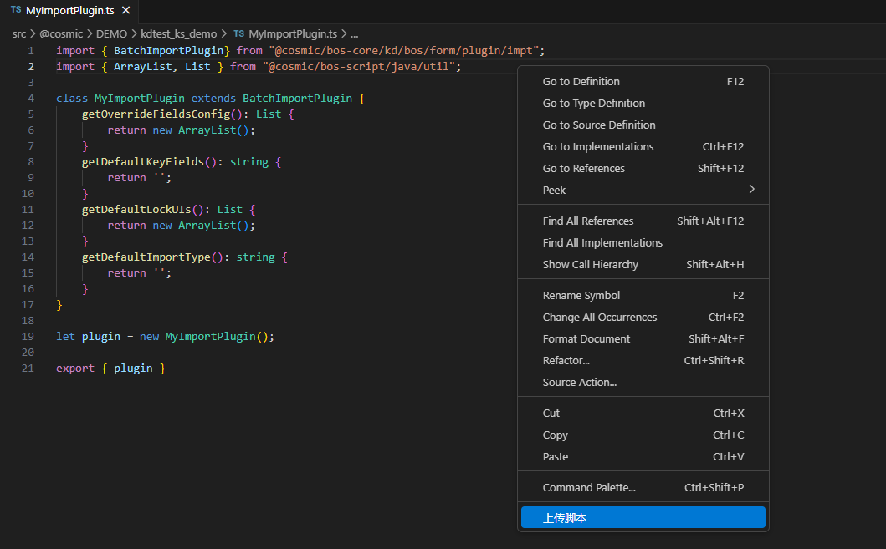
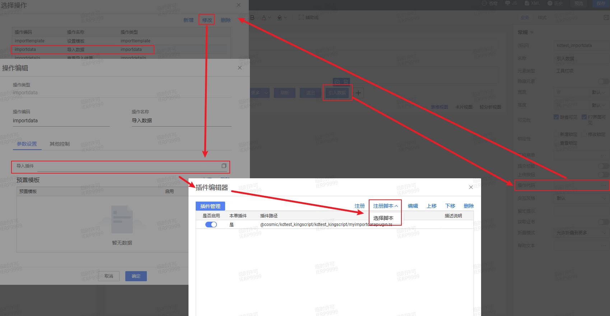

# 引入插件 KingScript 开发指南

## 目录
1. [概述](#概述)
2. [快速入门](#快速入门)
3. [核心事件详解](#核心事件详解)

---

## 概述
引入引出插件的基类为BatchImportPlugin。引入引出插件，必须从插件基类BatchImportPlugin中派生。

---

## 快速入门
本指南主要演示通过vscode编写脚本插件，并完成插件注册过程。
### 1. 新建ts文件，继承`BatchImportPlugin`插件
```kingscript
import { BatchImportPlugin} from "@cosmic/bos-core/kd/bos/form/plugin/impt";
import { List, ArrayList } from "@cosmic/bos-script/java/util";

class MyImportPlugin extends BatchImportPlugin {
    //事件根据自己的业务需要去重写，此处仅是演示，相关事件介绍参考核心事件详解章节
    getOverrideFieldsConfig(): List {
        return new ArrayList();
    }
    getDefaultKeyFields(): string {
        return '';
    }
    getDefaultLockUIs(): List {
        return new ArrayList();
    }
    getDefaultImportType(): string {
        return '';
    }
}

let plugin = new MyImportPlugin();

export { plugin }
```

### 2. 右键上传ts文件到环境中

### 3. 注册脚本插件，选择新建的脚本文件
【列表】→【引入数据操作】→【操作代码】→【修改】→【导入插件】→【插件编辑器】→【注册脚本/选择脚本】


---

## 核心事件详解
| 事件 | 说明 | 典型用途 |
| ---- | ---- | ---- |
| getOverrideFieldsConfig | 覆盖引入的匹配字段备选项 | 打开起始页时，自定义更新导入的匹配字段下拉框的下拉选项值 |
| getDefaultKeyFields | 覆盖引入的匹配字段的缺省值 | 打开起始页时，自定义更新导入的匹配字段下拉框的默认值 |
| getDefaultImportType | 缺省引入模式，新增、覆盖、覆盖并新增 | 打开起始页时，自定义默认的导入方式 |
| getDefaultLockUIs | 锁定的控件列表 | 打开起始页时，禁用更新导入下拉框 |

