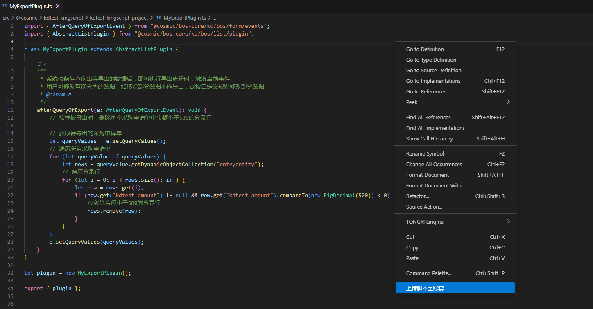
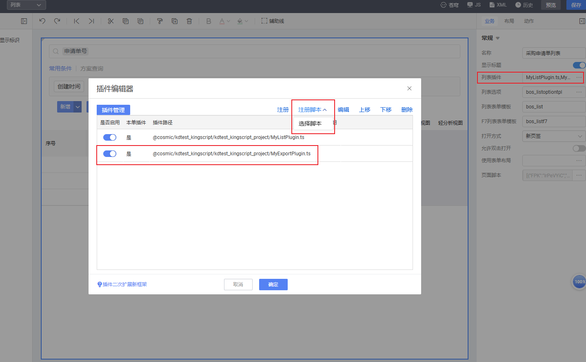

# 引出插件 KingScript 开发指南

## 目录
1. [概述](#概述)
2. [快速入门](#快速入门)
3. [核心事件详解](#核心事件详解)

---

## 概述
引出实质为将列表数据按照模板或列表格式导出为Excel。使用引出插件时，继承`AbstractListPlugin`插件并注册到列表即可

---

## 快速入门
本指南主要演示通过vscode编写脚本插件，并完成插件注册过程。
### 1. 新建ts文件，继承`AbstractListPlugin`插件
```kingscript
import { AfterQueryOfExportEvent } from "@cosmic/bos-core/kd/bos/form/events";
import { AbstractListPlugin } from "@cosmic/bos-core/kd/bos/list/plugin";

class MyExportPlugin extends AbstractListPlugin {
    //事件根据自己的业务需要去重写，此处仅是演示，相关事件介绍参考核心事件详解章节
    afterQueryOfExport(e: AfterQueryOfExportEvent): void {
        super.afterQueryOfExport(e);
    }
}

let plugin = new MyExportPlugin();

export { plugin };
```

### 2. 右键上传ts文件到环境中

### 3. 注册脚本插件，选择新建的脚本文件


---

## 核心事件详解
| 事件  | 说明 | 典型用途 |
|-----| ---- |------|
| beforeQueryOfExport   | 查询导出数据前事件 | 可以用来修改过滤条件、排序规则等     |
| afterQueryOfExport   | 查询导出数据后事件 |  可以用来修改查询返回的数据，比如修改字段数据等    |
| beforeExportFile   | 导出文件前事件 | 目前只可以用来修改导出的文件名     |
| afterExportFile   | 导出文件后事件 |  可以用来修改导出的文件内容，比如修改excel数据、格式、加密等    |