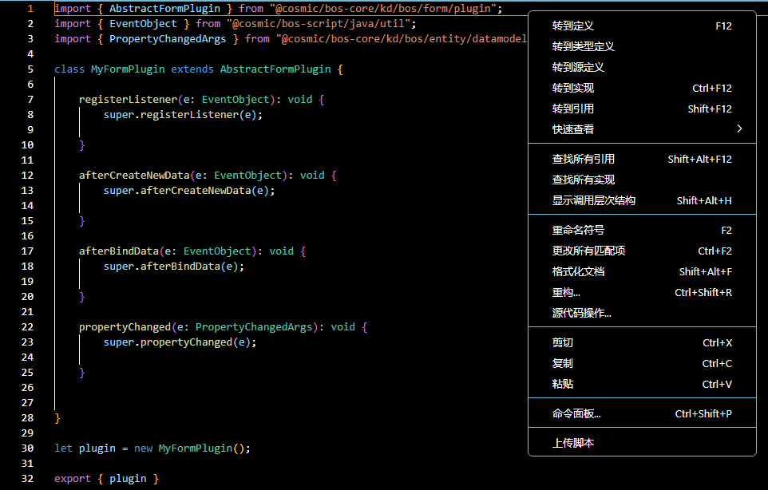
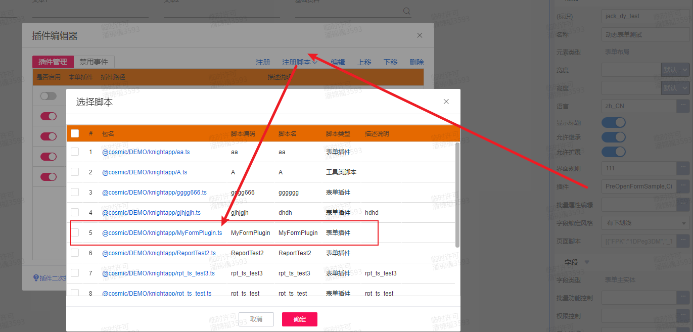

# 表单插件 KingScript 开发指南

## 目录
1. [概述](#概述)
2. [快速入门](#快速入门)
3. [核心事件详解](#核心事件详解)

---

## 概述
AbstractFormPlugin 继承链：
AbstractFormPlugin → AbstractDataModelPlugin
可通过继承AbstractFormPlugin插件实现动态表单插件事件能力。

---

## 快速入门
本指南主要演示通过vscode编写脚本插件，并完成插件注册过程。
### 1. 新建ts文件，继承`AbstractFormPlugin`插件
```kingscript
// MyFormPlugin.ts
import { AbstractFormPlugin } from "@cosmic/bos-core/kd/bos/form/plugin";
import { EventObject } from "@cosmic/bos-script/java/util";
import { PropertyChangedArgs } from "@cosmic/bos-core/kd/bos/entity/datamodel/events";

class MyFormPlugin extends AbstractFormPlugin {

    //注册事件监听
    registerListener(e: EventObject): void {
        super.registerListener(e);

    }

    //创建数据包之后
    afterCreateNewData(e: EventObject): void {
        super.afterCreateNewData(e);

    }

    //绑定数据包之后
    afterBindData(e: EventObject): void {
        super.afterBindData(e);

    }

    //属性值变更之后
    propertyChanged(e: PropertyChangedArgs): void {
        super.propertyChanged(e);

    }


}

let plugin = new MyFormPlugin();

export { plugin }
```
### 2. 右键上传ts文件到环境中

### 3. 在苍穹平台打开表单设计器，注册脚本插件，选择新建的脚本文件

---

## 核心事件详解
| 方法 | 触发时机 | 典型用途 |
|------|----------|----------|
| preOpenForm | 显示界面前，准备构建界面显示参数之前，触发此事件| 可以在此事件，取消界面的显示，或者修改显示参数 |
| loadCustomControlMetas | 显示界面前，构建界面显示参数时，触发此事件 | 可以在此事件修改显示参数，向前端动态增加控件 |
| initialize | 表单视图模型初始化，创建插件后，触发此事件 | 可以在此事件中，初始化必要的变量。***不可以在此事件设置字段值、设置控件状态、侦听控件事件、处理复杂逻辑*** |
| registerListener | 用户与界面上的控件进行交互时，触发此事件 | 可以在此事件，侦听各个控件的插件事件 |
| getEntityType | 表单基于主实体模型，创建数据包之前，触发此事件 | 可以在此事件，修改主实体模型，动态注册新的属性，从而实现向界面动态添加字段 |
| createNewData | 界面初始化或刷新，开始新建数据包之前，触发此事件 | 可以在此事件，自行创建界面数据包传回给系统，跳过系统内置的数据包创建过程 |
| afterCreateNewData | 界面初始化或刷新，新建表单数据包成功，并给字段填写了默认值之后，触发此事件 | 可以在此事件，重设字段的默认值 |
| beforeBindData | 界面数据包构建完毕，开始生成指令，刷新前端字段值、控件状态之前，触发此事件 | 可以在此事件中，调整后台视图模型(IFormView)中的字段、控件属性，间接控制前端界面字段值、控件状态 |
| afterBindData          | 界面数据包构建完毕，生成指令，刷新前端字段值、控件状态之后，触发此事件 | 可以在此事件，根据各字段值数据，重新设置控件、字段的可用、可见性等。***不要在此事件，修改字段值*** |
| beforeItemClick        | 用户点击菜单按钮后，在执行按钮绑定的操作前，触发此事件       | 可以在此事件，取消菜单绑定的操作                             |
| itemClick              | 用户点击菜单按钮时，触发此事件                               | 可以在此响应自定义菜单项的点击处理                           |
| beforeDoOperation      | 用户点击按钮、菜单，执行绑定的操作逻辑前，触发此事件         | 可以在此事件提示确认消息、校验数据，取消操作的执行、传递自定义操作参数给操作服务、操作插件 |
| afterDoOperation       | 用户点击按钮、菜单，执行完绑定的操作后，不论成功与否，均会触发此事件 | 可以在此事件，根据操作结果控制界面，进行操作后续处理。***这个事件是在表单界面层执行的，没有事务保护，不允许此事件同步修改数据库数据*** |
| confirmCallBack        | 用户确认了交互提示信息后，触发此事件，通知插件进行后续处理   | 可以在此事件，了解用户的态度，决定后续业务逻辑               |
| closedCallBack         | 子界面关闭时，触发父页面插件的此事件                         | 可以在此事件接收子界面返回的数据                             |
| flexBeforeClosed       | 弹性域维护界面关闭时，触发父界面此事件                       | 可以对弹性域录入值进行校验，取消弹性域录入界面的关闭         |
| onGetControl           | 在有代码尝试获取控件的编程模型时，触发此事件                 | 可以在此事件输出动态添加的控件的编程模型，侦听控件事件        |
| customEvent            | 前端自定义的控件，在与用户发生交互后，发送一个定制事件触发此事件 | 接收到此事件后，继续转发给业务插件，通知业务插件处理自定义控件的定制事件 |
| beforeClosed           | 界面关闭之前触发此事件                                       | 可以在此事件，取消界面关闭                                   |