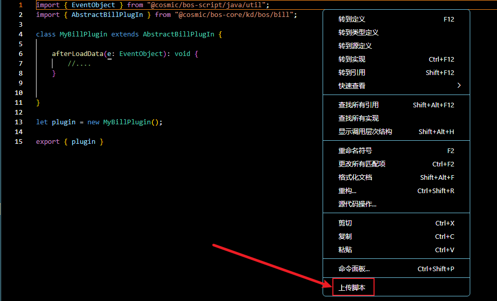
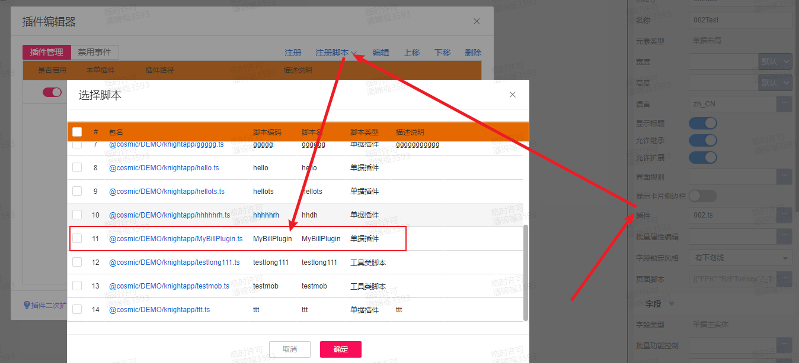

# 单据插件 KingScript 开发指南

## 目录
1. [概述](#概述)
2. [快速入门](#快速入门)
3. [核心事件详解](#核心事件详解)

---

## 概述
AbstractBillPlugIn 继承链：
AbstractBillPlugIn → AbstractFormPlugin → AbstractDataModelPlugin
可通过继承AbstractBillPlugIn插件实现动态表单插件和单据插件两个插件的事件能力。

---

## 快速入门
本指南主要演示通过vscode编写脚本插件，并完成插件注册过程。
### 1. 新建ts文件，继承`AbstractBillPlugIn`插件
```kingscript
// MyBillPlugin.ts
import { EventObject } from "@cosmic/bos-script/java/util";
import { AbstractBillPlugIn } from "@cosmic/bos-core/kd/bos/bill";

class MyBillPlugin extends AbstractBillPlugIn {

    afterLoadData(e: EventObject): void {
        //....
    }


}

let plugin = new MyBillPlugin();

export { plugin }
```
### 2. 右键上传ts文件到环境中

### 3. 在苍穹平台打开表单设计器，注册脚本插件，选择新建的脚本文件

---

## 核心事件详解
| 方法 | 触发时机 | 典型用途 |
|------|----------|----------|
| afterLoadData | 在单据数据加载完毕，还未绑定到界面前触发此事件| 可以在此事件可以对加载出的单据数据做调整 |