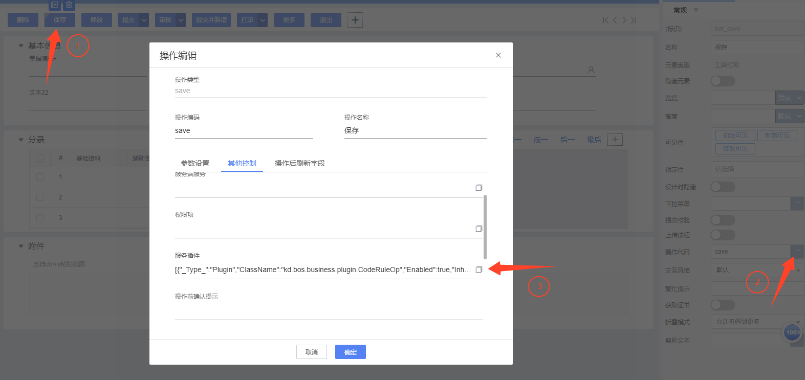
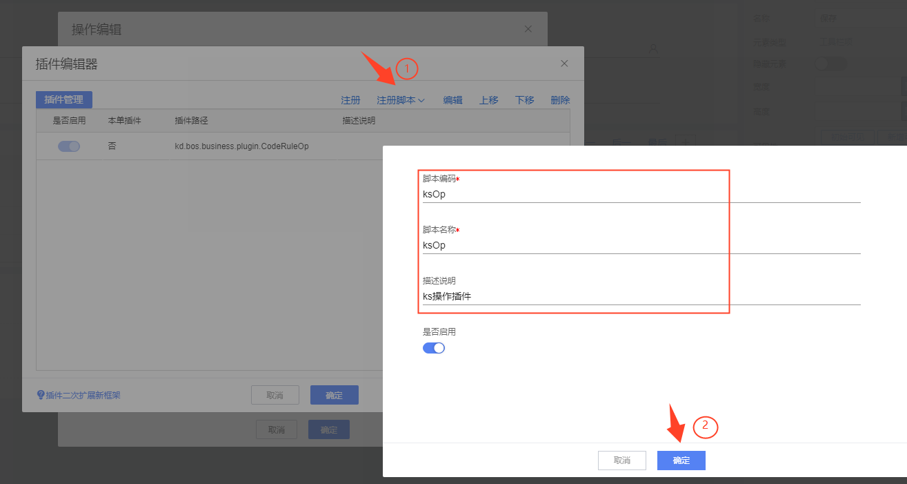
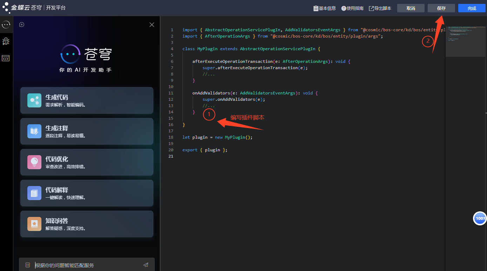

# 表单操作插件 KingScript 开发指南

## 目录
1. [概述](#概述)
2. [快速入门](#快速入门)
3. [核心事件详解](#核心事件详解)

---

## 概述
系统预置了一个操作插件基类 `AbstractOperationServicePlugIn` 实现了操作插件接口；
自定义的操作插件，继承预置的操作插件基类 `AbstractOperationServicePlugIn` 即可。

#### 单据操作说明
系统预置了一批操作，可以绑定在界面菜单、按钮上，用户点击按钮时，即自动执行这些操作，完成特定的操作功能。

这些预置的操作，可以根据是否写数据入库，分为两大类：
1. 表单操作：仅对表单界面及界面上的数据进行处理，不会写数据入库，如”新建”、”关闭”操作；
2. 实体操作：会写数据入库，只能配置在单据、基础资料上，如”保存”、”提交”、”审核”操作。

可以给单据上绑定的实体操作，单独开发操作插件，对操作写数据入库的过程，进行干预。

表单操作，不会写数据入库，只能针对表单界面及界面数据进行处理，不支持操作插件，但可以开发表单插件，对表单操作进行适度的干预；

与表单操作相关的表单插件事件，包括：
1. 菜单、按钮点击事件(`beforeitemClick`, `itemClick`, `beforeClick`, `click`)，可以取消操作的执行；
2. 操作执行前后事件(`beforeDoOperation`, `afterDoOperation`)，准备操作参数、接收操作执行结果刷新界面。

说明：实体操作清单。

下表列出了系统预置的实体操作，只能对这些操作，开发操作插件（其他未列出的操作属于界面操作，不能开发操作插件）。

| 操作                  | 典型用途                                                           |
|---------------------|----------------------------------------------------------------|
| 保存 (`save`)         | 把单据数据包中的数据，存入单据表格                                              |
| 保存并新增 (`saveandnew`)  | 把单据数据包中的数据，存入单据表格<br/>保存成功后，清空界面数据，进入新增状态                      |
| 状态转换 (`statusconvert`) | 切换单据状态字段值，并更新单据表格                                              |
| 提交 (`submit`)         | 切换单据状态字段值为”审核中”，并更新单据表格                                        |
| 提交并新增 (`submitandnew`) | 切换单据状态字段值为”审核中”， 并更新单据表格<br/>提交成功后，清空界面数据，进入新增状态               |
| 撤销 (`unsubmit`)       | 切换单据状态值为”暂存”， 并更新单据表格                                          |
| 审核 (`audit`)          | 切换单据状态值为”已审核”，并记录审核人，更新单据表格                                    |
| 反审核 (`unaudit`)       | 切换单据状态值为”暂存”，并清除审核人，更新单据表格                                     |
| 禁用 (`disable`)        | 切换使用状态为”停用”，并更新单据表格                                            |
| 启用 (`enable`)         | 切换使用状态为”启用”，并更新单据表格                                            |
| 作废 (`invalid`)        | 切换作废状态为”作废”，并更新单据表格                                            |
| 生效 (`valid`)          | 切换作废状态为”正常”，并更新单据表格                                            |
| 删除 (`delete`)         | 从单据表格中，删除单据数据                                                  |
| 空操作 (`donothing`)     | 特殊的实体操作，本身并不写单据入库<br/>但会执行操作的全部过程，包括权限校验、写日志，支持操作插件开发，触发全部操作事件 |

#### 插件接口

单据操作插件接口为IOperationServicePlugIn、IOperationService。

#### 方法介绍

插件基类 AbstractOperationServicePlugIn 内置了如下属性方法和本地变量，供插件访问，用以获取操作执行上下文：

| 方法名称       | 说明                                                                 |
|----------------|----------------------------------------------------------------------|
| `billEntityType` | 获取单据主实体，用于识别和操作单据的核心数据结构。                     |
| `operateMeta`    | 获取操作配置，通过该方法可以获知当前执行的操作信息，包括操作类型、目标单据等。 |
| `operationResult` | 获取操作结果，可以向其中添加操作提示信息，如成功消息、错误提示等，以便在操作完成后向用户展示。 |
| `getOption()`   | 获取自定义操作参数字典，可以包含各种自定义操作参数，用于在插件中根据特定需求进行定制化处理。 |

---

## 快速入门

### 注册 KingScript 操作插件






操作示例代码：
```kingscript
import { AbstractOperationServicePlugIn, AddValidatorsEventArgs } from "@cosmic/bos-core/kd/bos/entity/plugin";
import { AfterOperationArgs } from "@cosmic/bos-core/kd/bos/entity/plugin/args";
class MyPlugin extends AbstractOperationServicePlugIn {
    afterExecuteOperationTransaction(e: AfterOperationArgs): void {
        super.afterExecuteOperationTransaction(e);
        //...
    }
    onAddValidators(e: AddValidatorsEventArgs): void {
        super.onAddValidators(e);
        //...
    }
}
let plugin = new MyPlugin();
export { plugin };
```
---
## 核心事件详解

| 事件名称                | 触发时机                                                                 |
|-------------------------|--------------------------------------------------------------------------|
| `onPreparePropertys`    | 在单据列表上执行单据操作时，系统需要先根据传入的单据内码加载单据数据包；在加载单据数据包之前，触发此事件。插件需要在此事件中添加需要用到的字段。 |
| `onAddValidators`       | 系统预置的操作校验器加载完毕，执行校验之前，触发此事件。                 |
| `beforeExecuteOperationTransaction` | 操作校验通过之后，开启事务之前，触发此事件。                         |
| `beginOperationTransaction` | 操作校验通过，开启了事务，准备把数据提交到数据库之前触发此事件。         |
| `endOperationTransaction` | 数据已经提交到数据库之后，事务未提交之前，触发此事件。                   |
| `rollbackOperation`     | 操作事务提交失败，事务回滚之后触发此事件。                               |
| `afterExecuteOperationTransaction` | 操作执行完毕，事务提交之后，触发此事件。                             |
| `setContext`            | 设置上下文。                                                             |
| `initializeOperationResult` | 初始化操作结果集。                                                     |
| `onReturnOperation`     | 操作结束时触发此事件。操作服务执行完毕，准备返回操作结果之前，触发此事件。无论操作是否成功，都会触发此事件，允许插件基于操作结果进行后续处理，或者修改操作结果提示，释放资源。 |

