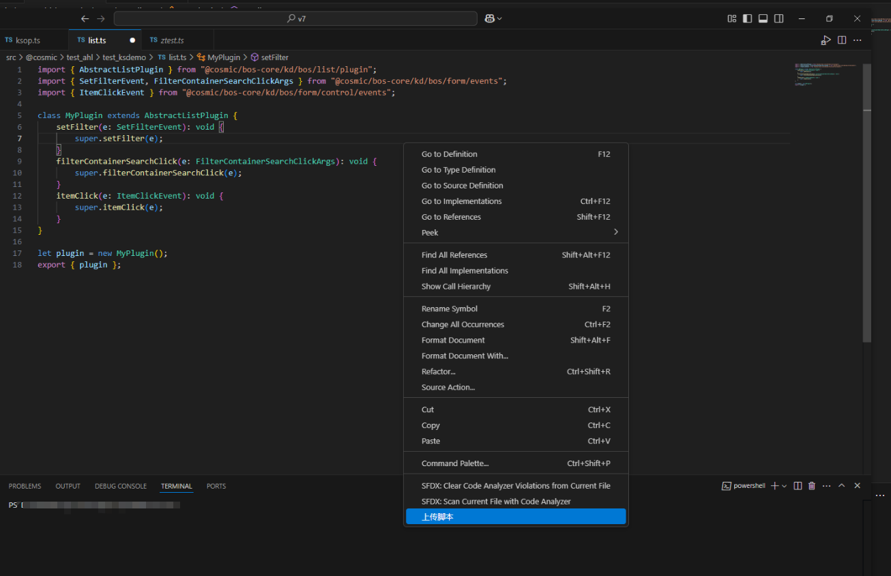
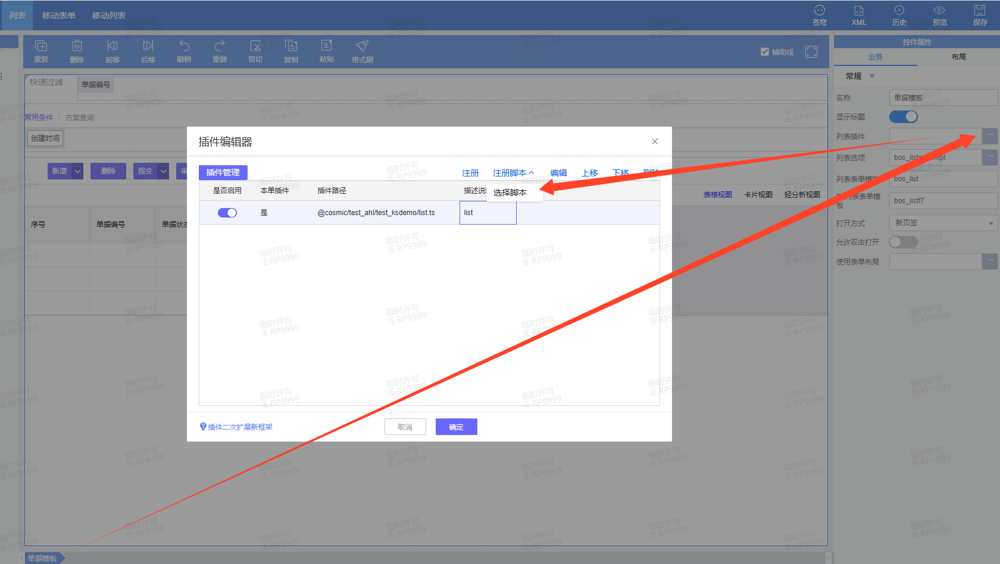

# 单据列表插件 KingScript 开发指南

## 目录
1. [概述](#概述)
2. [快速入门](#快速入门)
3. [核心事件详解](#核心事件详解)

---

## 概述
插件基类介绍在列表界面加载、过滤取数、显示的过程中，除了会触发动态表单的界面事件之外，还会触发特别定义的单据列表插件事件。

标准单据列表界面插件基类为 AbstractListPlugin，派生自动态表单界面插件基类，能够支持表单的各种事件。

---

## 快速入门
本指南主要演示通过vscode编写脚本插件，并完成插件注册过程。
### 1. 新建ts文件，继承`AbstractListPlugin`插件
```kingscript
import { AbstractListPlugin } from "@cosmic/bos-core/kd/bos/list/plugin";
import { SetFilterEvent, FilterContainerSearchClickArgs } from "@cosmic/bos-core/kd/bos/form/events";
import { ItemClickEvent } from "@cosmic/bos-core/kd/bos/form/control/events";

class MyPlugin extends AbstractListPlugin {
    setFilter(e: SetFilterEvent): void {
        super.setFilter(e);
    }
    filterContainerSearchClick(e: FilterContainerSearchClickArgs): void {
        super.filterContainerSearchClick(e);
    }
    itemClick(e: ItemClickEvent): void {
        super.itemClick(e);
    }
}

let plugin = new MyPlugin();
export { plugin };
```
### 2. 右键上传ts文件到环境中

### 3. 在苍穹平台打开列表设计器，注册脚本插件，选择新建的脚本文件

---

## 核心事件详解

### 事件说明
| 事件名称 | 说明 |
|------|--------| 
|billListHyperLinkClick|  超链接点击|
|beforeCreateListColumns|    列创建 |
|beforeCreateListDataProvider|   自定义取数(注意不要修改基础资料的引用属性，因为会打乱缓存数据，此方法只适合非基础资料字段修改)|
|setFilter| 设置过滤条件  |
|beforePackageData| 包装数据前，需要遍历这个数据包，用于格式化数据(注意不要修改基础资料的引用属性，因为会打乱缓存数据，此方法只适合非基础资料字段修改)|
|packageData| 包装数据，单元格填值，用于格式化数据|
|filterContainerInit|  过滤字段元数据初始化  |
|filterContainerSearchClick| 查询，过滤条件第一次解析，过滤条件是界面上的初始过滤值| 
|filterContainerAfterSearchClick| 最终查询条件解析后，可以在此事件得到最终解析后的过滤条件，然后做自定义处理|
|filterContainerBeforeF7Select|    常用过滤和方案过滤的F7监听  |
|filterColumnSetFilter| 过滤字段上的基础资料字段过滤条件调整事件|

### 事件生命周期

- 页面加载 
1. beforeCreateListDataProvider 
2. filterColumnSetFilter 
3. filterContainerInit 
4. beforeCreateListColumns 
5. setFilter 
6. packageData

- 点击查询
1. filterColumnSetFilter 
2. filterContainerInit 
3. filterContainerSearchClick 
4. filterContainerAfterSearchClick 
5. beforeCreateListColumns 
6. beforeCreateListDataProvider 
7. setFilter 
8. packageData