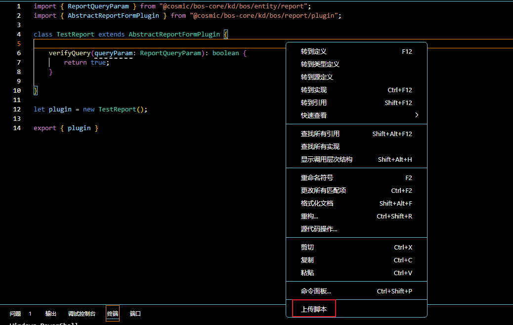
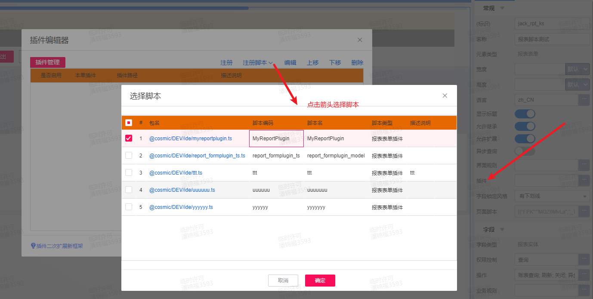

# 报表表单插件 KingScript 开发指南

## 目录
1. [概述](#概述)
2. [快速入门](#快速入门)
3. [核心事件详解](#核心事件详解)

---

## 概述
AbstractReportFormPlugin 继承链：
AbstractReportFormPlugin → AbstractFormPlugin → AbstractDataModelPlugin
可通过继承AbstractReportFormPlugin插件实现动态表单插件和报表插件两个插件事件能力。

---

## 快速入门
本指南主要演示通过vscode编写脚本插件，并完成插件注册过程。
### 1. 新建ts文件，继承`AbstractReportFormPlugin`插件
```kingscript
// MyReportPlugin.ts
import { ReportQueryParam } from "@cosmic/bos-core/kd/bos/entity/report";
import { AbstractReportFormPlugin } from "@cosmic/bos-core/kd/bos/report/plugin";

class MyReportPlugin extends AbstractReportFormPlugin {

    //事件根据自己的业务需要去重写，此处仅是演示，相关事件介绍参考核心事件详解章节
    verifyQuery(queryParam: ReportQueryParam): boolean {
        return true;
    }

}

let plugin = new MyReportPlugin();

export { plugin }
```
### 2. 右键上传ts文件到环境中

### 3. 在苍穹平台打开报表设计器，注册脚本插件，选择新建的脚本文件

---

## 核心事件详解
| 方法 | 触发时机 | 典型用途 |
|------|----------|----------|
| filterContainerInit | 渲染界面，控件绑定数据 | 初始化默认查询参数 |
| filterContainerBeforeF7Select | 过滤容器内基础资料f7点击 | 过滤容器内基础资料列表弹出前事件 |
| initDefaultQueryParam | loaddata没有默认方案时 | 初始化默认查询参数 |
| processRowData | 获取报表数据时 | 行数据处理，在创建表格列时之后 |
| packageData | 前端分页请求数据时 | 发送到前端的数据打包 |
| formatDisplayFilterField | 报表查询数据后  | 格式化主界面显示的筛选过滤字段 |
| verifyQuery | 报表查询数据前 | 查询前条件验证 |
| beforeQuery | 报表查询数据前 | 查询取数前事件，在verifyQuery之后触发 |
| afterQuery   | 报表查询数据后  | 查询取数后事件 |
| afterCreateColumn | 查询完数据创建报表列 | 表格列创建完成后 |
| filterContainerSearchClick | 过滤容器搜索 | 过滤容器搜索点击事件 |
| setOtherEntryFilter | 保存过滤方案             | 设置其他单据体过滤信息事件 |
| loadOtherEntryFilter | 加载过滤方案 | 加载其他单据体过滤信息事件，在afterSetModelValue之后 |
| preProcessExportData | 导出数据 | 报表导出之前事件，可以对数据进行加工 |
| afterSetModelValue  | 加载过滤方案   | 加载方案中给model设置值后触发事件，业务可以重新设置值 |
| setTreeReportList | 报表查询数据 | 调用插件取数之前设置折叠树形报表 |
| setFlexProperty | 报表查询数据 | 设置弹性域维度 |
| beforeCreateFilterInfo | 创建表格列时             | 过滤信息加载事件，主要用于设置列比较符 |
| setSortAndFilter | 创建表格列时 | 设置过滤排序列 |
| getComboItems | 创建表格列时             | 获取下拉值事件，插件可调整下拉列表枚举值集合，主要用于列头过滤场景 |
| setFloatButtomData  | 获取报表数据时  | 可以重新设置合计行的数据 |
| setCellStyleRules | 创建表格列时             | 自定义报表单元格规则 |
| setExcelName | 导出数据 | 自定义报表引出的名称 |
| setMergeColums   | 创建表格列时   | 自定义指定报表融合列 |
| resetColumns | 导出数据 | 导出支持重设表格列显示字段顺序 |
| setRowCellStyleEvent | 导出数据                 | 设置行样式 |
| resetDataCount   | 获取报表数据时           | 重设前端展示报表总行数，在processRowData之后，防止processRowData中增加或者减少数据导致总数不对 |
| exportInitialize | 导出数据 | 报表导出初始化事件 |
| colHeadFilterClick | 列头过滤 | 表头过滤字段点击确定时触发， 可用于更改下拉列表表头过滤字段下拉项 |