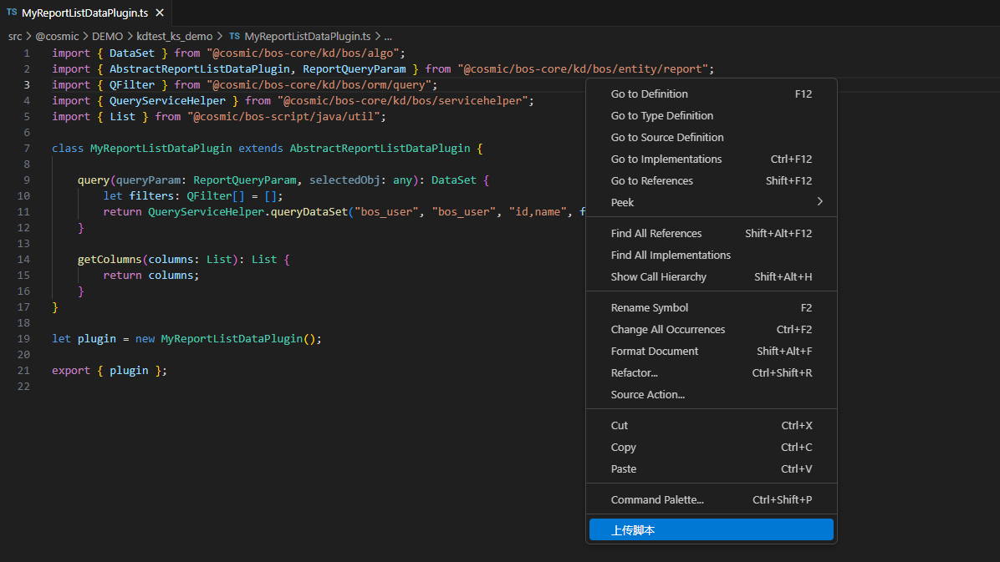
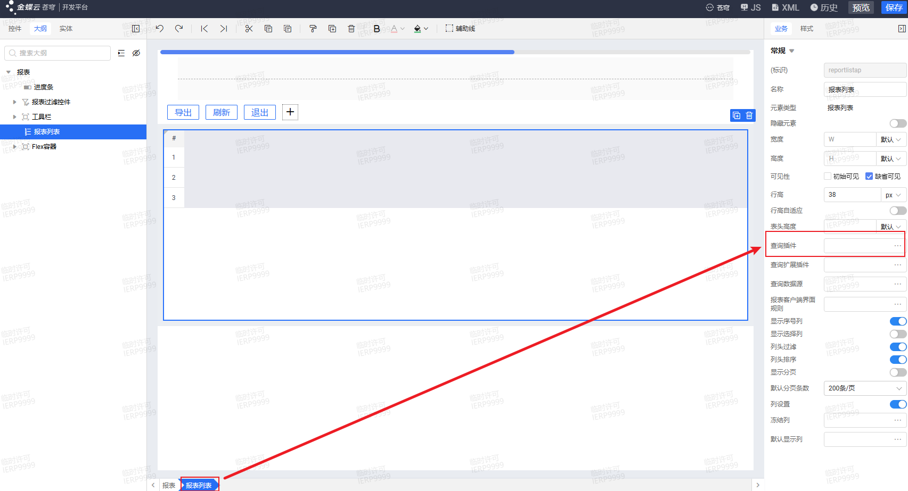
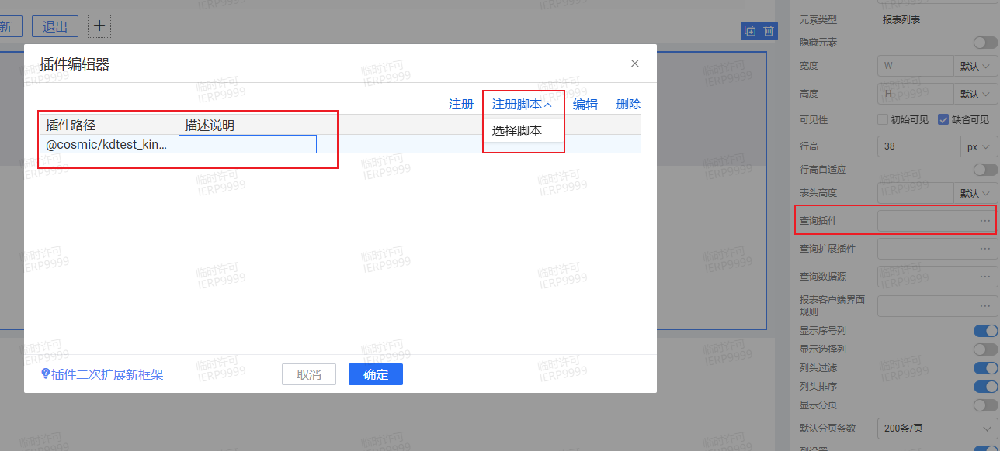

# 报表查询插件 KingScript 开发指南

## 目录
1. [概述](#概述)
2. [快速入门](#快速入门)
3. [核心事件详解](#核心事件详解)

---

## 概述
报表取数插件，必须从插件基类AbstractReportListDataPlugin中派生。

---

## 快速入门
本指南主要演示通过vscode编写脚本插件，并完成插件注册过程。
### 1. 新建ts文件，继承`AbstractReportListDataPlugin`插件
```kingscript
import { DataSet } from "@cosmic/bos-core/kd/bos/algo";
import { AbstractReportListDataPlugin, ReportQueryParam } from "@cosmic/bos-core/kd/bos/entity/report";
import { QFilter } from "@cosmic/bos-core/kd/bos/orm/query";
import { QueryServiceHelper } from "@cosmic/bos-core/kd/bos/servicehelper";
import { List } from "@cosmic/bos-script/java/util";

class MyReportListDataPlugin extends AbstractReportListDataPlugin {
    //事件根据自己的业务需要去重写，此处仅是演示，相关事件介绍参考核心事件详解章节
    getColumns(columns: List): List {
        return columns;
    }
}

let plugin = new MyReportListDataPlugin();

export { plugin };
```
### 2. 右键上传ts文件到环境中

### 3. 注册脚本插件位置

### 4. 在苍穹平台打开报表设计器，注册脚本插件，选择新建的脚本文件

---

## 核心事件详解
| 方法 | 说明  |
|------|-----|
| query | query事件用于对数据列操作 |
| getColumns | getColumns事件里可以对指定的列属性修改 |