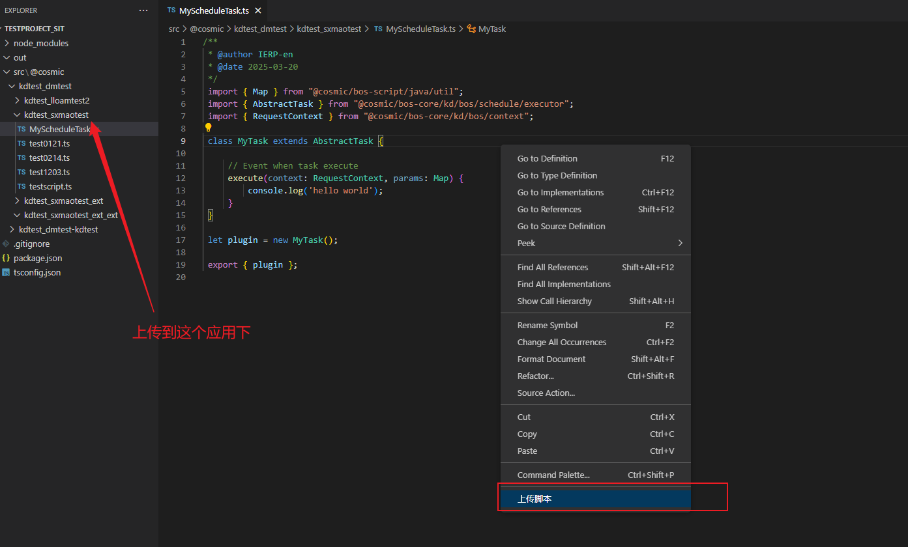
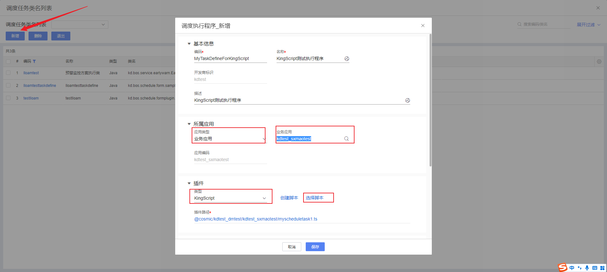
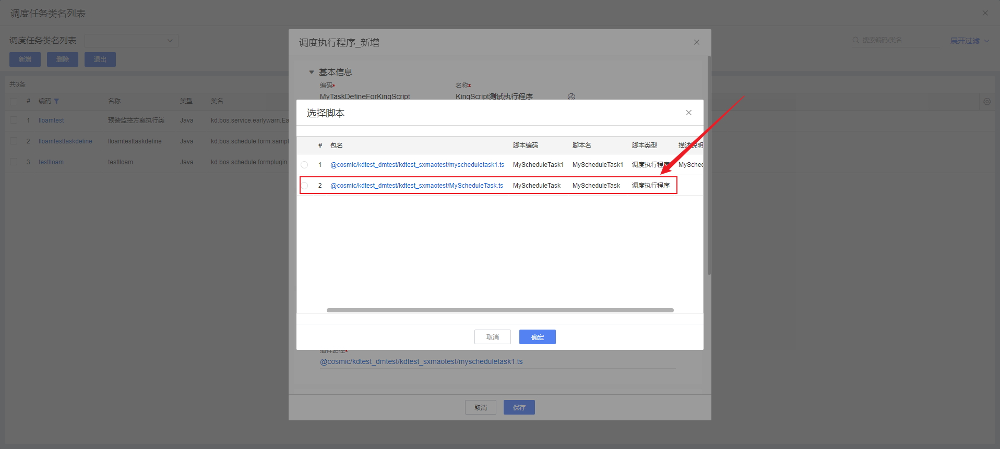
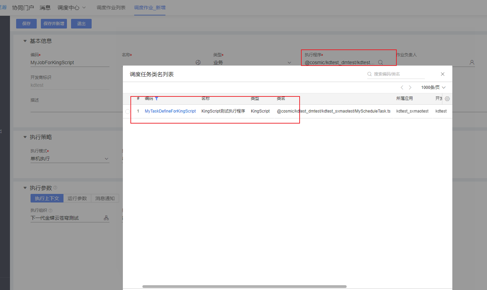
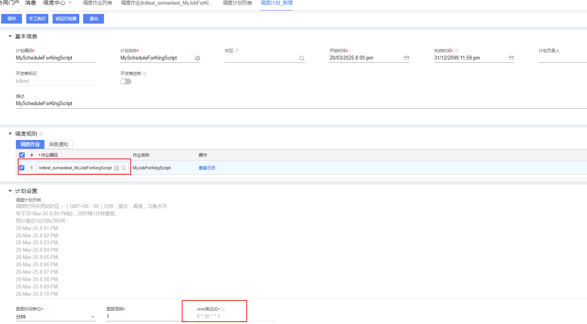
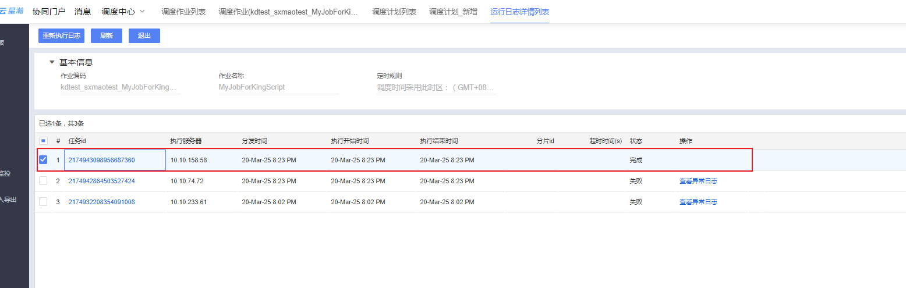

# 调度插件KingScript开发指南

## 目录

1.[概述](#概述)

2.[快速入门](#快速入门)

3.[核心事件详解](#核心事件详解)

---

## 概述

`AbstractTask` 继承链：

`AbstractTask` → `Task`

可通过继承`AbstractTask`插件实现调度任务相关事件能力。

## 快速入门

本指南主要演示通过vscode编写脚本插件，并完成调度执行成KingScript插件注册过程，实现调度任务通过KingScript脚本启动。

### 1.新建ts文件，继承`AbstractTask`插件

```typescript
/**
 * @author IERP-en
 * @date 2025-03-20
 */
 import { Map } from "@cosmic/bos-script/java/util";
 import { AbstractTask } from "@cosmic/bos-core/kd/bos/schedule/executor";
 import { RequestContext } from "@cosmic/bos-core/kd/bos/context";
 
 class MyTask extends AbstractTask {
 
     // Event when task execute
     execute(context: RequestContext, params: Map) {
         // 此处编写程序逻辑
     }
 }
 
 let plugin = new MyTask();
 
 export { plugin };
 
```

### 2.右键上传ts文件到环境中



### 3.选择脚本

在苍穹开发平台搜索`sch_taskdefine`页面，进入列表，新增执行程序，应用选择刚刚上传的应用，例`kdtest_sxmaotest`，插件类型选择KingScript，点击`选择脚本`即可看到刚刚上传的脚本。





### 4.新建调度作业



### 5.新建调度计划



### 6.运行结果



## 核心事件详解

| 方法    | 触发时机         | 典型用途                   |
| ------- | ---------------- | -------------------------- |
| execute | 执行程序入口方法 | 所有脚本程序必须含有此方法 |

### 内置方法详解

| 方法 | 用途                                             |
| ---- | ------------------------------------------------ |
| stop | 停止当前任务执行（将会抛出一个异常中断程序运行） |


