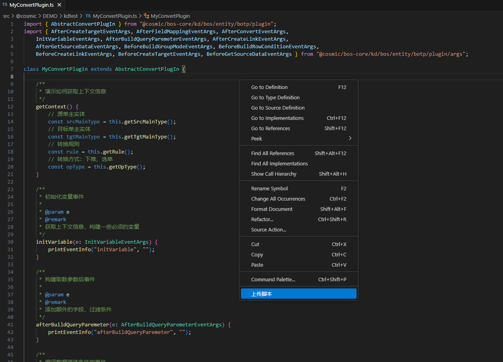
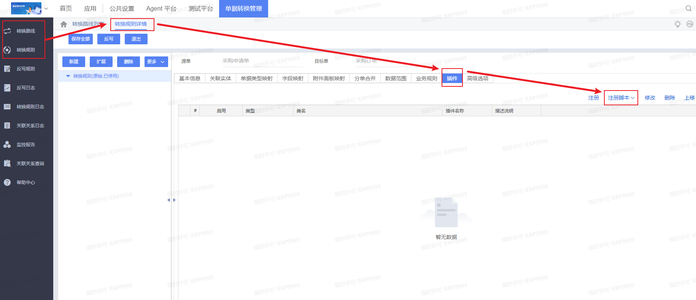
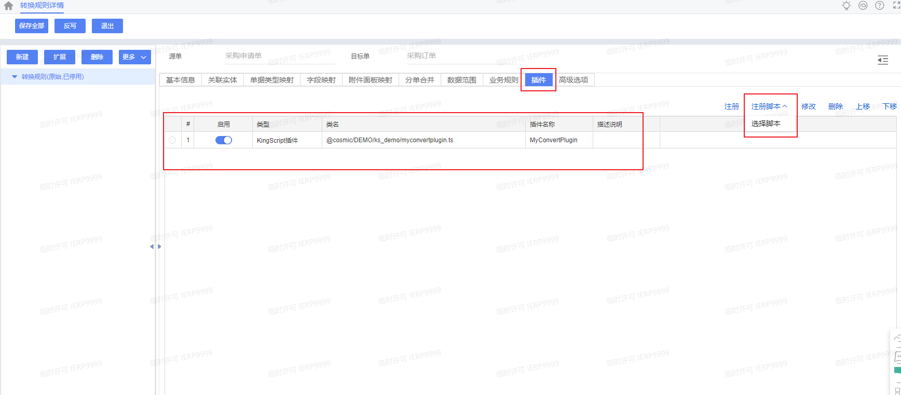

# 单据转换插件 KingScript 开发指南

## 目录
1. [概述](#概述)
2. [快速入门](#快速入门)
3. [核心事件详解](#核心事件详解)

---

## 概述
系统预置了单据转换插件基类`AbstractConvertPlugIn`，单据转换插件，必须从插件基类`AbstractConvertPlugIn`中派生。

#### 插件接口和实现类
单据转换插件实现了转换插件接口`IConvertPlugin`

---

## 快速入门
本指南主要演示通过vscode编写脚本插件，并完成插件注册过程。
### 1. 新建ts文件，继承`AbstractConvertPlugIn`插件
```kingscript
import { AbstractConvertPlugIn } from "@cosmic/bos-core/kd/bos/entity/botp/plugin";
import { AfterBuildQueryParemeterEventArgs, BeforeBuildRowConditionEventArgs, InitVariableEventArgs } from "@cosmic/bos-core/kd/bos/entity/botp/plugin/args";

class MyConvertPlugin extends AbstractConvertPlugIn {
    //事件根据自己的业务需要去重写，此处仅是演示，相关事件介绍参考核心事件详解章节
    initVariable(e: InitVariableEventArgs) {
        super.initVariable(e);
    }

    afterBuildQueryParemeter(e: AfterBuildQueryParemeterEventArgs) {
        super.afterBuildQueryParemeter(e);
    }

    beforeBuildRowCondition(e: BeforeBuildRowConditionEventArgs) {
        super.beforeBuildRowCondition(e);
    }
}

let plugin = new MyConvertPlugin();

export { plugin };
```
### 2. 右键上传ts文件到环境中

### 3. 注册脚本插件位置
【单据转换管理】→新增或修改一条【转换路线】→【插件】→【注册脚本】

### 4. 注册脚本插件，选择新建的脚本文件
自定义单据转换插件，必须扩展插件基类`AbstractConvertPlugIn`，绑定到单据转换规则上


---

## 核心事件详解
| 事件 | 触发时机 | 典型用途                                                            |
| ---- | ---- |-----------------------------------------------------------------|
| initVariable | 初始化变量事件 | 可以在此事件中，对本地变量进行初始化                                              |
| afterBuildQueryParemeter | 构建取数参数后事件 | 以在此事件中，增加需要加载的源单字段，调整源单行取数条件                                    |
| beforeBuildRowCondition | 编译数据筛选条件前事件 | 可以在此事件，忽略转换规则上配置的条件，改用插件定制条件，或者追加插件定制条件                         |
| beforeGetSourceData | 取源单数据前事件 | 可以对取数SELECT子句、取数条件，做最后的修改                                       |
| afterGetSourceData | 取源单数据后事件 | 可以根据通过条件的源单行数据，获取其他定制的引用数据；也可以直接替换掉系统自动获取到的源单行数据，改用插件自定读取的源单行数据 |
| beforeBuildGroupMode | 构建分单、行合并模式之前事件 | 可以在此事件，调整分单依赖的字段，影响后续的分单                                        |
| beforeCreateTarget | 暂未触发 | 可以在此事件，获取到现有的目标单数据包，提前进行定制处理                                    |
| afterCreateTarget | 创建目标单据数据包后事件 | 可以在此事件，对目标单字段设置默认值，或者根据源单字段值，动态生成目标单字段值                         |
| afterFieldMapping | 目标字段赋值完毕后事件 | 可以在此事件中，对目标单字段值，进行修订、计算、汇总等，或者根据生成的目标单字段值，进行拆单、拆行               |
| beforeCreateLink | 记录关联关系前事件 | 可以在此事件，撤销记录源单信息                                                 |
| afterCreateLink | 记录关联关系后事件 | 可以在此事件，根据目标单记录的源单信息，携带其他数据到目标单                                  |
| afterConvert | 单据转换完毕事件，最后执行 | 可以在这个事件，对生成的目标单数据，进行最后的调整                                       |