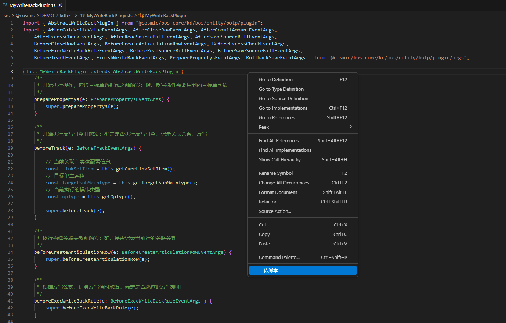
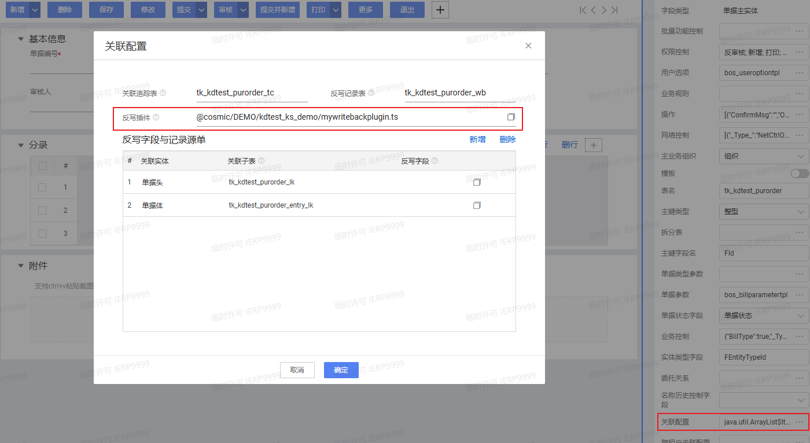

# 单据反写插件 KingScript 开发指南

## 目录
1. [概述](#概述)
2. [快速入门](#快速入门)
3. [核心事件详解](#核心事件详解)

---

## 概述

#### 场景
BOTP反写规则可以应用在一对已绑定关联关系的单据上，通过配置反写规则使下游目标单在保存或审核时进行反写操作，将目标单的指定字段按一定计算规则反写到源单关联行的那个字段上，并根据反写结果改变源单的状态，实现下游单据向上游单据的自动数据转换，节省人力，提高效率。下游目标单据反写源单过程中，会触发反写插件事件，允许自定义插件进行干预。


#### 反写步骤
* 根据相应的操作和单据状态进行分组，分别执行不同的逻辑
* 执行业务跟踪、反写主干逻辑，生成待保存数据
  * 分析数据包，是否有需要处理关联关系的数据行，以及需要分页执行的数据行
  * 单线程同步执行反写
  * 构建分批反写执行类
  * 执行分批反写类
  * 执行反写逻辑
    * 构建关联勾稽行
    * 基于当前数据，构建单据级追踪记录
    * 对比历史记录，生成分录行级追踪记录
    * 执行反写前，加载当前操作需要用到的反写规则
    * 构建源单追溯树
    * 基于最新反写规则，构建反写需求
    * 读取历史反写快照中用到的反写规则版本
    * 对比历史快照，计算本次实际需要反写的数量
    * 执行反写逻辑单元
    * 反写快照日志处理逻辑单元
  * 判断当前操作的单据，有没有读取到历史快照
  * 对比差异：生成待存储的单据级跟踪数据
  * 分析分批执行结果

---

## 快速入门
本指南主要演示通过vscode编写脚本插件，并完成插件注册过程。
### 1. 新建ts文件，继承`AbstractWriteBackPlugIn`插件
```kingscript
import { AbstractWriteBackPlugIn } from "@cosmic/bos-core/kd/bos/entity/botp/plugin";
import { BeforeCreateArticulationRowEventArgs, BeforeTrackEventArgs, PreparePropertysEventArgs } from "@cosmic/bos-core/kd/bos/entity/botp/plugin/args";

class MyWriteBackPlugin extends AbstractWriteBackPlugIn {
    //事件根据自己的业务需要去重写，此处仅是演示，相关事件介绍参考核心事件详解章节
    preparePropertys(e: PreparePropertysEventArgs) {
        super.preparePropertys(e);
    }

    beforeTrack(e: BeforeTrackEventArgs) {
        super.beforeTrack(e);
    }

    beforeCreateArticulationRow(e: BeforeCreateArticulationRowEventArgs) {
        super.beforeCreateArticulationRow(e);
    }
}

let plugin = new MyWriteBackPlugin();

export { plugin };

```
### 2. 右键上传ts文件到环境中


### 3. 注册脚本插件，选择新建的脚本文件
自定义反写插件，必须扩展插件基类AbstractWriteBackPlugIn，注册到下游单据的关联配置属性中


---

## 核心事件详解
| 事件 | 触发时机 | 典型用途                                                                                                    |
| ---- | ---- |---------------------------------------------------------------------------------------------------------|
| preparePropertys | 在读取下游目标单数据之前，触发此事件 | 可以在此事件中，指定需要用到的下游单据字段名，以确保在后续读取下游单据数据包时，会包含反写插件需用到的字段。 这个事件比设置上下文方法setContext更早执行，在此事件中，只能依赖事件参数获取上下文信息 |
| beforeTrack | 构建本关联主实体全部关联记录前，触发此事件 | 可用于取消关联、反写                                                                                              |
| beforeCreateArticulationRow | 构建本关联主实体，单行数据与源单的关联记录前，触发此事件 | 可用于取消本行的关联、反写                                                                                           |
| beforeExecWriteBackRule | 开始分析反写规则，计算反写量前触发此事件 | 可用于取消当前反写规则的执行                                                                                          |
| afterCalcWriteValue | 基于下游单据当前行，反写值计算完毕后，触发此事件 | 可用于修正反写量，调整对各源单行的分配量                                                                                    |
| beforeReadSourceBill | 读取源单数据之前，触发此事件 | 可用于添加需要加载的源单字段                                                                                          |
| afterReadSourceBill | 取源单数据之后，触发此事件 | 可用于插件读取相关的第三方单据                                                                                         |
| afterCommitAmount | 执行反写规则，把当前反写量，写到源单行之后，触发此事件 | 可用于对源单行，进行连锁更新                                                                                          |
| beforeExcessCheck | 源单行反写执行完毕，超额检查前，触发此事件 | 可用于取消超额检查                                                                                               |
| afterExcessCheck | 对源单行反写执行完毕，超额检查完毕后，触发此事件 | 可用于控制是否中止反写、提示超额，修正提示内容                                                                                 |
| beforeCloseRow | 关闭上游行前调用 | 可用于取消                                                                                                   |
| afterCloseRow | 对上游行进行了关闭状态填写后调用 | 可同步修改其他状态值                                                                                              |
| beforeSaveTrans | 反写逻辑处理完毕，开始开启事务，保存反写数据前触发此事件 | 可用于插件在事务前读取并处理第三方数据，以便在随后开启的事务中一并保存                                                                     |
| beforeSaveSourceBill | 反写规则执行完毕后，源单数据保存到数据库之前调用 | 可用于拿到完整的源单数据包，统一修正字段值                                                                                   |
| afterSaveSourceBill | 源单数据保存到数据库后调用 | 可用于同步保存第三方单据                                                                                            |
| rollbackSave | 保存失败，触发此事件，通知插件回滚数据 | 可用于保存失败时通知插件回滚数据                                                                                        |
| finishWriteBack | 反写所有逻辑已经执行完毕后触发 | 可用于通知插件释放资源，如插件申请的网控                                                                                    |