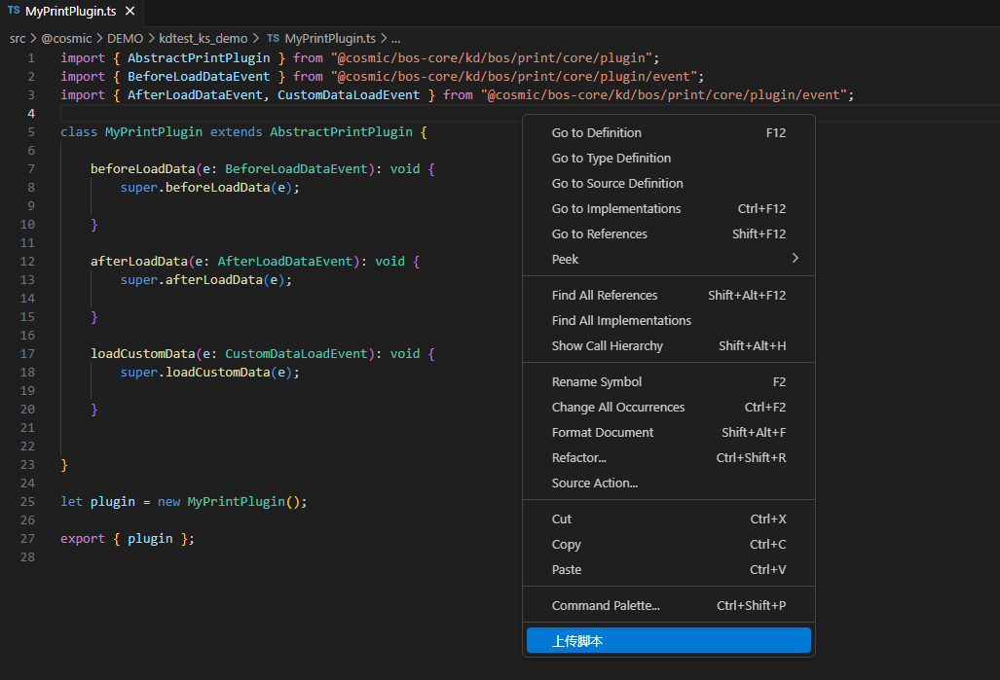
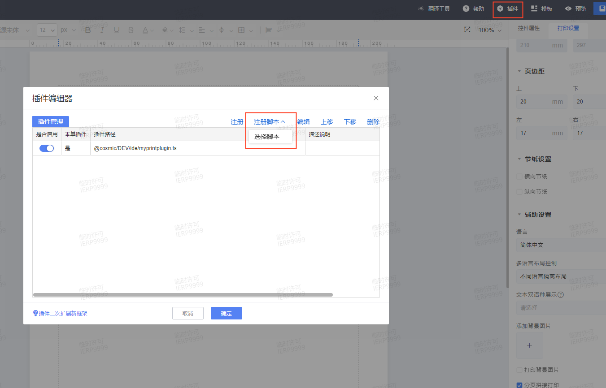

# 打印插件 KingScript 开发指南

## 目录
1. [概述](#概述)
2. [快速入门](#快速入门)
3. [核心事件详解](#核心事件详解)

---

## 概述
打印模板插件的基类为： AbstractPrintPlugin。 打印模板插件，必须从插件基类AbstractPrintPlugin派生而出，通过实现其定义的插件方法，从而实现自己想要的功能。

---

## 快速入门
本指南主要演示通过vscode编写脚本插件，并完成插件注册过程。
### 1. 新建ts文件，继承`AbstractPrintPlugin`插件
```kingscript
import { AbstractPrintPlugin } from "@cosmic/bos-core/kd/bos/print/core/plugin";
import { BeforeLoadDataEvent } from "@cosmic/bos-core/kd/bos/print/core/plugin/event";
import { AfterLoadDataEvent, CustomDataLoadEvent } from "@cosmic/bos-core/kd/bos/print/core/plugin/event";

class MyPrintPlugin extends AbstractPrintPlugin {
    //事件根据自己的业务需要去重写，此处仅是演示，相关事件介绍参考核心事件详解章节
    beforeLoadData(e: BeforeLoadDataEvent): void {
        super.beforeLoadData(e);
        
    }

    afterLoadData(e: AfterLoadDataEvent): void {
        super.afterLoadData(e);
        
    }

    loadCustomData(e: CustomDataLoadEvent): void {
        super.loadCustomData(e);
        
    }

    
}

let plugin = new MyPrintPlugin();

export { plugin };
```
### 2. 右键上传ts文件到环境中


### 3. 注册脚本插件，选择新建的脚本文件
将插件注册到打印模版上，入口：模板右上角“插件”。


---

## 核心事件详解
| 事件                 | 触发时机                         | 典型用途                                                                                                      |
|--------------------|------------------------------|-----------------------------------------------------------------------------------------------------------|
| afterLoadData      | 引擎数据加载完成后触发                  | 可用于对某些字段进行格式化、对数据结果集增加或删除、对单据列表数据进行排序，过滤、对分录数据进行排序，过滤和对数据进行合并汇总                                           |
| loadCustomData     | 模板配置了自定义数据源，引擎对自定义数据源进行取数时触发 | 可用于在插件中组装自定义数据源的数据                                                                                        |
| beforeInitWidget   | 文本，图片，条码，二维码，网格，表格等控件初始化前    | 可用于设置控件隐藏，下方控件是否跟随移动                                                                                      |
| beforeOutputRow    | 网格，表格行输出前触发                  | 可用于取消当前行不输出                                                                                               |
| afterOutputRow     | 网格，表格行输出后触发                  | 可用于在控件行计算完后对该行做一些设置                                                                                       |
| beforeExport       | 打印引擎开始往打印文件绘制打印内容前触发         | 可用于自定义设置输出文件名，当打印分文件输出时，会在该文件名后面添加后缀                                                                      |
| beforeExpFile      | 打印引擎输出文件前触发                  | 可用于自定义设置输出文件名。和beforeExport的区别在于，俩者触发的时机不一样，该事件中修改的文件名，是具体的某个文件的文件名，在分文件输出后，不会和beforeExport一样，再添加文件序号作为区分 |
| endExport          | 打印引擎在控件输出前，触发一次              | 可用于修改打印名称                                                                                                 |