# 二开示例.代码综合.金蝶AI星空增删改查常用方式样例

        ## 适用场景

        一篇偏“增删改查常用方式样例”的综合案例，适合沉淀成表单插件里最常见的 CRUD 操作模板。

        ## 原文链接

        - 社区原文: <https://vip.kingdee.com/knowledge/703248288652187904?specialId=570177930110532864&productLineId=40&isKnowledge=2&lang=zh-CN>

        ## 核心思路

        1. 增：新增分录、表头赋值。
2. 改：读取当前值后重算并回写。
3. 删：按当前行或指定行删除分录。
4. 查：从模型里读取表头和分录，再拼装摘要信息。

## 原文截图

以下截图来自社区原文，便于还原配置界面、效果或关键操作位置。

原文截图 1：
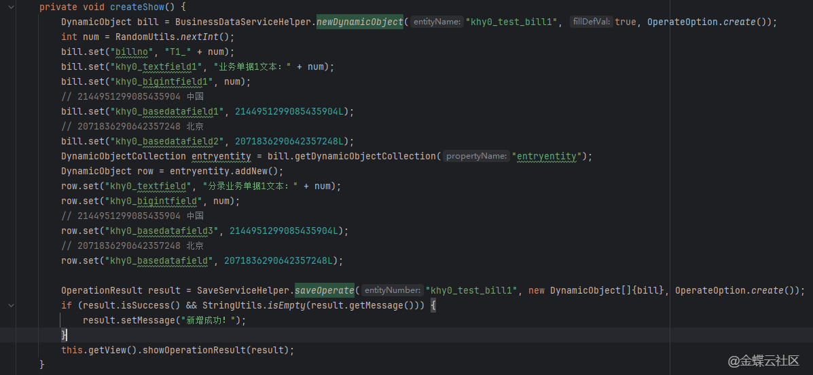

原文截图 2：
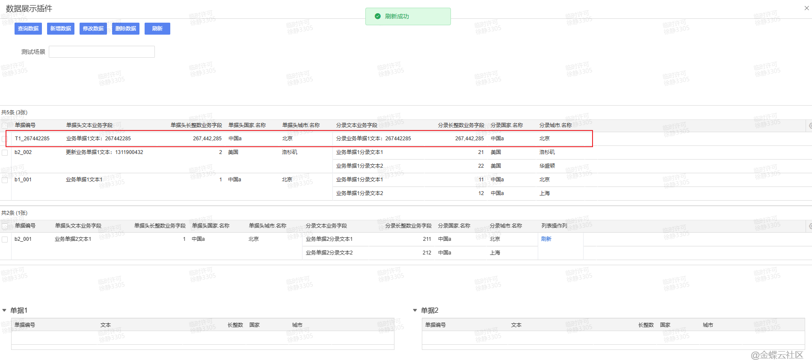

原文截图 3：
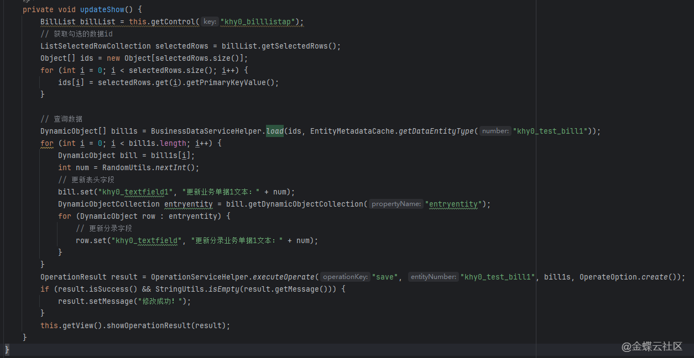

原文截图 4：
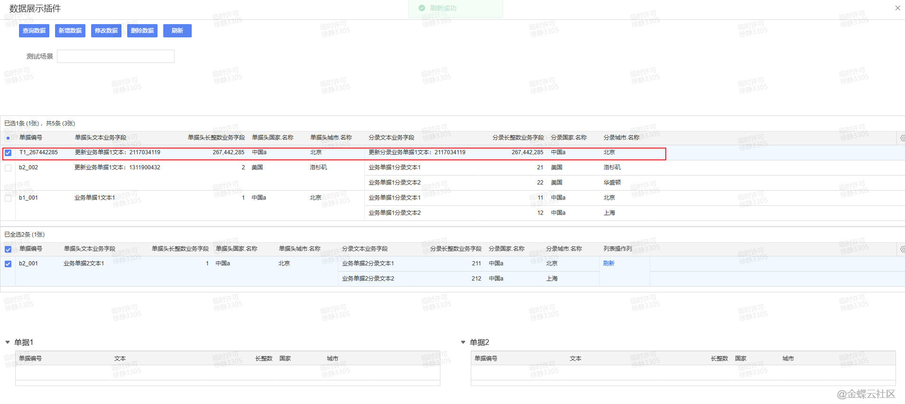

原文截图 5：
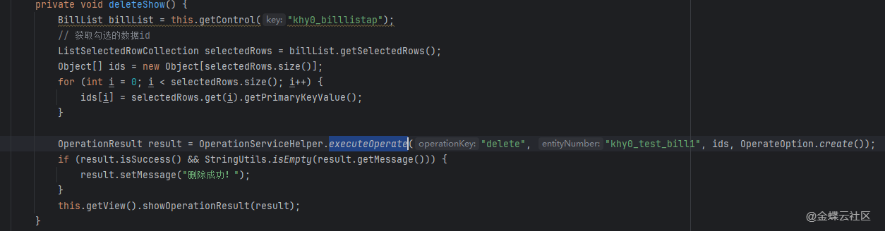

原文截图 6：
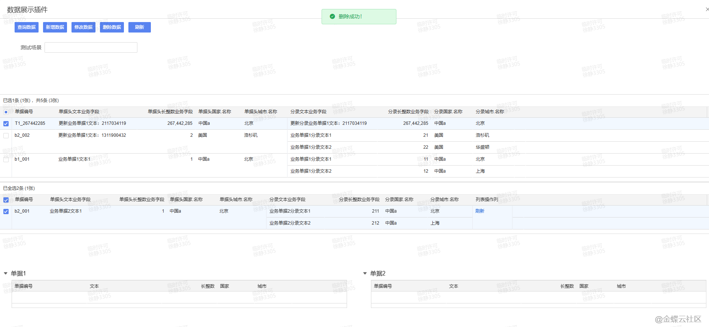

原文截图 7：
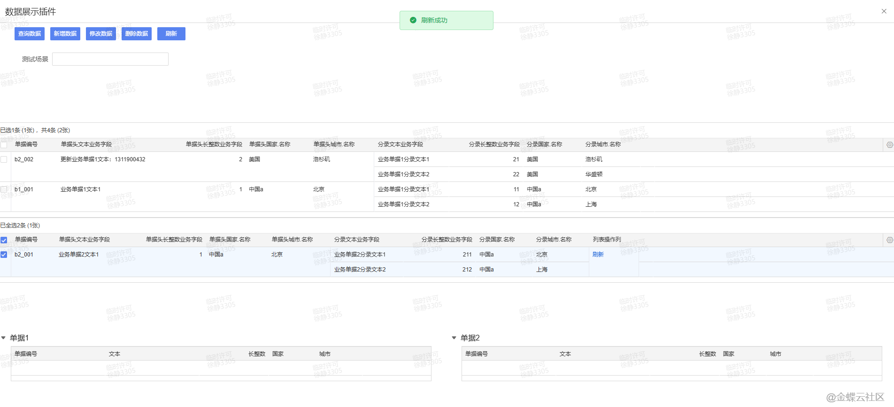

原文截图 8：
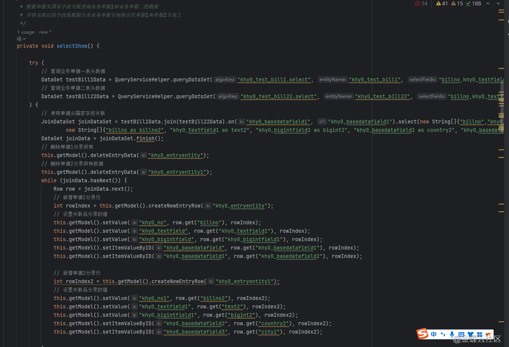

原文截图 9：
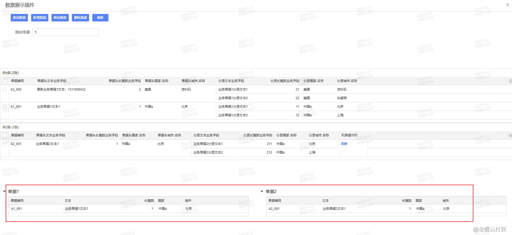

原文截图 10：
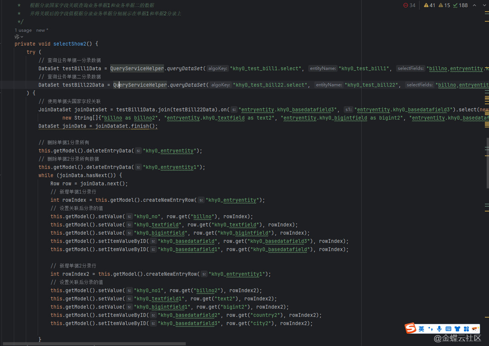

原文截图 11：
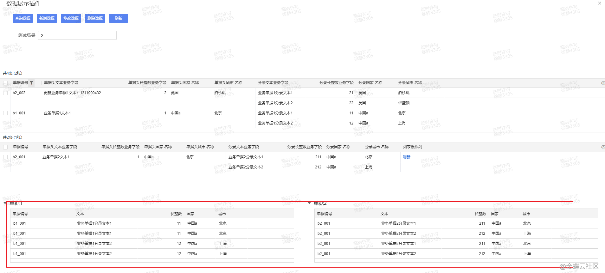

原文截图 12：
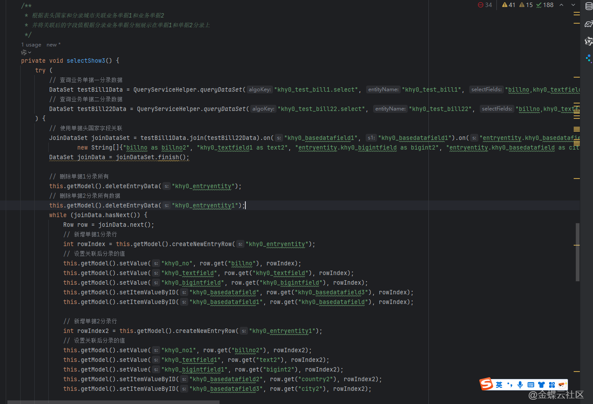

原文截图 13：
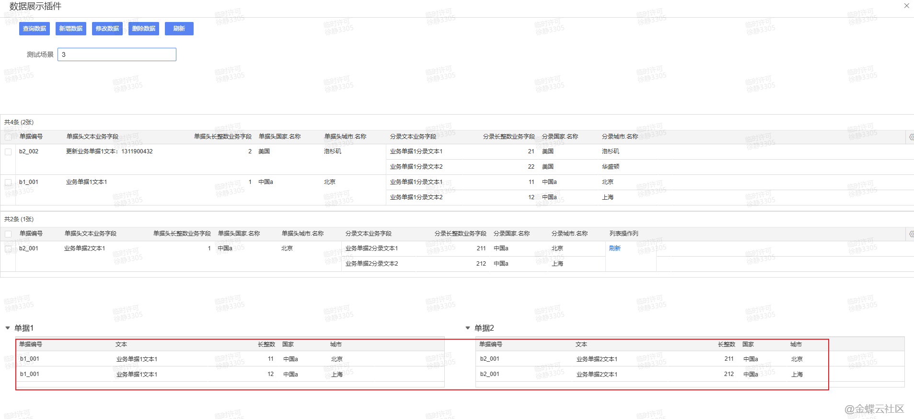

原文截图 14：
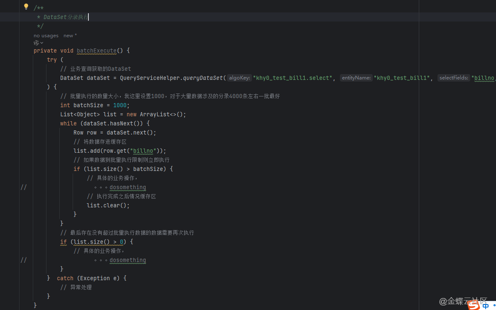
        ## 实现前提

        - 单据体示例标识：`billentry`
- 字段示例：`material`、`qty`、`price`、`amount`
- 按钮示例：`btn_add`、`btn_update`、`btn_delete`、`btn_query`

        ## Kingscript 实现

        ```ts
        import { AbstractBillPlugIn } from "@cosmic/bos-core/kd/bos/bill";
import { ItemClickEvent } from "@cosmic/bos-core/kd/bos/form/events";

class CrudSamplePlugin extends AbstractBillPlugIn {

  itemClick(e: ItemClickEvent): void {
    super.itemClick(e);

    if (e.getItemKey() === "btn_add") {
      const row = this.getModel().createNewEntryRow("billentry");
      this.getModel().setValue("material", 100001, row);
      this.getModel().setValue("qty", 1, row);
      this.getModel().setValue("price", 25, row);
      this.getModel().setValue("amount", 25, row);
      return;
    }

    if (e.getItemKey() === "btn_update") {
      const row = this.getModel().getEntryCurrentRowIndex("billentry");
      const qty = Number(this.getModel().getValue("qty", row) || 0);
      const price = Number(this.getModel().getValue("price", row) || 0);
      this.getModel().setValue("amount", qty * price, row);
      return;
    }

    if (e.getItemKey() === "btn_delete") {
      const row = this.getModel().getEntryCurrentRowIndex("billentry");
      if (row >= 0) {
        this.getModel().deleteEntryRow("billentry", row);
      }
      return;
    }

    if (e.getItemKey() === "btn_query") {
      const rowCount = this.getModel().getEntryRowCount("billentry");
      const billNo = this.getModel().getValue("billno");
      this.getView().showTipNotification("单据编号：" + billNo + "，当前分录数：" + rowCount);
    }
  }
}

let plugin = new CrudSamplePlugin();
export { plugin };
        ```

        ## 关键步骤说明

        1. 把增删改查分别落到独立按钮上，避免一个案例同时承担过多业务语义。
2. 新增和删除优先操作分录，便于快速看懂模型 API。
3. 修改逻辑用“数量 * 单价 = 金额”这种最直观的规则演示。

        ## 转写说明

        原文更像综合代码清单。这里按 skill 的使用方式，把它浓缩成一个容易搜到、容易改造的 CRUD 模板。

        ## 注意事项 / 风险点

        - `getValue(field, row)` 在不同上下文里如果项目封装不同，也可以替换成先取分录对象再读字段。
- 删除当前行前最好做 `row >= 0` 判断，避免没有选中分录时报错。
- 如果金额字段是 `BigDecimal`，需要按项目既有写法改成高精度计算。

        风险等级：`改字段标识后可用`

        ## 验证建议

        1. 新增后确认分录成功插入。
2. 修改按钮执行后确认金额会按数量和单价重算。
3. 删除按钮执行后确认当前分录被移除。

        ## 来源说明

        - L2 原文图片转写
- L4 本地资料校对
- L5 推断补全

        - 适合作为 skill 中的“综合基础模板”。
