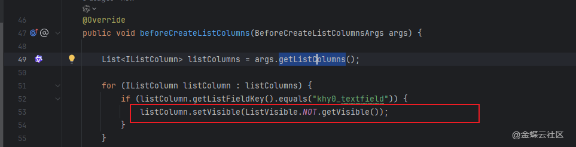
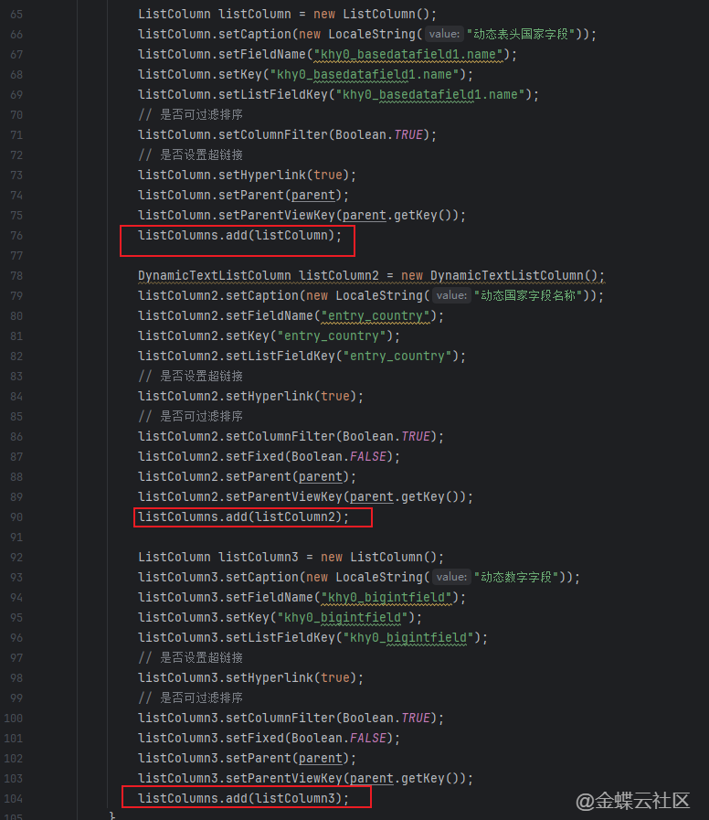
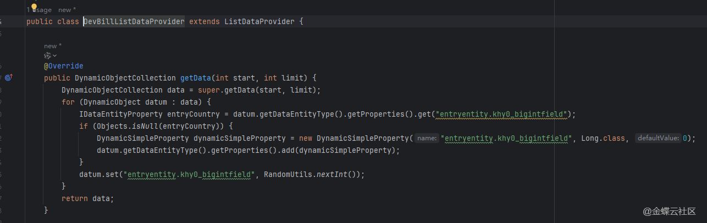
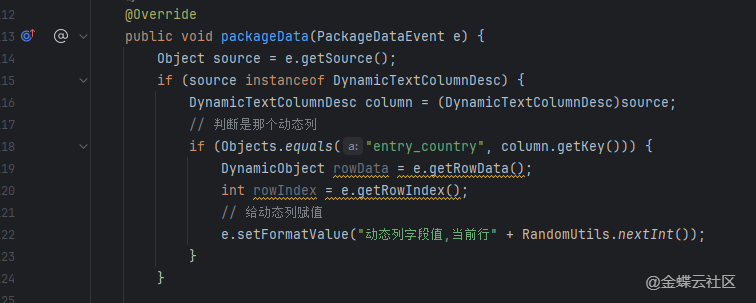
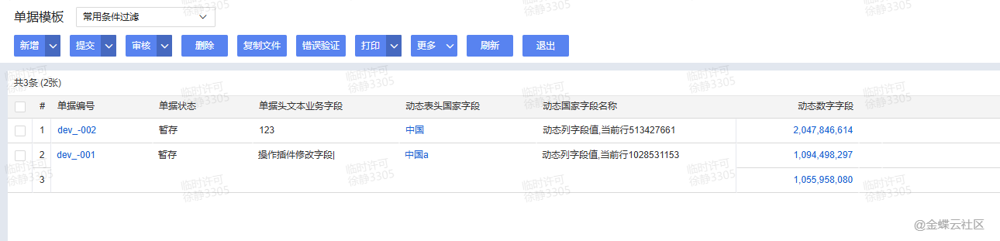

# 二开示例.列表插件.动态列实现

## 适用场景

列表需要根据业务场景动态显示、隐藏或追加列，例如不同入口展示不同列，或者根据查询结果构造动态指标列。

## 原文链接

- 社区原文: <https://vip.kingdee.com/knowledge/716295294820029952?specialId=570177930110532864&productLineId=40&isKnowledge=2&lang=zh-CN>

## 核心思路

1. 列表列的处理入口在 `beforeCreateListColumns(...)`。
2. 固定列的显示隐藏可以直接基于已有列集合判断；真正的动态列需要先生成列元数据，再在数据包装阶段回填值。
3. 如果动态列来自数据库聚合结果，建议先把列定义和行值缓存好，再在列表生命周期里分阶段使用。

## 原文截图

以下截图来自社区原文，便于还原配置界面、效果或关键操作位置。

原文截图 1：


原文截图 2：


原文截图 3：


原文截图 4：


原文截图 5：

## 实现前提

- 列表插件挂载在目标业务对象列表页面
- 动态列标题来源字段示例：月份、仓库、项目等

## Kingscript 实现

```ts
import { AbstractListPlugin } from "@cosmic/bos-core/kd/bos/list/plugin";
import { BeforeCreateListColumnsArgs } from "@cosmic/bos-core/kd/bos/list/events";
import { DynamicTextListColumn } from "@cosmic/bos-core/kd/bos/list";
import { LocaleString } from "@cosmic/bos-core/kd/bos/dataentity/entity";

class DynamicColumnListPlugin extends AbstractListPlugin {

  beforeCreateListColumns(args: BeforeCreateListColumnsArgs): void {
    super.beforeCreateListColumns(args);

    const monthKeys = ["2026-01", "2026-02", "2026-03"];
    for (let i = 0; i < monthKeys.length; i++) {
      const monthKey = monthKeys[i];
      const listColumn = new DynamicTextListColumn(
        "kdec_month_" + i,
        new LocaleString(monthKey),
        new $.java.util.ArrayList(),
        "{0}"
      );
      args.addListColumn(listColumn);
    }
  }
}

let plugin = new DynamicColumnListPlugin();
export { plugin };
```

## 关键步骤说明

1. 先明确动态列是“只隐藏已有列”还是“真的新增列”，两者复杂度不同。
2. 在 `beforeCreateListColumns(...)` 里处理列定义，在后续数据包装阶段按列 key 回填值。
3. 如果动态列很多，建议限制数量并做好列顺序规划，避免列表难以使用。

## 转写说明

原文强调的是动态列场景和实现分层。这里保留了最核心的列创建入口，并把复杂的数据回填逻辑留给后续实际项目按业务补充。

## 注意事项 / 风险点

- `DynamicTextListColumn` 能解决大部分文本型动态列；数值、下拉或复杂样式列需要换具体列类型。
- 列定义和数据包装必须使用同一套 key，否则界面会出现空列。
- 动态列过多时会明显影响列表可读性和渲染性能。

风险等级：`需按实际元数据调整`

## 验证建议

1. 打开列表确认动态列能按预期生成。
2. 切换不同场景参数，确认列数量和标题会跟着变化。
3. 如果继续补数据包装逻辑，确认每一列都能对应到正确的业务值。

## 来源说明

- L2 原文图片转写
- L4 本地资料校对
- L5 推断补全

- 本地 SDK 已确认 `BeforeCreateListColumnsArgs.addListColumn(...)` 与 `DynamicTextListColumn` 存在。
