# 二开示例.列表插件.同一个单据配置多个菜单显示不同的内容，新增页面默认不同的单据类型

## 适用场景

同一个业务对象通过不同菜单入口进入时，需要看到不同单据类型的数据；同时从当前入口新增单据时，也要默认落到对应的单据类型。

## 原文链接

- 社区原文: <https://vip.kingdee.com/knowledge/720657699377032960?specialId=570177930110532864&productLineId=40&isKnowledge=2&lang=zh-CN>

## 核心思路

1. 菜单入口先传入自定义参数，例如 `billtype` 或 `scene`。
2. 列表插件在 `setFilter` 中读取入口参数，追加单据类型过滤条件。
3. 新增页默认单据类型优先通过菜单入口参数或表单默认值配置解决，脚本主要负责列表侧隔离。

## 原文截图

以下截图来自社区原文，便于还原配置界面、效果或关键操作位置。

原文截图 1：
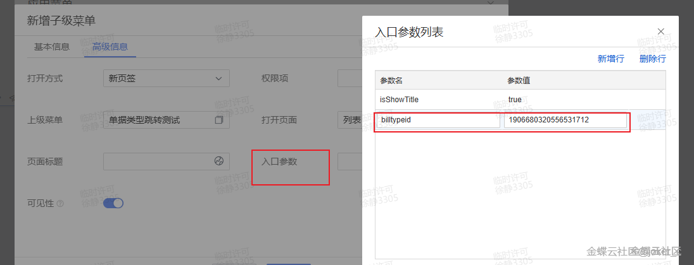

原文截图 2：
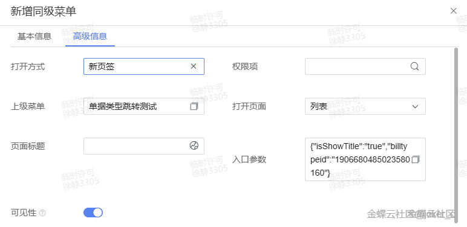

原文截图 3：
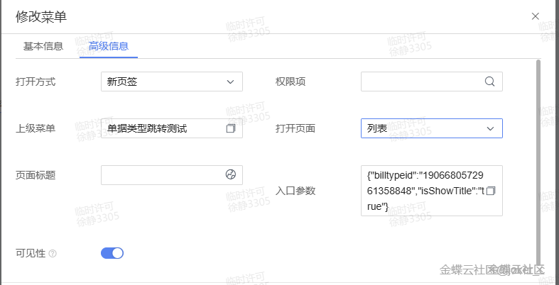

原文截图 4：
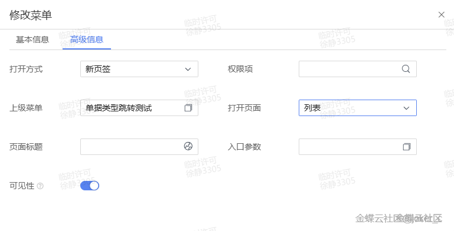

原文截图 5：


原文截图 6：
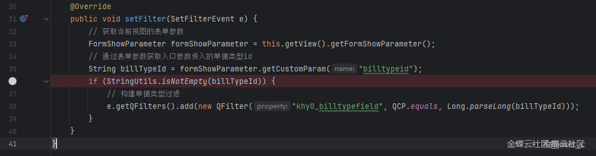

原文截图 7：
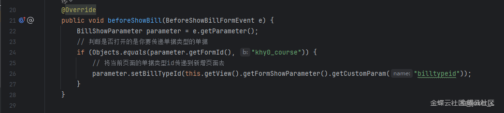

原文截图 8：
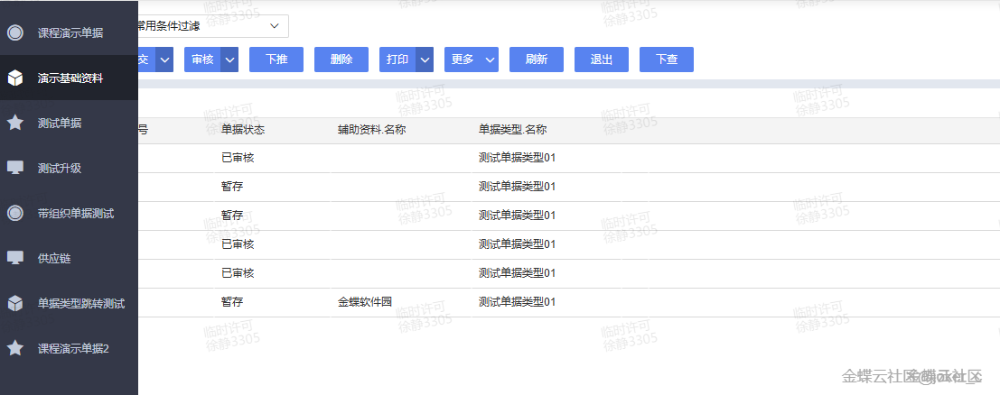

原文截图 9：
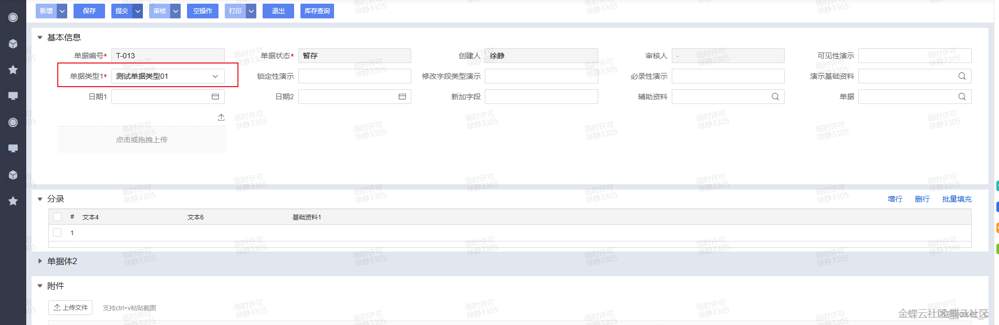

原文截图 10：
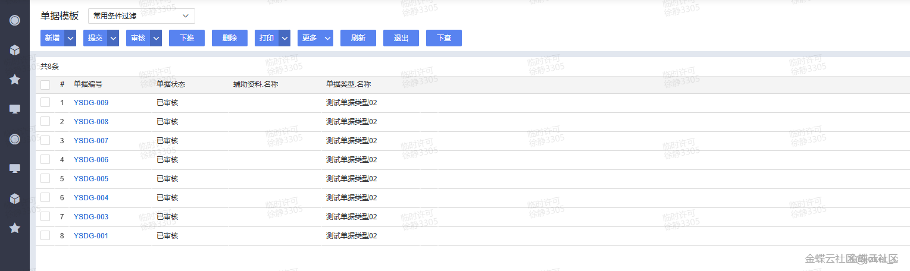

原文截图 11：
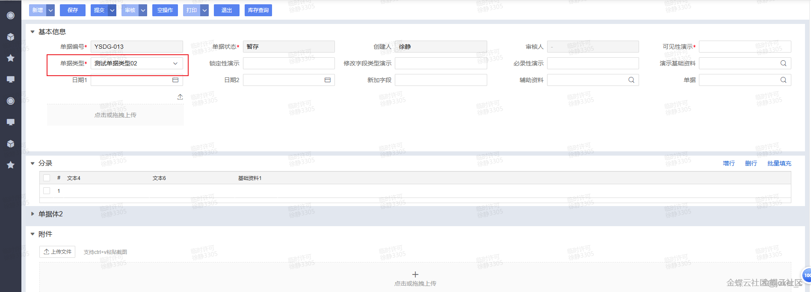

原文截图 12：
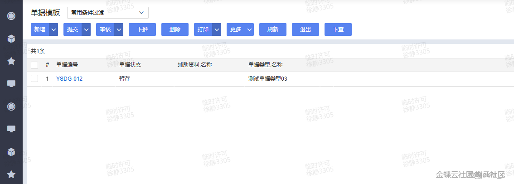

原文截图 13：
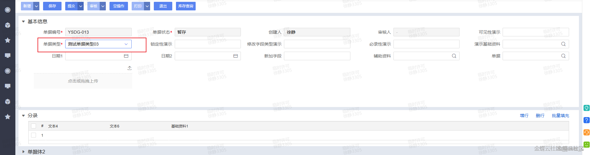
## 实现前提

- 菜单入口参数示例：`billtype=STANDARD`、`billtype=RETURN`
- 单据类型字段示例：`billtype.number`
- 当前案例代码落点：列表插件

## Kingscript 实现

```ts
import { AbstractListPlugin } from "@cosmic/bos-core/kd/bos/list/plugin";
import { SetFilterEvent } from "@cosmic/bos-core/kd/bos/list/events";
import { QFilter } from "@cosmic/bos-core/kd/bos/orm/query";

class MultiMenuBillTypeListPlugin extends AbstractListPlugin {

  setFilter(e: SetFilterEvent): void {
    super.setFilter(e);

    const formParam = this.getView().getFormShowParameter();
    const billType = formParam.getCustomParam("billtype") as string;
    if (billType == null || billType === "") {
      return;
    }

    e.getQFilter().add(new QFilter("billtype.number", "=", billType));
  }
}

let plugin = new MultiMenuBillTypeListPlugin();
export { plugin };
```

## 关键步骤说明

1. 在菜单配置里复制多个入口，每个入口带不同的 `billtype` 参数。
2. 把列表插件挂到业务对象列表页面，在查询前按入口参数追加过滤。
3. 新增页面的默认单据类型优先在入口参数和业务对象默认值中配置，脚本只保留必要补充。

## 转写说明

原文是“菜单参数 + 列表插件 + 新增默认值”的组合方案。这里先把最稳定、最适合 skill 检索复用的列表过滤部分沉淀成 KS。

## 注意事项 / 风险点

- 不同版本里单据类型字段的真实路径可能不是 `billtype.number`，需要按实际模型调整。
- 如果菜单没有传参，插件不会生效，这属于入口配置问题，不是脚本问题。
- 新增页默认单据类型通常仍要配合菜单参数或元数据默认值，不能只靠列表过滤。

风险等级：`改字段标识后可用`

## 验证建议

1. 从不同菜单入口进入同一个列表，确认看到的数据集不同。
2. 在不带参数的入口中进入列表，确认插件不会误过滤。
3. 从各入口新增单据，确认默认单据类型与入口场景一致。

## 来源说明

- L2 原文图片转写
- L4 本地资料校对
- L5 推断补全

- 原文包含较多界面配置截图，文档里保留截图并把脚本方案单独整理。
