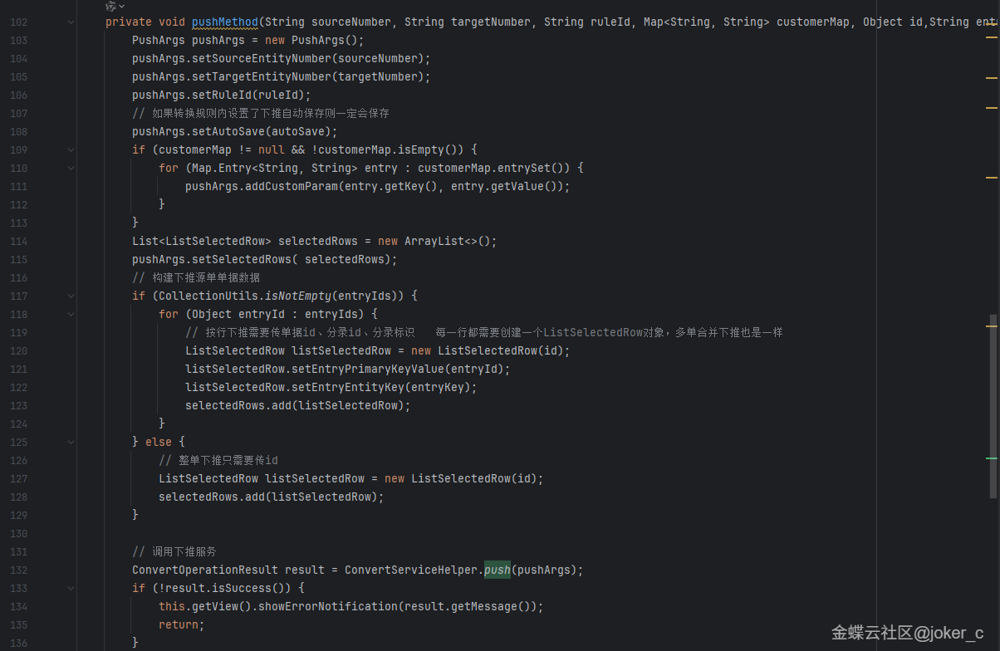
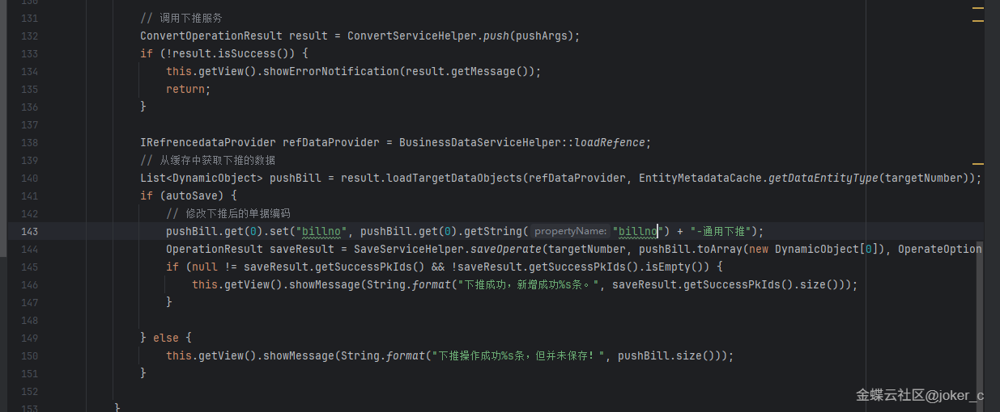
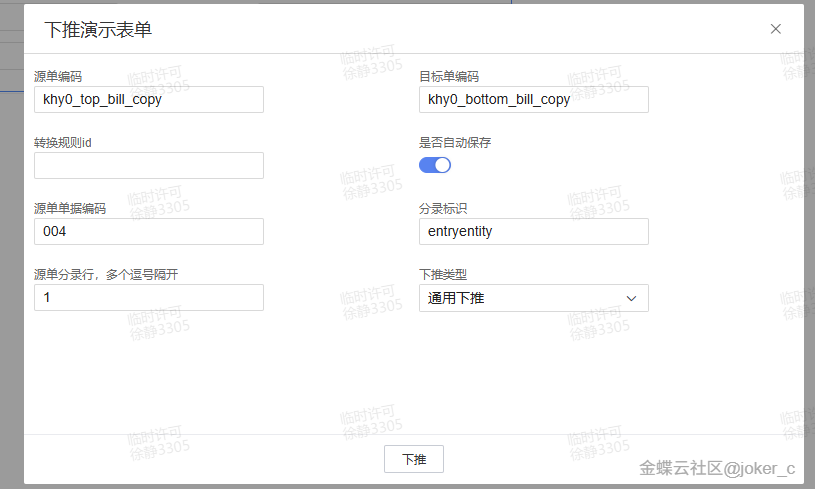
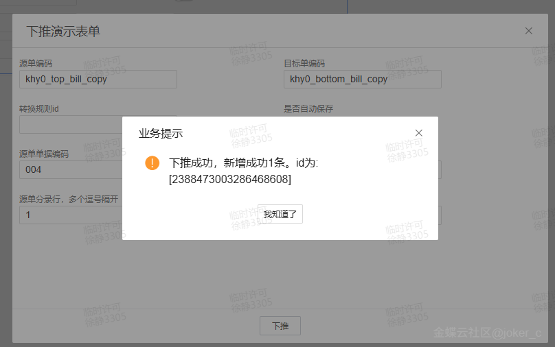
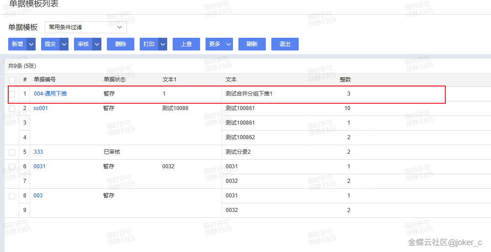
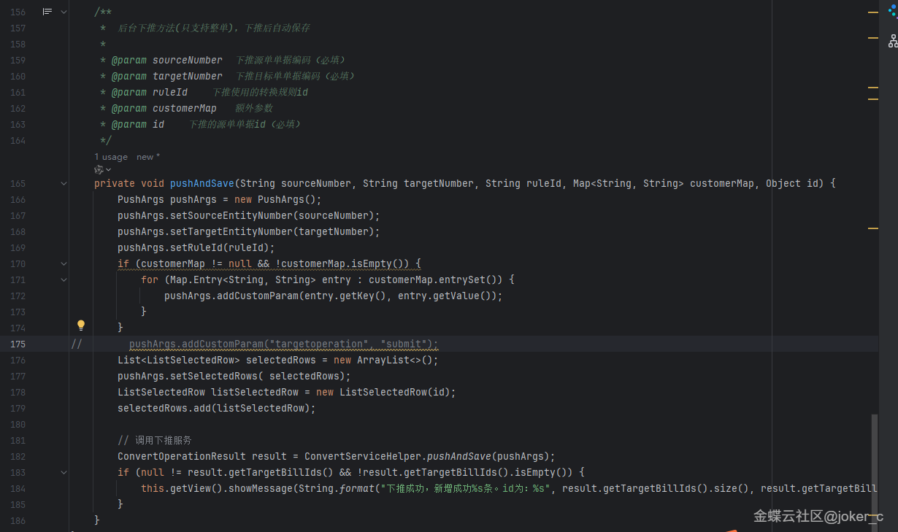
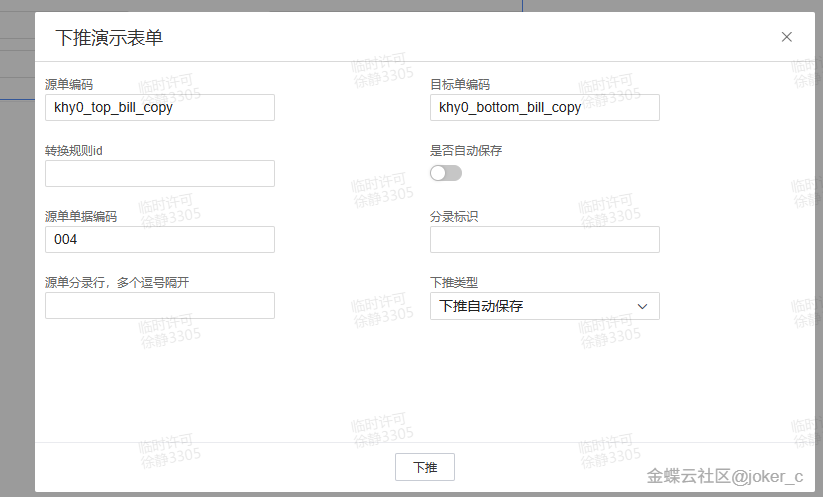
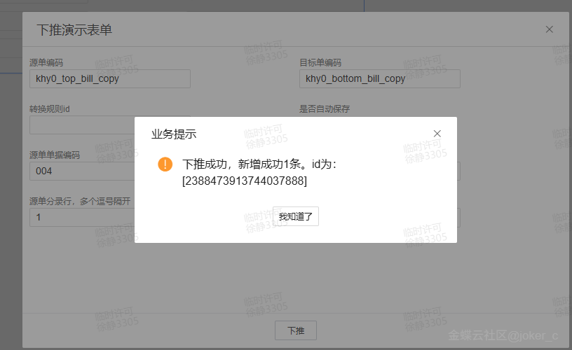
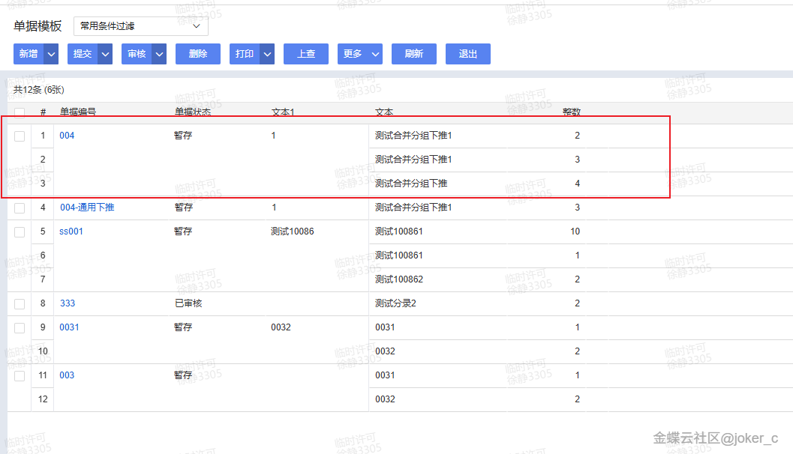

# 二开示例.单据转换下推实例

        ## 适用场景

        上游单据在审核或提交后自动下推生成下游单据，必要时还要自动保存、提交甚至审核下游单据。

        ## 原文链接

        - 社区原文: <https://vip.kingdee.com/knowledge/797425793713180672?specialId=570177930110532864&productLineId=40&isKnowledge=2&lang=zh-CN>

        ## 核心思路

        1. 界面场景下最常见的入口是 `afterDoOperation(...)`。
2. 用 `ConvertServiceHelper.push(...)` 执行下推，再按需要调用保存或提交操作。
3. 如果下推后还要改目标单据字段，记得在保存前先补值。

## 原文截图

以下截图来自社区原文，便于还原配置界面、效果或关键操作位置。

原文截图 1：


原文截图 2：


原文截图 3：


原文截图 4：


原文截图 5：


原文截图 6：


原文截图 7：


原文截图 8：


原文截图 9：

        ## 实现前提

        - 来源单据示例：`pm_purorder`
- 目标单据示例：`im_purinbill`
- 转换规则 key 示例：`purorder_to_purinbill`

        ## Kingscript 实现

        ```ts
        import { AbstractBillPlugIn } from "@cosmic/bos-core/kd/bos/bill";
import { AfterDoOperationEventArgs } from "@cosmic/bos-core/kd/bos/form/events";
import { ConvertServiceHelper } from "@cosmic/bos-core/kd/bos/servicehelper";
import { OperationServiceHelper } from "@cosmic/bos-core/kd/bos/servicehelper/operation";
import { PushArgs } from "@cosmic/bos-core/kd/bos/entity/botp/runtime";

class AutoPushPlugin extends AbstractBillPlugIn {

  afterDoOperation(e: AfterDoOperationEventArgs): void {
    super.afterDoOperation(e);
    if (e.getOperateKey() !== "audit" || e.getOperationResult() == null || !e.getOperationResult().isSuccess()) {
      return;
    }

    const pushArgs = new PushArgs();
    pushArgs.setSourceFormId("pm_purorder");
    pushArgs.setTargetFormId("im_purinbill");
    pushArgs.setConvertRuleKey("purorder_to_purinbill");
    pushArgs.setBillIds([this.getModel().getDataEntity().getPkValue()]);

    const pushResult = ConvertServiceHelper.push(pushArgs);
    if (pushResult != null && pushResult.isSuccess()) {
      OperationServiceHelper.executeOperate(
        "save",
        "im_purinbill",
        pushResult.getTargetDataEntities(),
        null
      );
    }
  }
}

let plugin = new AutoPushPlugin();
export { plugin };
        ```

        ## 关键步骤说明

        1. 确认转换规则已经在 BOS 中配置完成。
2. 在来源单据操作成功后执行下推。
3. 根据业务需要继续补保存、提交、审核或目标单据字段修正。

        ## 转写说明

        原文是经典的单据转换下推案例，这里把最核心的“审核成功后自动下推并保存”沉淀成一个简化 KS 版。

        ## 注意事项 / 风险点

        - 转换规则 key、源目标单据标识都必须与系统真实配置一致。
- 如果目标单据下推后还要补字段，应该在保存前处理，而不是保存后再改。
- 批量审核场景要重点关注性能与异常回滚策略。

        风险等级：`改字段标识后可用`

        ## 验证建议

        1. 审核来源单据后，确认能自动生成下游单据。
2. 故意让转换规则不满足条件，再验证失败提示链路。
3. 批量审核多张单据时，确认每张来源单据都能稳定下推。

        ## 来源说明

        - L2 原文图片转写
- L4 本地资料校对

        - 本地 `afterDoOperation` 示例已覆盖 `ConvertServiceHelper.push(...)` 基本写法。
