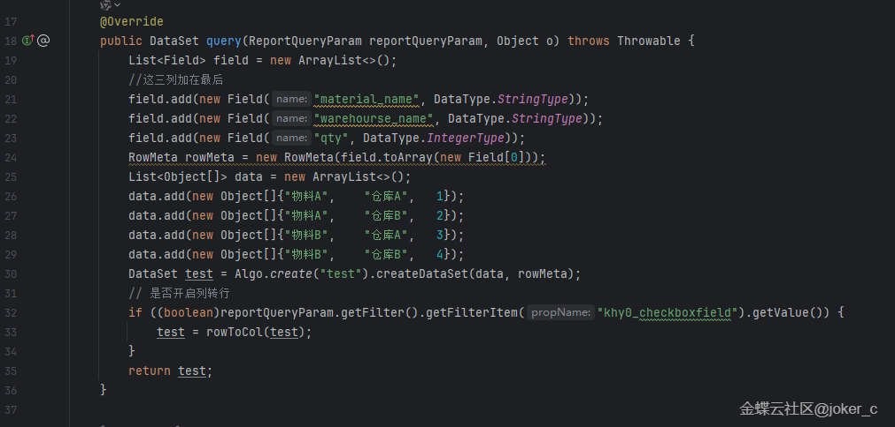
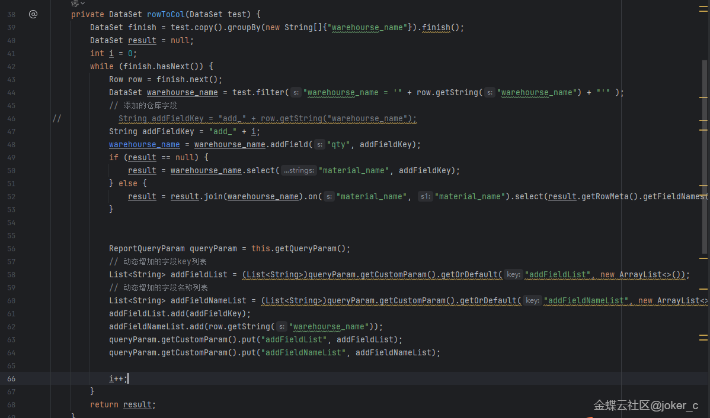
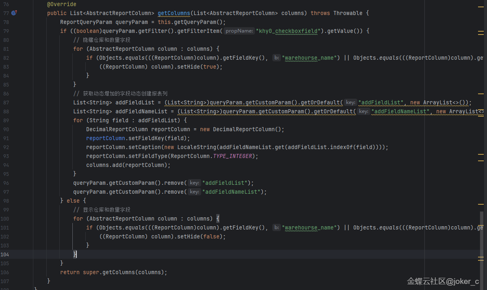
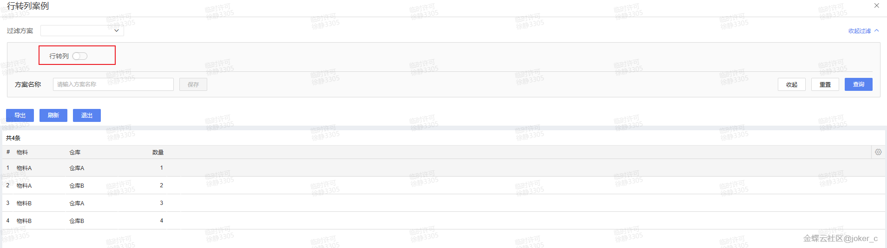
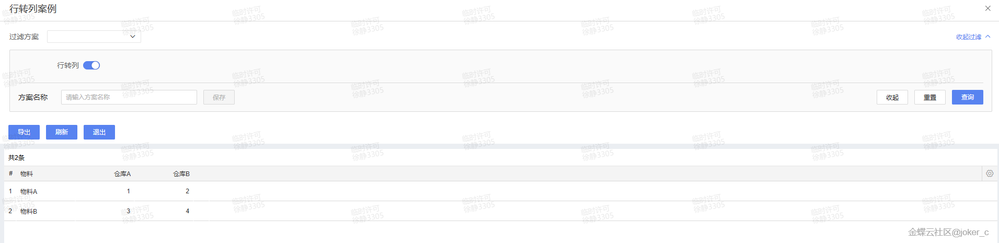

# 二开示例.报表插件.行转列案例

        ## 适用场景

        报表源数据按“行”存储，但界面需要按某个维度展开成“列”展示，例如按仓库、月份或项目展开成动态列。

        ## 原文链接

        - 社区原文: <https://vip.kingdee.com/knowledge/768528049645749760?specialId=570177930110532864&productLineId=40&isKnowledge=2&lang=zh-CN>

        ## 核心思路

        1. 先按主键维度分组，再收集所有要转成列的维度值。
2. 把每个维度值映射成一个动态列 key。
3. 最后输出新的二维表结构，再交给报表插件或数据集处理层。

## 原文截图

以下截图来自社区原文，便于还原配置界面、效果或关键操作位置。

原文截图 1：


原文截图 2：


原文截图 3：


原文截图 4：


原文截图 5：

        ## 实现前提

        - 原始数据示例字段：`material`、`warehouse`、`qty`
- 这段代码更适合放在报表数据处理或查询结果后加工阶段

        ## Kingscript 实现

        ```ts
        type RowData = {
  material: string;
  warehouse: string;
  qty: number;
};

function pivotByWarehouse(rows: RowData[]): Array<Record<string, string | number>> {
  const warehouseSet = new Set<string>();
  const rowMap = new Map<string, Record<string, string | number>>();

  for (const row of rows) {
    warehouseSet.add(row.warehouse);

    let target = rowMap.get(row.material);
    if (target == null) {
      target = { material: row.material };
      rowMap.set(row.material, target);
    }
    target["warehouse_" + row.warehouse] = row.qty;
  }

  const warehouseList = Array.from(warehouseSet);
  const result = Array.from(rowMap.values());
  for (const item of result) {
    for (const warehouse of warehouseList) {
      const key = "warehouse_" + warehouse;
      if (item[key] == null) {
        item[key] = 0;
      }
    }
  }
  return result;
}
        ```

        ## 关键步骤说明

        1. 先用普通查询拿到明细行数据。
2. 按主键维度分组，再把横向维度转成动态列 key。
3. 把结果交回报表插件，生成最终显示列。

        ## 转写说明

        原文强调的是“利用 dataset API 行转列”。为了避免在 skill 里硬写过多具体报表运行时 API，这里先把最核心的行转列算法抽成了可直接复用的 KS 函数。

        ## 注意事项 / 风险点

        - 真正接到报表插件时，还要补“动态列元数据创建”那一步。
- 如果横向维度很多，列数会暴涨，建议先做数量限制。
- 数值汇总、排序和空值填充都要按实际报表要求再细化。

        风险等级：`推断版，建议先验证`

        ## 验证建议

        1. 用 2-3 个仓库、2-3 个物料的样例数据运行一次，确认输出结构正确。
2. 验证没有数据的仓库列会自动补 0。
3. 接到报表插件后确认列标题和列值能一一对应。

        ## 来源说明

        - L2 原文图片转写
- L4 本地资料校对
- L5 推断补全

        - 这是一个典型的“算法稳定、具体报表接线因项目而异”的案例。
