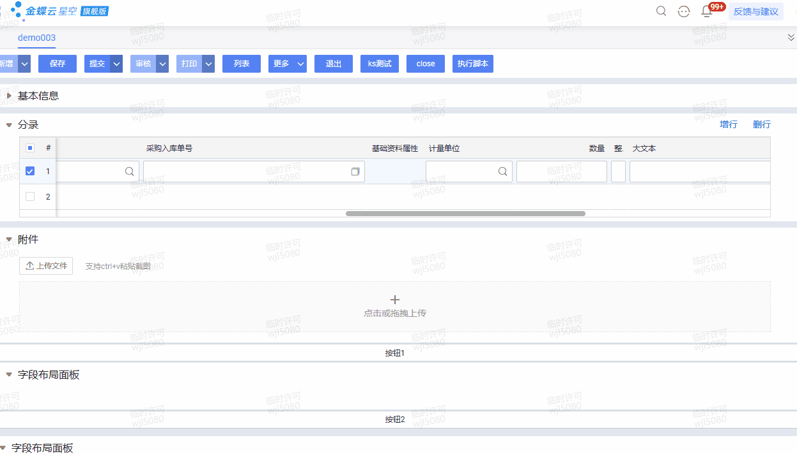
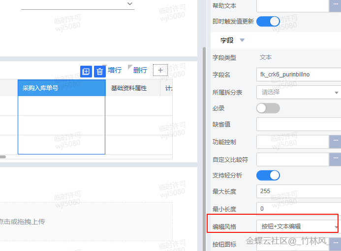

# 二开示例.点击文本框弹窗选择单据

## 适用场景

在自定义单据单据体的文本框中，点击文本框后弹出采购入库单列表，选择单据后把单据编号回填到当前分录文本框，效果类似 F7，并支持多选。

## 原文链接

- 社区原文: <https://vip.kingdee.com/knowledge/735947481094819328?specialId=570177930110532864&productLineId=40&isKnowledge=2&lang=zh-CN&islogin=true>

## 核心思路

1. 在 `registerListener` 里给目标文本框增加点击监听。
2. 点击后用 `ListShowParameter` 打开 `bos_listf7` 列表，并把 `billFormId` 指向采购入库单 `im_purinbill`。
3. 打开方式设为模态窗，开启多选。
4. 在关闭回调里读取 `ListSelectedRowCollection`，把多条单据编号拼成字符串写回当前分录。

## 原文截图

以下截图来自社区原文，便于还原配置界面、效果或关键操作位置。

原文截图 1：


原文截图 2：

## 实现前提

- 文本框字段标识示例: `crk6_purinbillno`
- 当前单据体标识示例: `entryentity`
- 文本框编辑风格需设置为“按钮+文本编辑”
- 采购入库单表单标识示例: `im_purinbill`

## Kingscript 实现

```ts
import { ListSelectedRow, ListSelectedRowCollection } from "@cosmic/bos-core/kd/bos/entity/datamodel";
import { AbstractBillPlugIn } from "@cosmic/bos-core/kd/bos/bill";
import { Control } from "@cosmic/bos-core/kd/bos/form/control";
import { ShowType, CloseCallBack, StyleCss } from "@cosmic/bos-core/kd/bos/form";
import { ClosedCallBackEvent } from "@cosmic/bos-core/kd/bos/form/events";
import { ListShowParameter } from "@cosmic/bos-core/kd/bos/list";
import { EventObject } from "@cosmic/bos-script/java/util";

class ClickTextOpenBillPlugin extends AbstractBillPlugIn {

  private readonly fieldPurinBillNo: string = "crk6_purinbillno";
  private readonly entryKey: string = "entryentity";

  registerListener(e: EventObject): void {
    super.registerListener(e);
    this.addClickListeners(this.fieldPurinBillNo);
  }

  click(evt: EventObject): void {
    const control = evt.getSource() as Control;
    const key = control.getKey().toLowerCase();

    if (key !== this.fieldPurinBillNo) {
      return;
    }

    const showParam = new ListShowParameter();
    showParam.setFormId("bos_listf7");
    showParam.setBillFormId("im_purinbill");
    showParam.getOpenStyle().setShowType(ShowType.Modal);

    const inlineStyleCss = new StyleCss();
    inlineStyleCss.setHeight("580");
    inlineStyleCss.setWidth("960");
    showParam.getOpenStyle().setInlineStyleCss(inlineStyleCss);

    showParam.setMultiSelect(true);
    showParam.setLookUp(true);
    showParam.setShowApproved(true);
    showParam.setShowUsed(true);
    showParam.setCloseCallBack(new CloseCallBack(this, "purinbillno"));

    this.getView().showForm(showParam);
  }

  closedCallBack(e: ClosedCallBackEvent): void {
    super.closedCallBack(e);

    if (e.getActionId() !== "purinbillno") {
      return;
    }

    const rows = e.getReturnData() as ListSelectedRowCollection;
    if (rows == null || rows.size() === 0) {
      return;
    }

    const billNos: string[] = [];
    for (let index = 0; index < rows.size(); index++) {
      const row = rows.get(index) as ListSelectedRow;
      billNos.push(row.getBillNo());
    }

    const rowIndex = this.getModel().getEntryCurrentRowIndex(this.entryKey);
    this.getModel().setValue(this.fieldPurinBillNo, billNos.join(";"), rowIndex);
  }
}

let plugin = new ClickTextOpenBillPlugin();
export { plugin };
```

## 关键步骤说明

- `addClickListeners(...)` 让文本框点击事件能进到插件。
- `setFormId("bos_listf7") + setBillFormId("im_purinbill")` 是这个方案的关键组合。
- `setMultiSelect(true)` 后，回调里不要只取第一条，要遍历 `ListSelectedRowCollection`。
- 回填分录时要带上 `getEntryCurrentRowIndex(...)`，否则多行场景容易写错行。

## Java -> KS 映射说明

这篇原文已经同时给出了 Java 和 Kingscript，所以上面的 KS 以原文 Kingscript 为主，仅做了变量命名和空值判断整理。

## 注意事项 / 风险点

- `crk6_purinbillno`、`entryentity`、`im_purinbill` 都需要替换成你的真实标识。
- 如果文本框不是“按钮+文本编辑”，点击事件通常不会达到预期效果。
- 多选回填这里是用分号拼接；如果你要逐行展开，需要改成新增分录的回填方式。

风险等级：`改字段标识后可用`

## 验证建议

1. 在单据体新增两行分录，分别点击文本框，确认回填不会串行。
2. 单选和多选各测一次，确认回调数据都能正确写回。
3. 空选关闭窗口时，确认不会把原值清空。

## 来源说明

- `L1 原文直取`
- `L4 本地资料校对`

原文直接提供了 Kingscript 代码与效果图，本案例主要做了文档化整理和少量健壮性补充。
