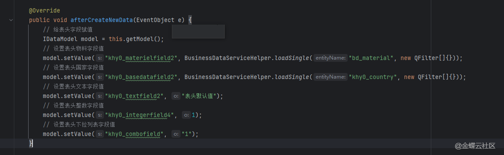
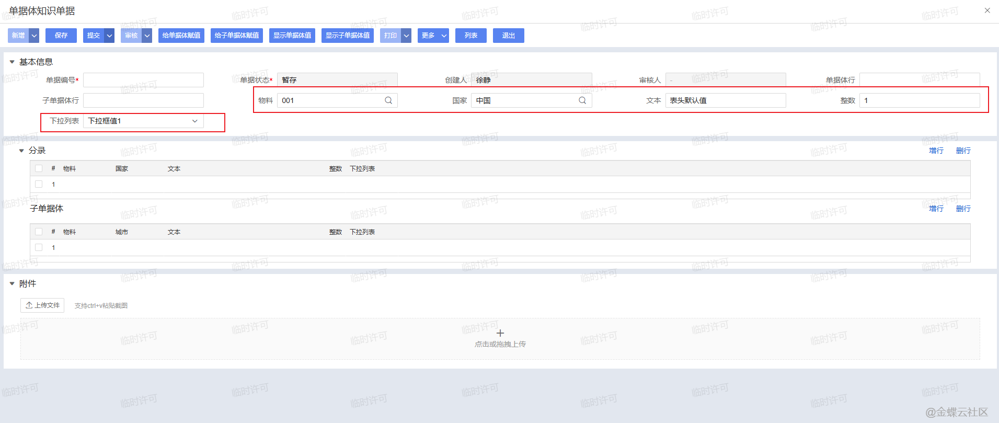
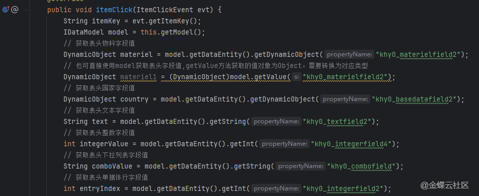
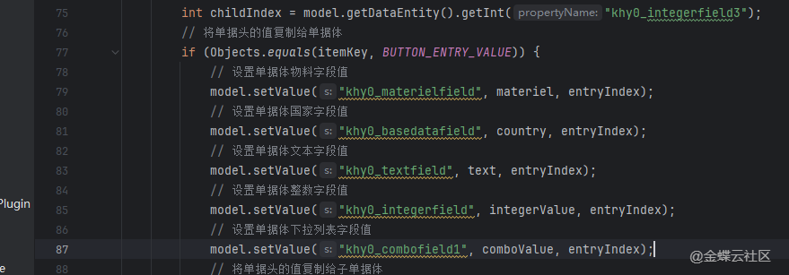
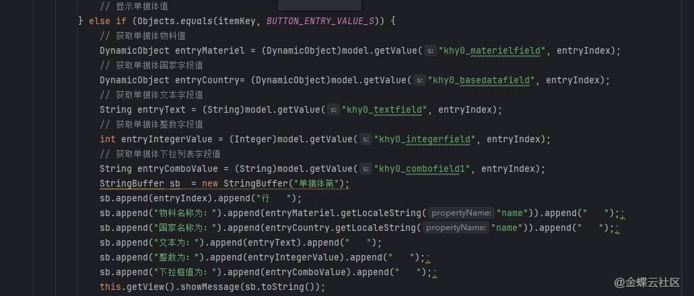
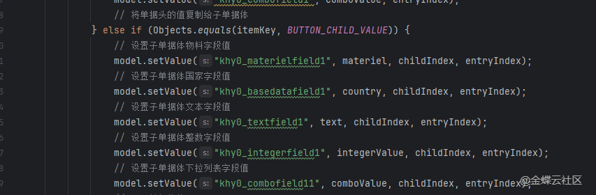
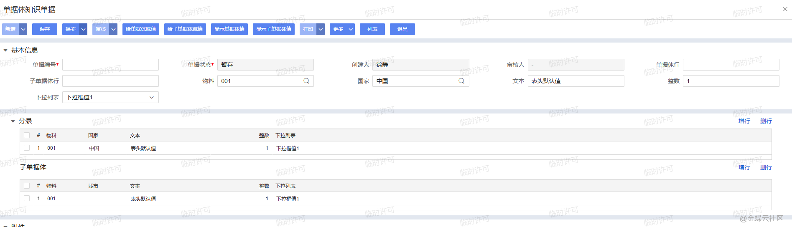
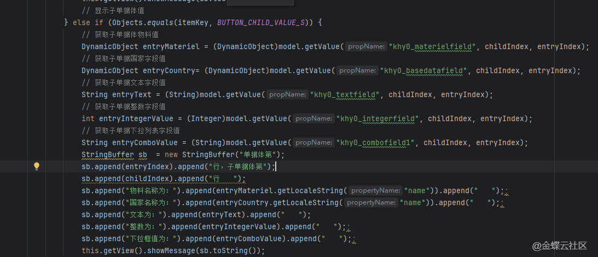
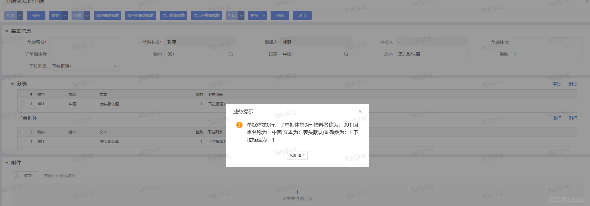
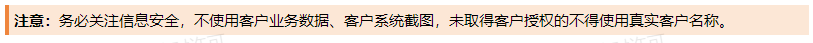

# 二开示例.表单使用.表单取值赋值API使用实战

        ## 适用场景

        给刚接触星空二开的同学准备的一篇“表单取值 / 赋值 API 实战”案例，重点是把表头、单据体、子单据体的常用读写方式串到一组按钮场景里。

        ## 原文链接

        - 社区原文: <https://vip.kingdee.com/knowledge/667019612730419456?specialId=570177930110532864&productLineId=40&isKnowledge=2&lang=zh-CN>

        ## 核心思路

        1. 表头字段直接 `getValue / setValue`。
2. 单据体字段通过 `setValue(field, value, row)` 和 `getEntryCurrentRowIndex(entryKey)` 操作当前行。
3. 如果需要批量造分录，可以用 `createNewEntryRow(...)` 或 `batchCreateNewEntryRow(...)`。

## 原文截图

以下截图来自社区原文，便于还原配置界面、效果或关键操作位置。

原文截图 1：


原文截图 2：


原文截图 3：


原文截图 4：


原文截图 5：


原文截图 6：


原文截图 7：


原文截图 8：


原文截图 9：


原文截图 10：

        ## 实现前提

        - 单据体示例标识：`billentry`
- 按钮示例：`btn_fill_head`、`btn_fill_entry`、`btn_read_summary`
- 字段标识均为示例，落地前需替换成真实模型字段

        ## Kingscript 实现

        ```ts
        import { AbstractBillPlugIn } from "@cosmic/bos-core/kd/bos/bill";
import { ItemClickEvent } from "@cosmic/bos-core/kd/bos/form/events";

class FormValueApiDemoPlugin extends AbstractBillPlugIn {

  itemClick(e: ItemClickEvent): void {
    super.itemClick(e);

    if (e.getItemKey() === "btn_fill_head") {
      this.getModel().setValue("remark", "由案例脚本自动带出");
      this.getModel().setValue("biztype", "standard");
      this.getView().showSuccessNotification("表头字段已赋值");
      return;
    }

    if (e.getItemKey() === "btn_fill_entry") {
      const rowIndex = this.getModel().createNewEntryRow("billentry");
      this.getModel().setValue("material", 100001, rowIndex);
      this.getModel().setValue("qty", 2, rowIndex);
      this.getModel().setValue("price", 50, rowIndex);
      this.getModel().setValue("amount", 100, rowIndex);
      this.getView().updateView("billentry");
      return;
    }

    if (e.getItemKey() === "btn_read_summary") {
      const remark = this.getModel().getValue("remark");
      const rowCount = this.getModel().getEntryRowCount("billentry");
      this.getView().showTipNotification("备注=" + remark + "，分录行数=" + rowCount);
    }
  }
}

let plugin = new FormValueApiDemoPlugin();
export { plugin };
        ```

        ## 关键步骤说明

        1. 先把文章里分散的按钮场景归并成一套统一按钮入口，方便 skill 检索。
2. 分别演示表头赋值、创建分录并赋值、读取页面摘要信息。
3. 后续要扩到子单据体时，再按相同模式补 `setEntryCurrentRowIndex(...)` 即可。

        ## 转写说明

        原文偏“操作手册 + 配置附件”，这里把高频 API 压缩成一组最常见的 KS 操作模板，适合当作入门案例引用。

        ## 注意事项 / 风险点

        - 示例里直接写了 `material=100001` 这类主键值，真实项目里通常要先查询或从 F7 选择得到。
- 如果按钮较多，建议拆成多个插件或多个私有方法，避免一个 `itemClick` 过长。
- 大量联动场景下，赋值后别忘了按需 `updateView(...)`。

        风险等级：`改字段标识后可用`

        ## 验证建议

        1. 点击表头赋值按钮，确认字段值即时刷新。
2. 点击分录赋值按钮，确认能新增并写入一行分录。
3. 点击读取按钮，确认能读到备注和分录数量。

        ## 来源说明

        - L3 Java 逻辑转 KS
- L4 本地资料校对
- L5 推断补全

        - 这篇很适合作为 skill 的基础操作案例入口。
