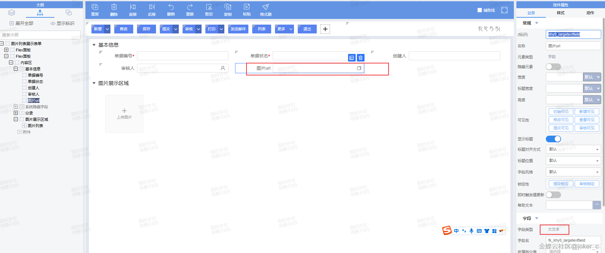
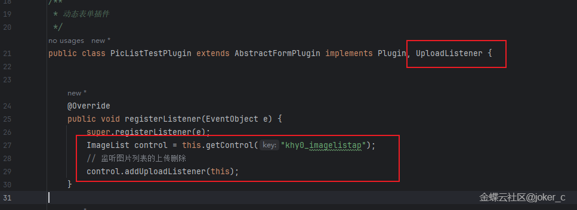
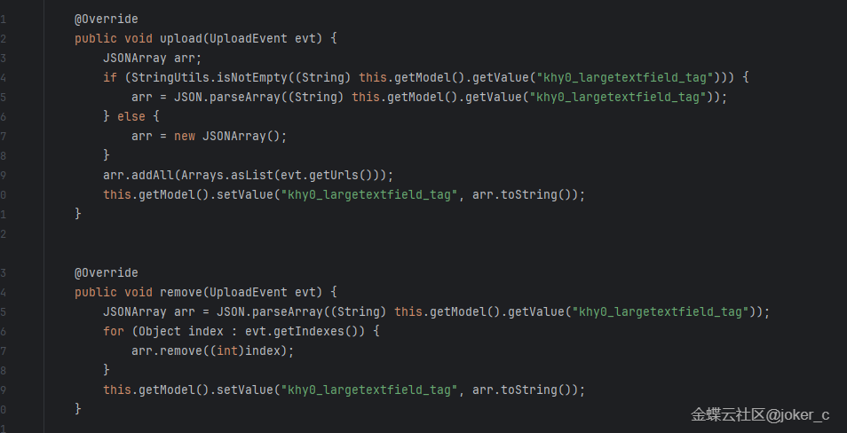
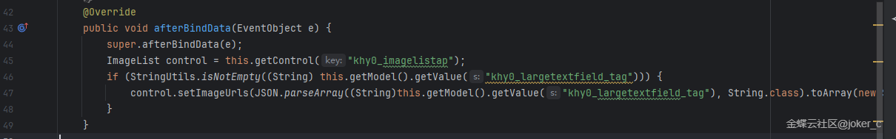
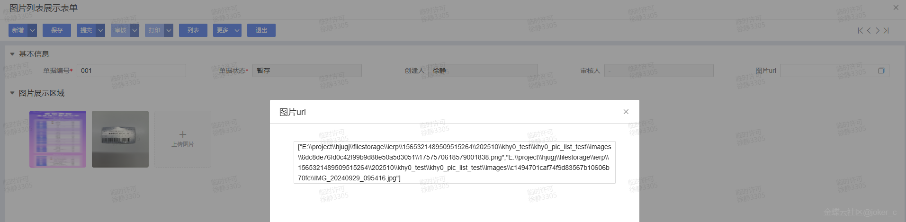
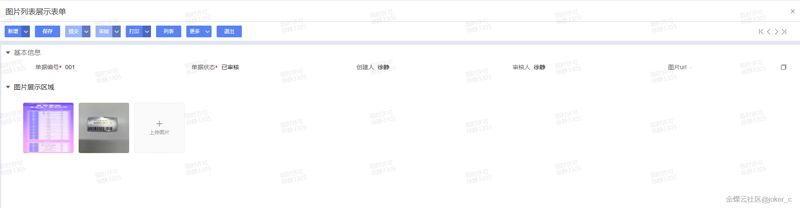

# 二开示例.表单插件.图片列表保存

        ## 适用场景

        页面上需要上传多张图片并在保存后还能回显，常见做法是把图片 URL 列表落到一个长文本字段里，再在页面加载时反向渲染。

        ## 原文链接

        - 社区原文: <https://vip.kingdee.com/knowledge/768509214821451264?specialId=570177930110532864&productLineId=40&isKnowledge=2&lang=zh-CN>

        ## 核心思路

        1. 图片列表控件负责交互，真正持久化的数据可落到长文本字段。
2. 上传完成时把 URL 追加到数组并序列化，删除时从数组中移除。
3. 页面初始化或数据绑定后，再根据长文本字段里的 URL 列表做回显。

## 原文截图

以下截图来自社区原文，便于还原配置界面、效果或关键操作位置。

原文截图 1：


原文截图 2：


原文截图 3：


原文截图 4：


原文截图 5：


原文截图 6：

        ## 实现前提

        - 长文本字段示例：`kdec_image_urls`
- 图片列表控件事件名称需按实际页面控件确认

        ## Kingscript 实现

        ```ts
        import { AbstractFormPlugin } from "@cosmic/bos-core/kd/bos/form/plugin";

class ImageListStorePlugin extends AbstractFormPlugin {

  private readImageUrls(): string[] {
    const value = this.getModel().getValue("kdec_image_urls") as string;
    if (value == null || value === "") {
      return [];
    }
    return JSON.parse(value) as string[];
  }

  private saveImageUrls(urls: string[]): void {
    this.getModel().setValue("kdec_image_urls", JSON.stringify(urls));
  }

  onImageUploaded(url: string): void {
    const urls = this.readImageUrls();
    urls.push(url);
    this.saveImageUrls(urls);
  }

  onImageRemoved(url: string): void {
    const urls = this.readImageUrls().filter(item => item !== url);
    this.saveImageUrls(urls);
  }
}
        ```

        ## 关键步骤说明

        1. 给业务对象增加一个长文本字段，专门保存图片 URL 数组。
2. 在上传完成和删除回调里分别维护这个数组。
3. 页面打开时读取数组，回灌到图片列表控件。

        ## 转写说明

        原文更偏控件配置和效果展示。因为图片列表控件的具体事件在不同工程里落点可能不同，所以这里保留最稳定的“URL 列表持久化”核心逻辑。

        ## 注意事项 / 风险点

        - 案例里把图片列表事件抽象成 `onImageUploaded/onImageRemoved`，接线时要替换成你页面里的真实事件。
- 如果图片 URL 可能重复，需要补去重逻辑。
- 长文本字段适合存 URL 列表，不适合直接存大体积图片内容。

        风险等级：`需按实际元数据调整`

        ## 验证建议

        1. 上传多张图片后保存，重新打开页面确认图片仍能回显。
2. 删除其中一张后再次保存，确认长文本字段同步更新。
3. 手动清空长文本字段后打开页面，确认不会报 JSON 解析错误。

        ## 来源说明

        - L2 原文图片转写
- L4 本地资料校对
- L5 推断补全

        - 这篇案例的关键在“图片交互”和“持久化存储”拆开处理。
