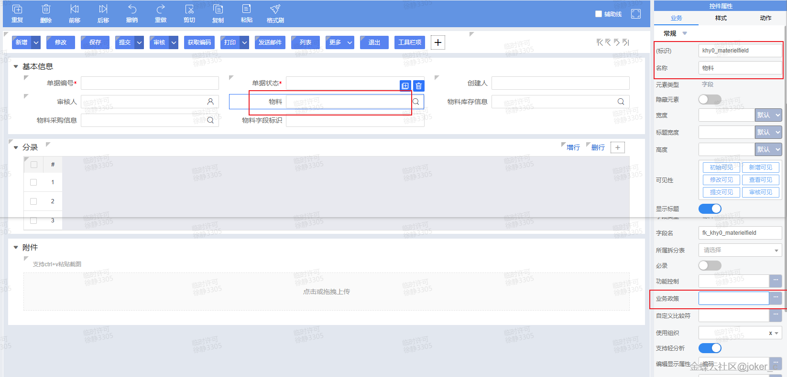
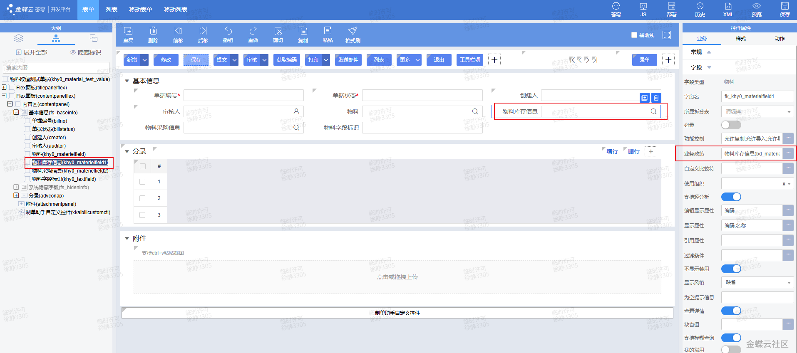
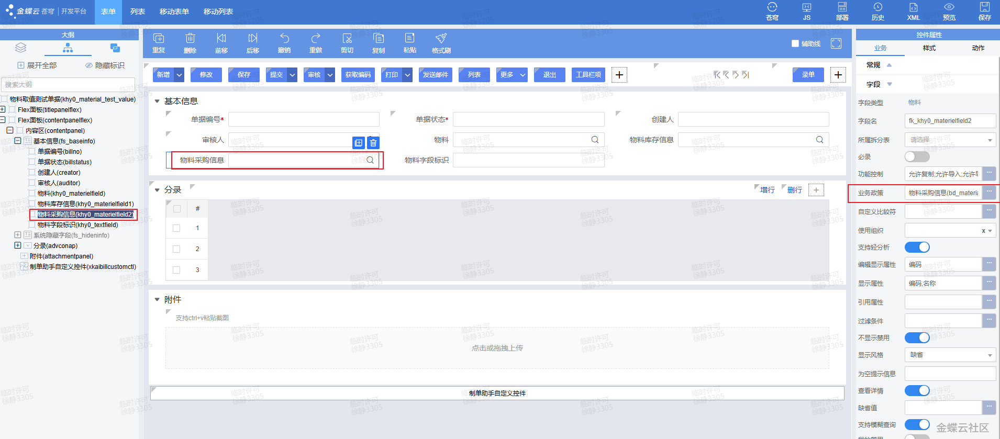
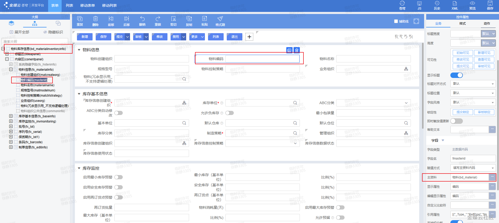
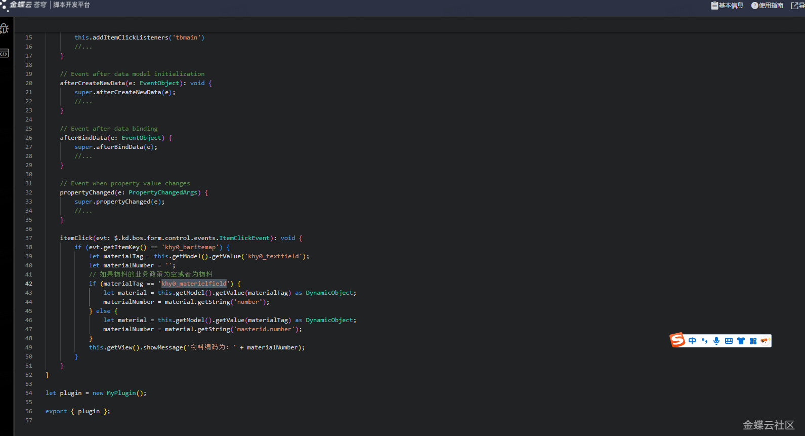
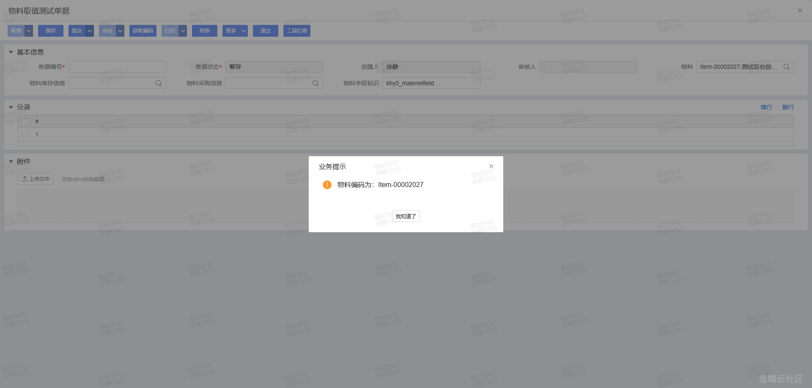
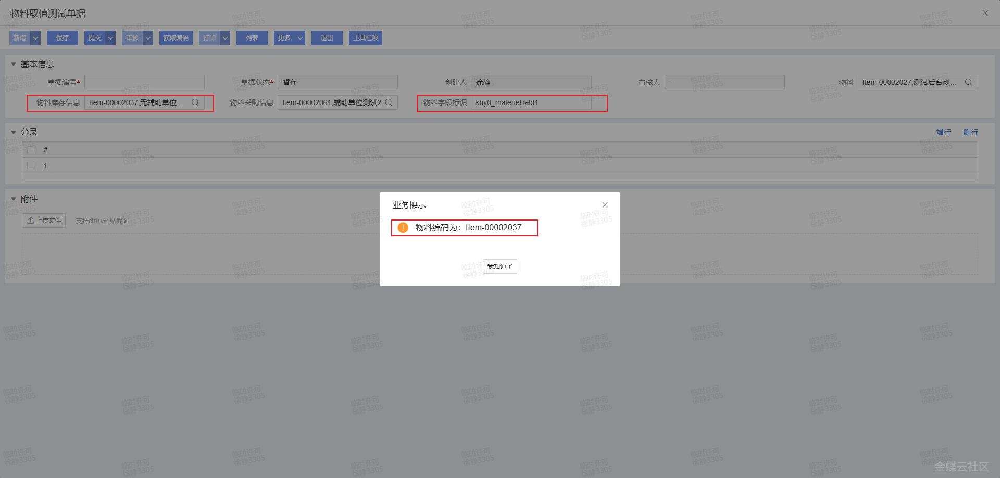
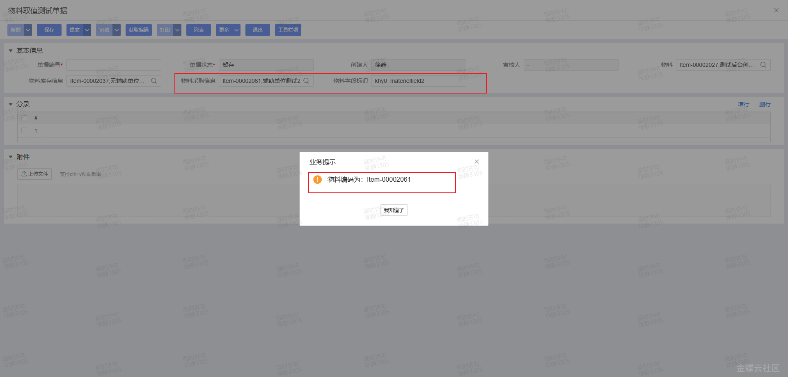

# 二开示例.表单插件.如何获取物料的物料编码

## 适用场景

同一个页面上存在多个物料类基础资料字段，但这些字段绑定的“业务政策”不同。需要在脚本里稳定拿到真正的物料编码，而不是只拿到业务政策对应的资料编码。

## 原文链接

- 社区原文: <https://vip.kingdee.com/knowledge/743882537025228544?specialId=570177930110532864&productLineId=40&isKnowledge=2&lang=zh-CN>

## 核心思路

1. 当字段业务政策为空或直接为“物料”时，当前基础资料对象本身就能直接取 `number`。
2. 当字段业务政策是“物料库存信息”“物料采购信息”等业务政策资料时，当前对象需要再经过 `masterid` 才能拿到真正的物料主档编码。
3. 可以在按钮点击、字段联动或保存前统一走一个“解析物料编码”的助手方法。

## 原文截图

以下截图来自社区原文，便于还原配置界面、效果或关键操作位置。

原文截图 1：


原文截图 2：


原文截图 3：


原文截图 4：


原文截图 5：


原文截图 6：


原文截图 7：


原文截图 8：

## 实现前提

- 直接物料字段示例: `khy0_materialfield`
- 业务政策物料字段示例: `khy0_materialstockfield`、`khy0_materialpurchasefield`
- 结果显示字段示例: `khy0_number1`、`khy0_number2`、`khy0_number3`
- 如果你想保留原文截图里的按钮式交互，可以继续用 `itemClick`；如果更希望自动回填，建议改成 `propertyChanged`

## Kingscript 实现

下面这版不是照抄截图里的字段名跳转逻辑，而是整理成更适合 skill 复用的“固定字段映射版”。

```ts
import { AbstractFormPlugin } from "@cosmic/bos-core/kd/bos/form/plugin";
import { DynamicObject } from "@cosmic/bos-core/kd/bos/dataentity/entity";
import { PropertyChangedArgs } from "@cosmic/bos-core/kd/bos/entity/datamodel/events";

class GetMaterialNumberPlugin extends AbstractFormPlugin {

  propertyChanged(e: PropertyChangedArgs): void {
    super.propertyChanged(e);

    const fieldKey = e.getProperty().getName();

    if (fieldKey === "khy0_materialfield") {
      this.fillMaterialNumber("khy0_materialfield", "khy0_number1", false);
    } else if (fieldKey === "khy0_materialstockfield") {
      this.fillMaterialNumber("khy0_materialstockfield", "khy0_number2", true);
    } else if (fieldKey === "khy0_materialpurchasefield") {
      this.fillMaterialNumber("khy0_materialpurchasefield", "khy0_number3", true);
    }
  }

  private fillMaterialNumber(materialField: string, resultField: string, useMasterId: boolean): void {
    const material = this.getModel().getValue(materialField) as DynamicObject;
    if (material == null) {
      this.getModel().setValue(resultField, "");
      return;
    }

    let materialNumber = "";
    if (useMasterId) {
      materialNumber = material.getString("masterid.number");
    } else {
      materialNumber = material.getString("number");
    }

    this.getModel().setValue(resultField, materialNumber);
    this.getView().updateView(resultField);
  }
}

let plugin = new GetMaterialNumberPlugin();
export { plugin };
```

## 与原图转写的对应关系

原图里的核心判断逻辑可以概括成下面这几行：

```ts
let material = this.getModel().getValue(materialTag) as DynamicObject;
if (materialTag === "khy0_materialfield") {
  materialNumber = material.getString("number");
} else {
  materialNumber = material.getString("masterid.number");
}
```

也就是说，截图的关键结论不是“按钮名怎么写”，而是：

- 直接物料字段取 `number`
- 业务政策资料字段取 `masterid.number`

## 关键步骤说明

- `DynamicObject` 是这里最关键的数据承载对象。
- `material.getString("number")` 适用于直接物料字段。
- `material.getString("masterid.number")` 适用于库存信息、采购信息这类业务政策字段。
- 如果你想做成原图那样的按钮点击提示，可以把 `fillMaterialNumber(...)` 的结果改成 `showMessage(...)`。

## Java -> KS 映射说明

这篇原文主要是配置图和代码截图，没有可复制的文本版 KS。上面的实现是基于截图 OCR 结果和本地 `DynamicObject`、`PropertyChangedArgs`、基础资料示例整理出来的 skill 版写法。

## 注意事项 / 风险点

- `khy0_materialfield` 等字段标识是示例值，落地时必须替换成真实字段标识。
- `masterid.number` 的前提是该字段底层确实是业务政策资料并且包含 `masterid`。
- 如果你的字段不是“选择后自动回填”，也可以改成按钮点击后统一读取并提示。

风险等级：`推断版，建议先验证`

## 验证建议

1. 分别给“业务政策为空”“物料库存信息”“物料采购信息”三类字段选值。
2. 校验直接物料字段能否拿到 `number`。
3. 校验业务政策字段能否拿到 `masterid.number`，以及空值时不会报空指针。

## 来源说明

- `L2 原文图片转写`
- `L4 本地资料校对`
- `L5 推断补全`

原文重点在截图与结构说明，没有完整文本版 KS。本案例保留了原图里的关键判断逻辑，并整理成更适合 skill 检索的可复用版本。
