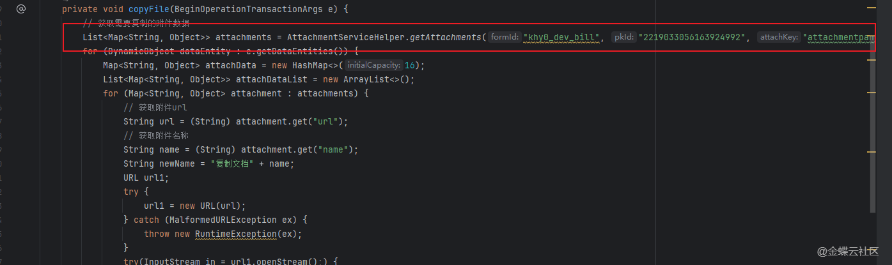
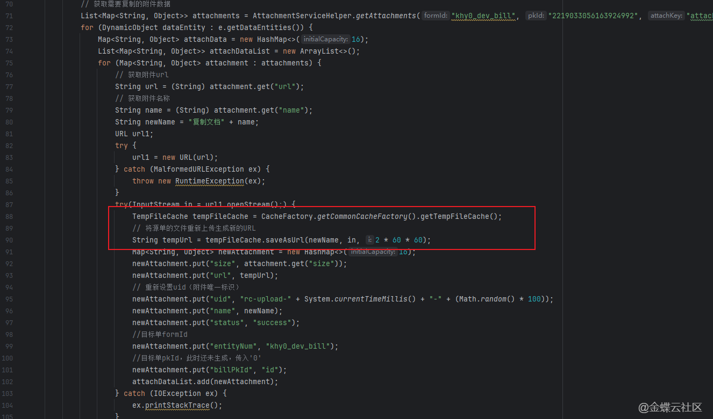
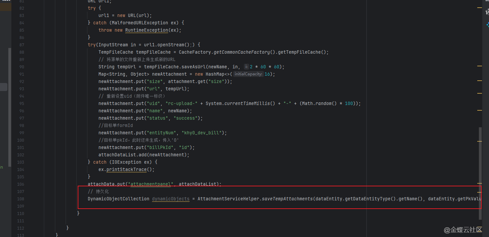
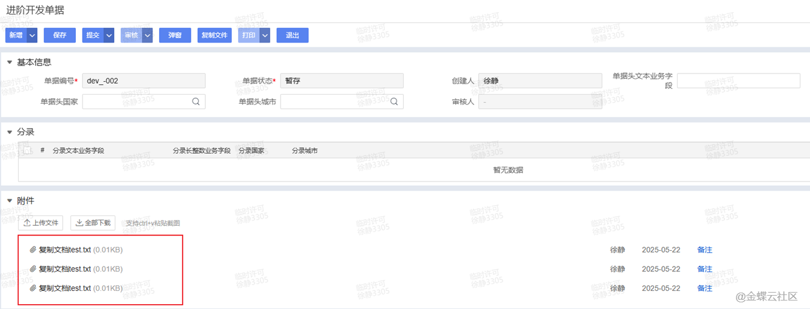

# 二开示例.附件.后台复制附件

## 适用场景

在后台插件或操作插件里，把单据 A 的附件复制并绑定到单据 B，不依赖前端手工重新上传。

## 原文链接

- 社区原文: <https://vip.kingdee.com/knowledge/716319390643302144?specialId=570177930110532864&productLineId=40&isKnowledge=2&lang=zh-CN>

## 核心思路

1. 先用 `AttachmentServiceHelper.getAttachments(...)` 取出源单据附件列表。
2. 再用 `genBindingParam(...)` + `bindingAttachment(...)` 把附件绑定到目标单据。
3. 这种方式适合后台复制，不适合前端上传交互。

## 原文截图

以下截图来自社区原文，便于还原配置界面、效果或关键操作位置。

原文截图 1：


原文截图 2：


原文截图 3：


原文截图 4：

## 实现前提

- 源单据表单标识示例：`pm_purorder`
- 目标单据表单标识示例：`im_purinbill`
- 附件字段标识示例：`attachmentkey`

## Kingscript 实现

```ts
import { AttachmentServiceHelper } from "@cosmic/bos-core/kd/bos/servicehelper";

class AttachmentCopyUtils {

  static copyAttachments(
    sourceFormId: string,
    sourcePkId: any,
    targetFormId: string,
    targetPkId: any,
    attachKey: string
  ): void {
    const sourceAttachments = AttachmentServiceHelper.getAttachments(
      sourceFormId,
      sourcePkId,
      attachKey,
      true
    );

    if (sourceAttachments == null || sourceAttachments.size() === 0) {
      return;
    }

    const bindingParam = AttachmentServiceHelper.genBindingParam(
      targetFormId,
      String(targetPkId),
      sourceAttachments
    );
    bindingParam.put("attachKey", attachKey);

    AttachmentServiceHelper.bindingAttachment(bindingParam);
  }
}

AttachmentCopyUtils.copyAttachments(
  "pm_purorder",
  100001,
  "im_purinbill",
  200001,
  "attachmentkey"
);
```

## 关键步骤说明

1. 在源单据保存后或目标单据生成后，拿到两边的主键。
2. 读取源单据附件集合，生成绑定参数，再把集合绑定到目标单据。
3. 如果目标单据是新建的，务必先确认目标单据已拿到主键。

## 转写说明

原文给的是后台复制附件思路，这里把核心服务调用收敛成一个可直接复用的帮助类，适合挂到操作插件、表单插件或后台任务中。

## 注意事项 / 风险点

- 目标单据必须已经持久化并拥有主键，否则附件无法稳定绑定。
- 源附件如果来自临时目录，还要先确认临时文件在当前环境仍可访问。
- 如果目标单据已有同名附件，是否覆盖要按业务规则补充判断。

风险等级：`改字段标识后可用`

## 验证建议

1. 复制前后分别检查源单据和目标单据的附件数量。
2. 打开目标单据确认附件能正常预览或下载。
3. 对没有附件的源单据执行一次，确认不会抛空指针。

## 来源说明

- L3 Java 逻辑转 KS
- L4 本地资料校对

- 已用本地 SDK 清点 `getAttachments`、`genBindingParam`、`bindingAttachment` 的方法签名。
