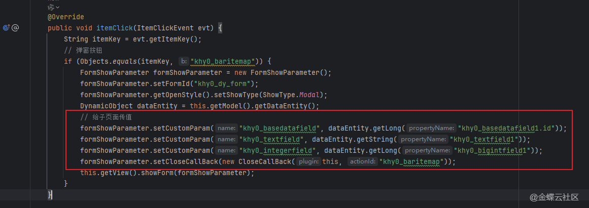
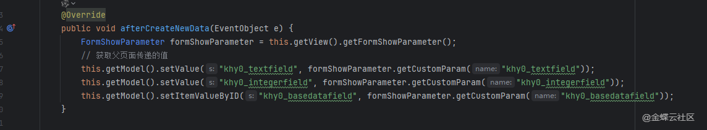
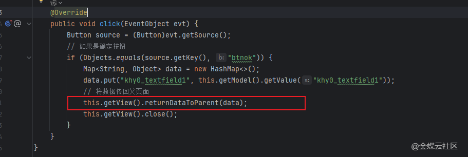
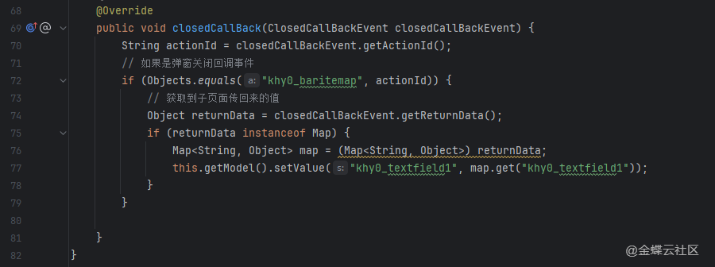
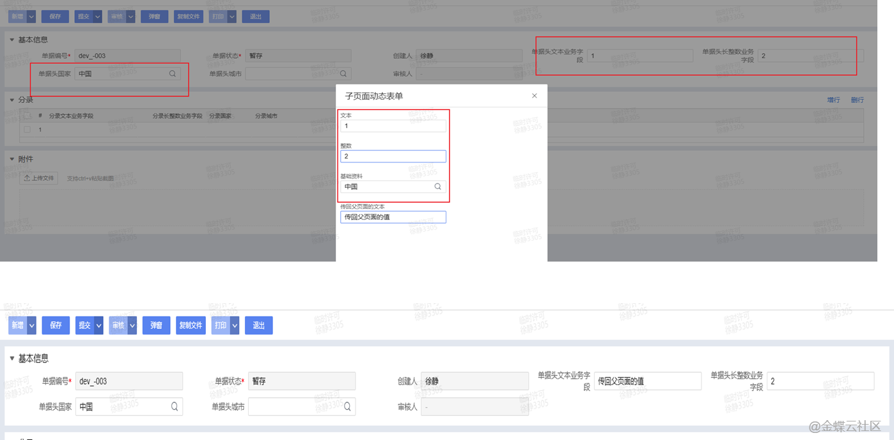

# 二开示例.页面传值.父子页面传值

## 适用场景

父页面打开子页面时传入上下文值，子页面处理完成后再把结果回传给父页面，实现典型的父子页面双向传值。

## 原文链接

- 社区原文: <https://vip.kingdee.com/knowledge/716290013872380160?specialId=570177930110532864&productLineId=40&isKnowledge=2&lang=zh-CN>

## 核心思路

1. 父页面用 `FormShowParameter` + `setCustomParam(...)` 传入初始值。
2. 子页面通过 `getFormShowParameter().getCustomParam(...)` 读取父页面传参。
3. 子页面关闭前通过 `returnDataToParent(...)` 返回结果，父页面在 `closedCallBack` 中接收。

## 原文截图

以下截图来自社区原文，便于还原配置界面、效果或关键操作位置。

原文截图 1：


原文截图 2：


原文截图 3：


原文截图 4：


原文截图 5：

## 实现前提

- 父页面按钮示例：`btn_open_child`
- 子页面表单标识示例：`kdec_child_form`
- 父页面回填字段示例：`kdec_result`

## Kingscript 实现

```ts
import { AbstractFormPlugin } from "@cosmic/bos-core/kd/bos/form/plugin";
import { ItemClickEvent } from "@cosmic/bos-core/kd/bos/form/events";
import { ClosedCallBackEvent } from "@cosmic/bos-core/kd/bos/form/events";
import { FormShowParameter, ShowType, StyleCss, CloseCallBack } from "@cosmic/bos-core/kd/bos/form";

class ParentPagePlugin extends AbstractFormPlugin {

  itemClick(e: ItemClickEvent): void {
    super.itemClick(e);
    if (e.getItemKey() !== "btn_open_child") {
      return;
    }

    const showParam = new FormShowParameter();
    showParam.setFormId("kdec_child_form");
    showParam.getOpenStyle().setShowType(ShowType.Modal);
    showParam.getOpenStyle().setInlineStyleCss(new StyleCss("720", "480"));
    showParam.getCustomParams().put("sourceBillNo", this.getModel().getValue("billno"));
    showParam.setCloseCallBack(new CloseCallBack(this, "child_result"));
    this.getView().showForm(showParam);
  }

  closedCallBack(e: ClosedCallBackEvent): void {
    super.closedCallBack(e);
    if (e.getActionId() !== "child_result") {
      return;
    }

    const returnData = e.getReturnData() as string;
    if (returnData != null && returnData !== "") {
      this.getModel().setValue("kdec_result", returnData);
    }
  }
}

class ChildPagePlugin extends AbstractFormPlugin {

  itemClick(e: ItemClickEvent): void {
    super.itemClick(e);
    if (e.getItemKey() !== "btn_confirm") {
      return;
    }

    const sourceBillNo = this.getView().getFormShowParameter().getCustomParam("sourceBillNo") as string;
    const result = sourceBillNo + "-" + this.getModel().getValue("kdec_child_value");
    this.getView().returnDataToParent(result);
    this.getView().close();
  }
}
```

## 关键步骤说明

1. 父页面打开弹窗前，用 `customParam` 把业务上下文打包传给子页面。
2. 子页面按自己的交互逻辑处理数据，确认时把最终结果回传给父页面。
3. 父页面在 `closedCallBack` 里做空值判断，再执行回填、刷新或新增分录。

## 转写说明

原文介绍的是通用父子页面传值模式，这里把它拆成“父页面发起 + 子页面返回”的一对 KS 模板，后续做选人、选物料、选地址都可以套这个模式。

## 注意事项 / 风险点

- 如果父页面没有 `setCloseCallBack(...)`，`closedCallBack` 不会触发。
- 回传对象不一定是字符串，也可以是数组或 JSON；这里用字符串是为了让案例最容易复用。
- 子页面如果直接关闭而不调用 `returnDataToParent(...)`，父页面必须能接受空返回。

风险等级：`改字段标识后可用`

## 验证建议

1. 父页面打开子页面后，确认子页面能读到父页面传来的单据编号。
2. 子页面点击确认后，确认父页面字段成功回填。
3. 子页面直接取消关闭时，确认父页面不会误写空值。

## 来源说明

- L2 原文图片转写
- L4 本地资料校对

- 这篇案例和现有 `closedCallBack`、弹窗选资料示例能形成互补。
