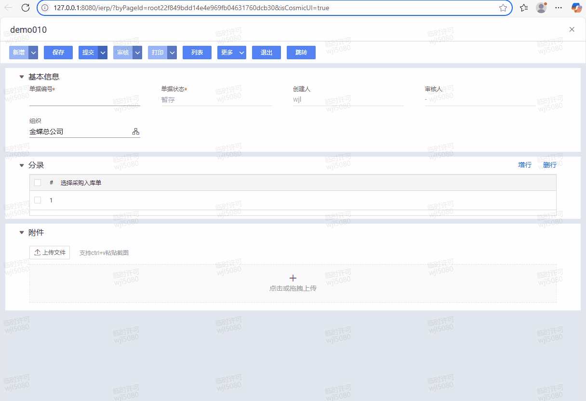
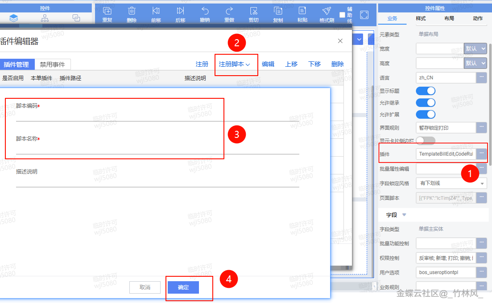

# 二开示例：KingScript.点击菜单按钮跳转外部url

        ## 适用场景

        点击菜单按钮后直接跳转外部 URL，比如打开帮助文档、外部系统页面或第三方查询页面。

        ## 原文链接

        - 社区原文: <https://vip.kingdee.com/knowledge/738057408810658816?specialId=570177930110532864&productLineId=40&isKnowledge=2&lang=zh-CN>

        ## 核心思路

        1. 通过按钮事件识别指定菜单 key。
2. 将外部 URL 固定写死或按当前数据动态拼接。
3. 真正跳转动作由视图层 `openUrl(...)` 执行。

## 原文截图

以下截图来自社区原文，便于还原配置界面、效果或关键操作位置。

原文截图 1：


原文截图 2：

        ## 实现前提

        - 菜单按钮示例：`tb_open_doc`

        ## Kingscript 实现

        ```ts
        import { AbstractBillPlugIn } from "@cosmic/bos-core/kd/bos/bill";
import { ItemClickEvent } from "@cosmic/bos-core/kd/bos/form/events";

class OpenExternalUrlPlugin extends AbstractBillPlugIn {

  itemClick(e: ItemClickEvent): void {
    super.itemClick(e);
    if (e.getItemKey() !== "tb_open_doc") {
      return;
    }

    const billNo = this.getModel().getValue("billno");
    this.getView().openUrl("https://example.com/help?billno=" + encodeURIComponent(String(billNo)));
  }
}

let plugin = new OpenExternalUrlPlugin();
export { plugin };
        ```

        ## 关键步骤说明

        1. 在工具栏或菜单栏上配置按钮并绑定脚本插件。
2. 在点击事件中识别按钮 key。
3. 按需拼接外部 URL 后调用 `openUrl(...)`。

        ## 转写说明

        这篇原文本身就给了相对清晰的 KS 场景，适合直接收敛成简洁案例。

        ## 注意事项 / 风险点

        - 外部 URL 如果带敏感参数，要先确认安全策略和编码方式。
- 如果运行环境对外链有白名单限制，需要提前验证。
- 移动端和 PC 端的打开行为可能不同，必要时分别验证。

        风险等级：`改字段标识后可用`

        ## 验证建议

        1. 点击按钮后确认会打开正确链接。
2. 单据编号等动态参数中包含中文或特殊字符时，确认 URL 编码正常。
3. 在测试环境先验证目标网站是否允许被当前环境打开。

        ## 来源说明

        - L1 原文直取
- L4 本地资料校对

        - 这篇与“点击超链接打开详情页”可以形成一内一外两个跳转模板。
