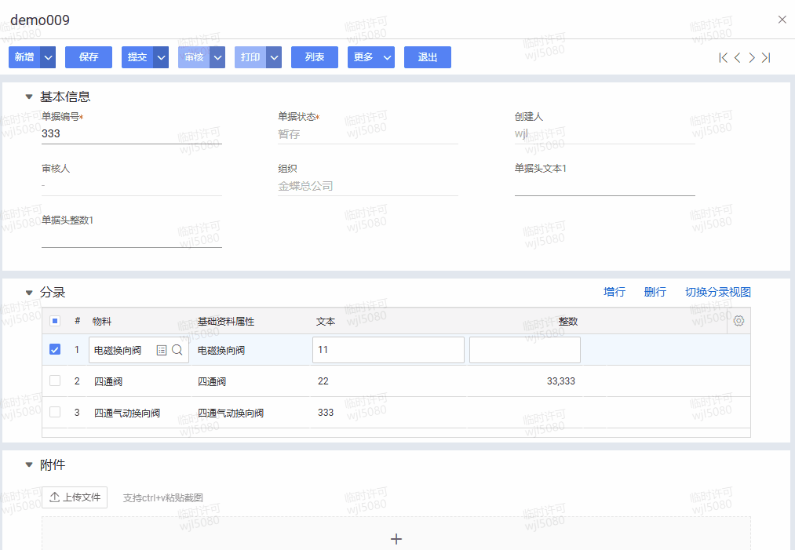
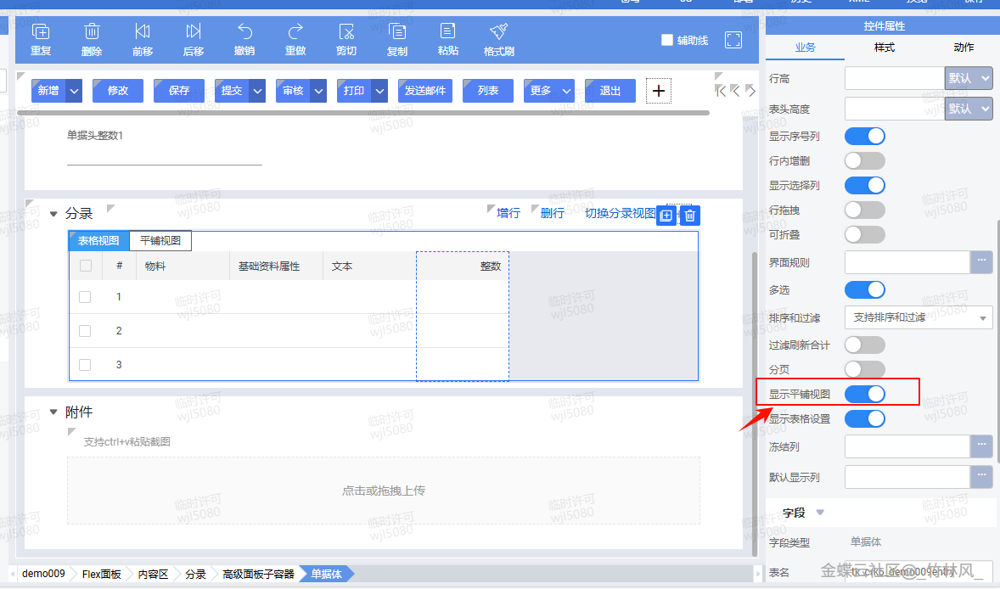
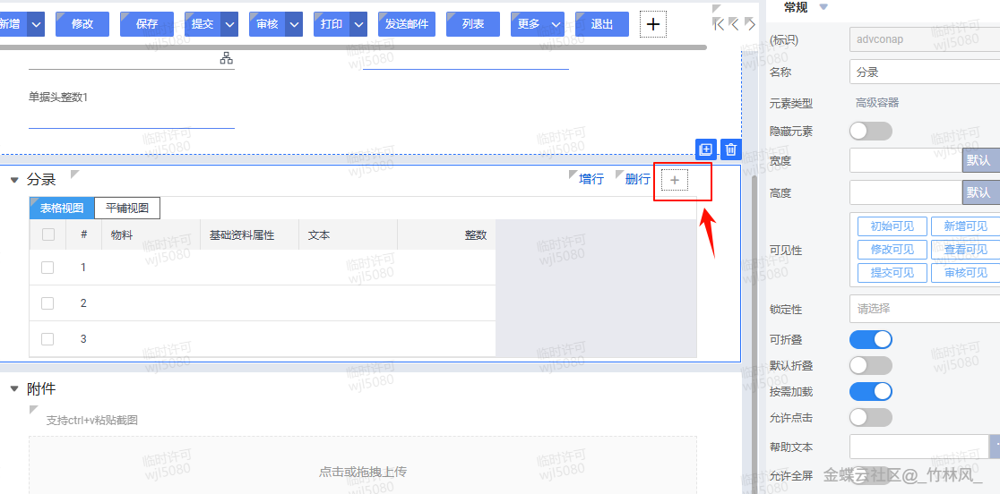
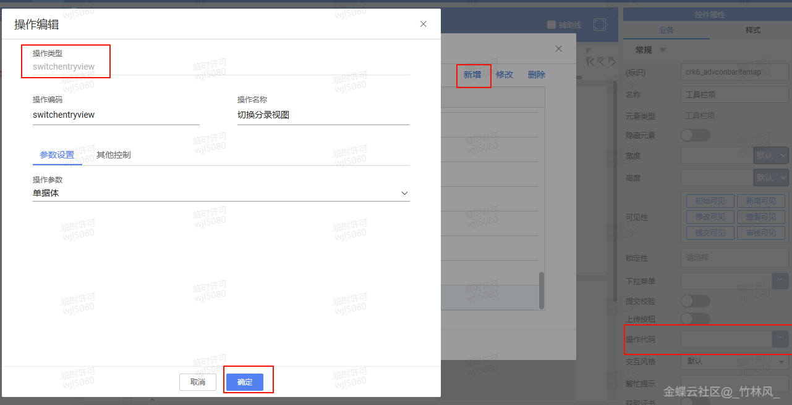

# 单据体设置平铺视图，实现类似企业版代理字段功能

## 适用场景

这篇文章本质上是一个“界面配置 + 代理字段联动”的案例：通过单据体平铺视图把分录字段直接铺到界面上，再配合脚本把表头或入口字段同步到各分录，做出类似企业版代理字段的交互效果。

## 原文链接

- 社区原文: <https://vip.kingdee.com/knowledge/735547609321947648?specialId=570177930110532864&productLineId=40&isKnowledge=2&lang=zh-CN>

## 核心思路

1. 平铺视图主要通过元数据配置启用，脚本的职责是处理字段联动和批量回填。
2. 当表头代理字段变化时，遍历单据体行，把目标字段统一写入分录。
3. 如果希望仅对新增行生效，可以把同样的逻辑放到 `afterCreateNewEntryRow` 或新增按钮回调里。

## 原文截图

以下截图来自社区原文，便于还原配置界面、效果或关键操作位置。

原文截图 1：


原文截图 2：


原文截图 3：


原文截图 4：

## 实现前提

- 单据体示例标识：`entryentity`
- 表头代理字段示例：`kdec_agent`
- 分录代理字段示例：`kdec_entry_agent`
- 平铺视图的开关、工具栏按钮和默认打开方式仍需在业务对象设计器里配置

## Kingscript 实现

```ts
import { AbstractFormPlugin } from "@cosmic/bos-core/kd/bos/form/plugin";
import { PropertyChangedArgs } from "@cosmic/bos-core/kd/bos/entity/datamodel/events";

class EntryFlatProxyPlugin extends AbstractFormPlugin {

  propertyChanged(e: PropertyChangedArgs): void {
    super.propertyChanged(e);

    if (e.getProperty().getName() !== "kdec_agent") {
      return;
    }

    const agentValue = this.getModel().getValue("kdec_agent");
    const entryKey = "entryentity";
    const rowCount = this.getModel().getEntryRowCount(entryKey);

    for (let row = 0; row < rowCount; row++) {
      this.getModel().setValue("kdec_entry_agent", agentValue, row);
    }

    this.getView().updateView(entryKey);
  }
}

let plugin = new EntryFlatProxyPlugin();
export { plugin };
```

## 关键步骤说明

1. 先在设计器里启用单据体平铺视图，并配置切换按钮或默认打开方式。
2. 把需要扮演“代理字段”的公共输入项放到表头或工具栏可访问位置。
3. 通过脚本把公共输入值同步到各分录字段，实现平铺界面里的批量编辑体验。

## 转写说明

原文更偏元数据配置和效果展示，没有直接给可复制的 KS 文本。这份案例把“平铺视图负责展示，脚本负责分录联动”的核心思路沉淀成了可复用的 KS 写法。

## 注意事项 / 风险点

- 平铺视图不是脚本开关，仍然依赖业务对象元数据配置。
- 如果分录很多，表头字段变更后整表回填会触发较多联动，建议按业务需要增加脏值判断。
- 如果你只希望未锁定的行可被回填，需要在循环里增加状态判断。

风险等级：`需按实际元数据调整`

## 验证建议

1. 切换到平铺视图后修改表头代理字段，确认每一行分录都能同步刷新。
2. 新增分录后再次修改代理字段，确认新老分录都能拿到新值。
3. 关闭平铺视图回到普通分录表格时，确认数据仍然一致。

## 来源说明

- L2 原文图片转写
- L4 本地资料校对
- L5 推断补全

- 原文重点在配置步骤和界面效果，脚本部分为适配 skill 的增强整理版。
