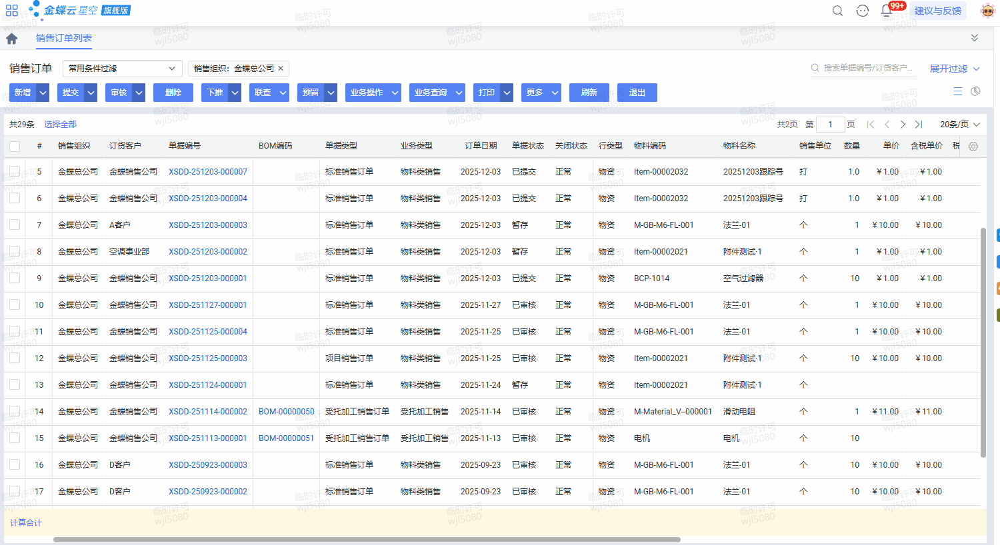
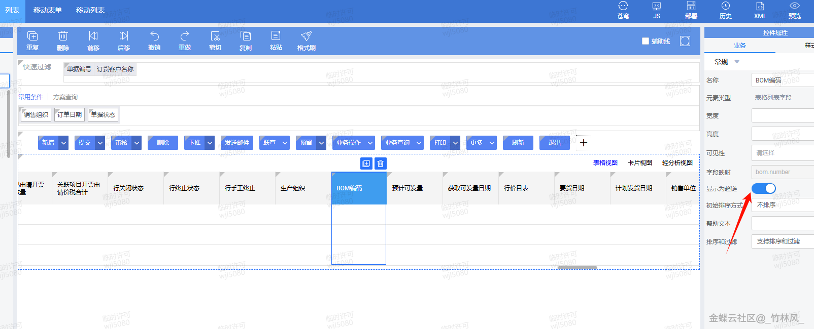
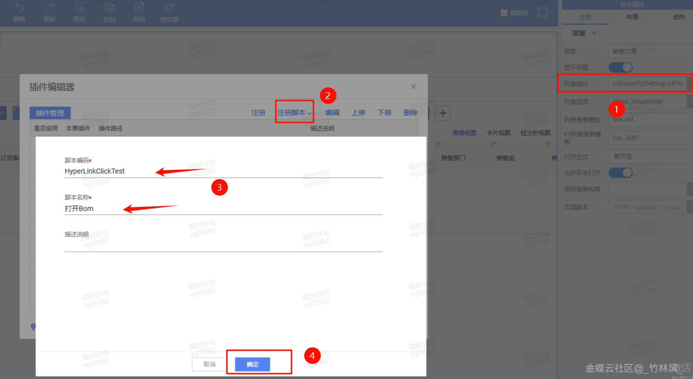

# 在列表点击超链接时打开单据详情页面

        ## 适用场景

        在列表里点击超链接字段时，不是打开外部网站，而是直接打开系统内某张单据或基础资料的详情页面。

        ## 原文链接

        - 社区原文: <https://vip.kingdee.com/knowledge/786258020556295680?specialId=570177930110532864&productLineId=40&isKnowledge=2&lang=zh-CN>

        ## 核心思路

        1. 把列表字段配置为超链接。
2. 在 `hyperLinkClick(...)` 中读取当前行的主键或业务主键。
3. 构造 `BillShowParameter` 打开对应详情页。

## 原文截图

以下截图来自社区原文，便于还原配置界面、效果或关键操作位置。

原文截图 1：


原文截图 2：


原文截图 3：

        ## 实现前提

        - 超链接字段示例：`bomno`
- 目标表单标识示例：`eng_bom`
- 目标主键字段示例：`bomid`

        ## Kingscript 实现

        ```ts
        import { AbstractListPlugin } from "@cosmic/bos-core/kd/bos/list/plugin";
import { HyperLinkClickEvent } from "@cosmic/bos-core/kd/bos/list/events";
import { BillShowParameter } from "@cosmic/bos-core/kd/bos/bill";

class OpenDetailFromHyperLinkPlugin extends AbstractListPlugin {

  hyperLinkClick(e: HyperLinkClickEvent): void {
    super.hyperLinkClick(e);
    if (e.getFieldName() !== "bomno") {
      return;
    }

    const rowData = e.getRowData();
    const showParam = new BillShowParameter();
    showParam.setFormId("eng_bom");
    showParam.setPkId(rowData.get("bomid"));
    this.getView().showForm(showParam);
  }
}

let plugin = new OpenDetailFromHyperLinkPlugin();
export { plugin };
        ```

        ## 关键步骤说明

        1. 先在列表字段属性里把目标列设置为超链接显示。
2. 在列表插件里接管 `hyperLinkClick(...)`。
3. 按当前行数据构造打开参数并显示目标详情页。

        ## 转写说明

        原文是很典型的列表跳转案例，这里保留了最核心的超链接点击与详情页打开逻辑。

        ## 注意事项 / 风险点

        - 目标页面如果不是单据，而是基础资料或列表，打开参数可能要改成对应的 show parameter 类型。
- 行数据里的主键字段名必须和列表返回字段一致，不能只看展示列名。
- 如果字段没勾选“显示为超链接”，点击事件通常不会触发。

        风险等级：`改字段标识后可用`

        ## 验证建议

        1. 点击超链接列后确认能打开正确详情页。
2. 点击其他非超链接列时确认不会误触发。
3. 如果当前行目标主键为空，确认插件能优雅退出。

        ## 来源说明

        - L3 Java 逻辑转 KS
- L4 本地资料校对

        - 本地列表插件示例已经覆盖 `hyperLinkClick + BillShowParameter` 的基本模式。
