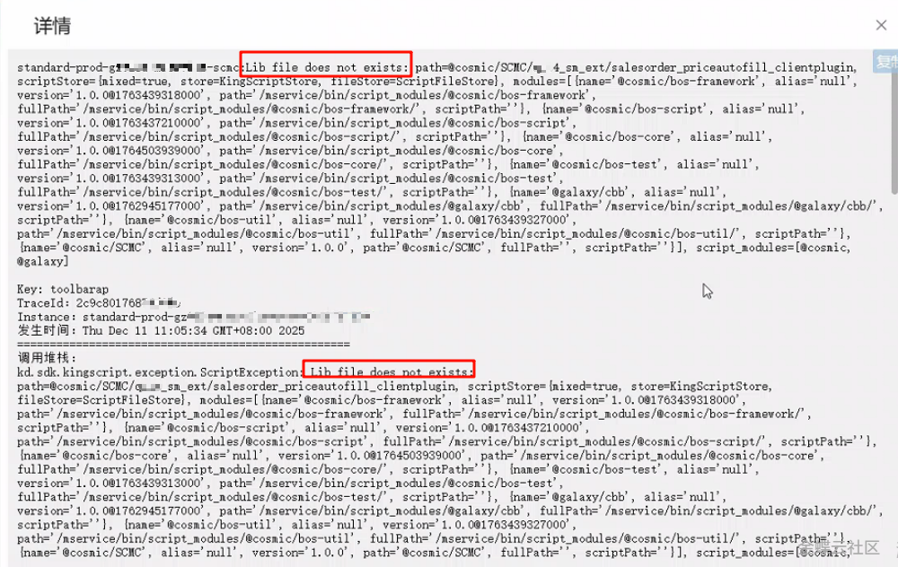
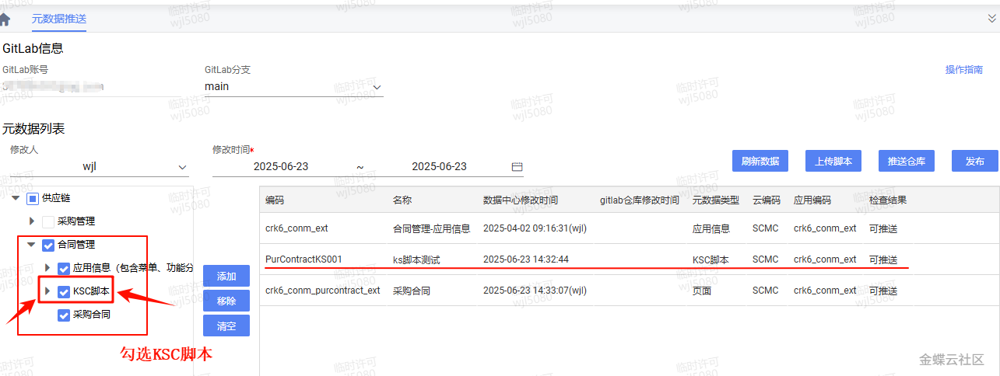

# 打开单据提示"Lib file does not exists"错误？

        ## 适用场景

        本地开发环境运行正常，但发布到沙箱或生产后打开单据提示 `Lib file does not exists`。这不是业务逻辑问题，而是脚本资源没有跟着元数据一起部署。

        ## 原文链接

        - 社区原文: <https://vip.kingdee.com/knowledge/787039850381264640?specialId=570177930110532864&productLineId=40&isKnowledge=2&lang=zh-CN>

        ## 核心思路

        1. KS 脚本文件和元数据配置是两层东西，推元数据不代表脚本资源已同步。
2. 排查时先确认插件脚本是否真实存在、插件配置是否引用了正确脚本、发布时是否把脚本资源一并带上。
3. 为了便于排错，可以先准备一个最小可运行脚本作为探针。

## 原文截图

以下截图来自社区原文，便于还原配置界面、效果或关键操作位置。

原文截图 1：


原文截图 2：

        ## 实现前提

        - 需要能在目标环境重新推送元数据和脚本资源

        ## Kingscript 实现

        ```ts
        import { AbstractFormPlugin } from "@cosmic/bos-core/kd/bos/form/plugin";

class DeployProbePlugin extends AbstractFormPlugin {
  afterBindData(): void {
    super.afterBindData();
    this.getView().showTipNotification("DeployProbePlugin loaded");
  }
}

let plugin = new DeployProbePlugin();
export { plugin };
        ```

        ## 关键步骤说明

        1. 先把复杂业务脚本替换成一个最小探针脚本，验证目标环境能否找到并加载脚本资源。
2. 重新推送脚本资源和元数据，确认插件引用指向的还是当前脚本文件。
3. 探针加载成功后，再换回真实业务脚本继续验证。

        ## 转写说明

        原文是排障文章，不是功能开发文章。为了满足 skill 场景里的“需要带 KS 代码”要求，这里给了一份最小探针脚本，方便快速判断问题出在资源部署还是业务逻辑。

        ## 注意事项 / 风险点

        - 这篇案例的核心不是代码，而是部署链路；不要误以为换脚本内容就能解决发布问题。
- 如果目标环境脚本路径、资源包或版本号不一致，仍然会继续报同样错误。
- 探针脚本验证完后记得切回真实脚本，避免误提交。

        风险等级：`推断版，建议先验证`

        ## 验证建议

        1. 目标环境加载探针脚本时，确认是否还报 `Lib file does not exists`。
2. 若探针能加载，再切回真实脚本验证业务逻辑。
3. 检查发布流程里是否明确包含 KS 脚本资源而不是只推元数据。

        ## 来源说明

        - L2 原文图片转写
- L4 本地资料校对
- L5 推断补全

        - 这篇更适合作为“部署排障案例”收入 skill。
